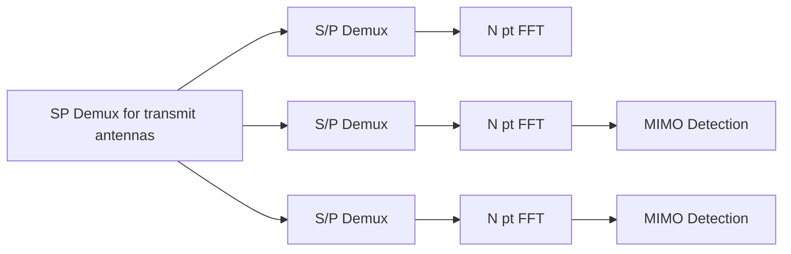
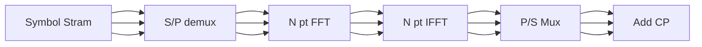

### 2024-12-17

- Multi carrier Modulation
  _if no noise_
  $$
  y(t) = s(t) =  \sum_{i} X_{i} e^{j 2 \pi f_{i}t}
  $$

<!-- $$ -->
<!-- f_{o}\int_0^{T_{o}}y(t) \left( e^{j 2 \pi f_{i}t}\right) dt = {B\over N} \int_0^{N\over  B} \left(\sum_{i} X_{i} e^{j 2\pi i {B\over N} t}\right) e^{} -->
<!-- $$' -->
<!---->

- [ ] OFDM
- [[Intersymbol Interference]]

## 2024-12-31

### MIMO OFDM(OFDMA)

- Combination of multiple-input multiple-output with OFDM
-



- [ ] Complete

$$
y(n) = \sum_{l=0}^{L-1} H(l)x(n-1) + w(n)
$$

### Effect of Freq Offset in OFDM

- Due to variations in **orthogonality**
- [ ] Inter Carrer Interference (ICI) in OFDM

$$
\large \epsilon = \frac{\Delta f}{{B\over N}}\tag{1}
$$

Where $\epsilon$ -> normalized freq offset

#### Peak to average Power Ratio (PAPR)

$$\text{Peak Power } = \text{Average Power} =  E \large\left\{ |x(f)|^2\right\}= a^2$$

- [ ] Correct

### Single Carrier FDMA(SC-FDMA)

- To reduce the Peak to avg power ratio
- PAPR -> $0dB$

- [ ] Picture



Hypothetical

#### SC_FDMA Reciever

- [ ] Sub Carrier Mapping

### Sub carrier mapping in SC-FDMA

```mermaid

```

> [!Series]
>
> - [ ] LFDMA & I-FDMA -> {Zero Pad , Interleaving Zeros}

#### PathLoss , Shadowing , Doplar Shift

---
