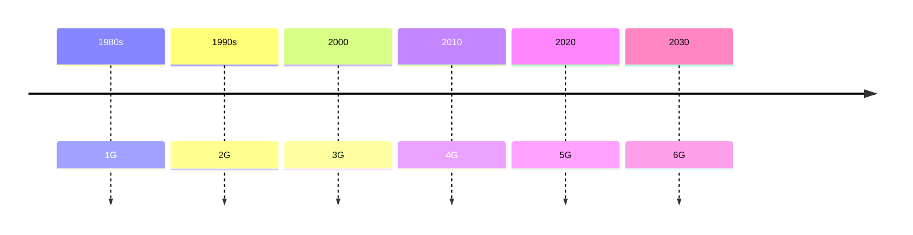
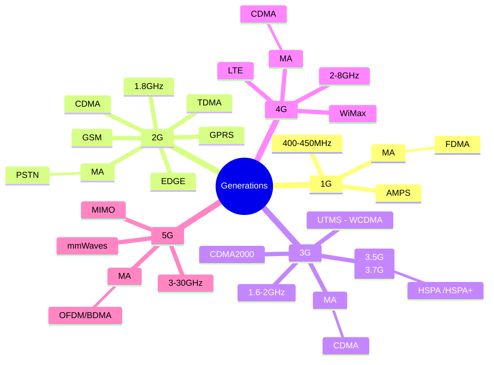

---
aliases:
  - wireless communication
tags:
  - classNote
banner: "https://images.unsplash.com/photo-1583602621722-cbd1130b210b?q=80&w=2070&auto=format&fit=crop&ixlib=rb-4.0.3&ixid=M3wxMjA3fDB8MHxwaG90by1wYWdlfHx8fGVufDB8fHx8fA%3D%3D"
banner_x: 0.46919
banner_y: 1
---
# Wireless Communication
**Notes**
 - [ECT402-M1-Ktunotes.in.pdf - Google Drive](https://drive.google.com/file/d/15qRXezdSeRtsAYzEJ30Okd2BMqdrn4dJ/view) , [Another One](https://drive.google.com/file/d/1Y13NBNi2OrjUdG6CrdaD6l41RjGiG3D5/view)
# Module 1


 **Introduction to Wireless Communication Systems**
- [x] Generations: 2G, 3G, 4G, 5G. ✅ 2025-04-18
- [x] Wireless LAN, ✅ 2025-04-18
- [x] Bluetooth and Personal Area networks, ✅ 2025-04-18
- [ ] Broadband Wireless Access -- WiMAX Technology.
- [ ] Wireless Spectrum allocation, Standards.
**Cellular System Design Fundamentals** 
- [ ] Frequency Reuse, 
- [ ] channel assignment strategies
- [ ] Handoff strategies, 
- [ ] Interference and system capacity, 
- [ ] trunking and grade off service, 
- [ ] improving coverage and capacity – cell splitting,
- [ ] sectoring, microcells.
## Introduction


---

## Generations
Marconi transmitted **Morse code** signals using radio waves wirelessly to a distance of **3.2 KMs** in #1895 





- [[1G]]
- [[2G]]
- [[3G]]
- [[4G]]

```dataview
TABLE  
max_speed as "Maximum Speed" , frequency as "Band" , tech as "Tech"
from #generations 

```


## WLAN
- within an area of building/school etc
- 2.4GHz Band
- the phy and MAC layer is specified by the IEEE802.11 standard
## Bluetooth
- It also uses the 2.4GHz
- low data rate compared to wifi
- also short distance 

## The Cellular Concept
- It replaces the single big transmitter (high  power) transmitter with many low power transmitter(cells) 

### Frequency Reuse (Frequency Planning)
The design process of selecting and allocating
channel groups for all of the cellular base
stations within a system is called frequency
reuse or frequency planning.
It involves dividing a geographical area into smaller regions, called cells, and assigning the same set of frequencies to different cells that are spaced sufficiently apart.
## Multiple Access
*It is the application of multiplexing*
1. [[FDMA]]


# Module 2

**Syllabus**

2.1 Path loss and shadowing (1): 
- [ ] Free space path loss,
- [ ] Two-Ray model, Shadowing,

2.2 Statistical Multipath Channel Models (4): 
- [ ] Time-varying channel impulse response,
- [ ]  Narrowband fading,
- [ ] Wideband fading models, 
- [ ] Delay spread and Coherence bandwidth, 
- [ ] Doppler spread and Coherence time, 
- [ ] Flat fading versus frequency selective fading, 
- [ ] Slow fading versus fast fading, Discrete-time model.

2.3 Capacity of Wireless Channels (2):
- [ ] Review of Capacity in AWGN, 
- [ ] Capacity of flat fading channel – Ergodic capacity,
- [ ] Capacity with Outage,
- [ ] Capacity with CSI-R. (Derivations of capacity formulae are not required; Only expressions, computations and significance required.)


## Path Loss 

$$
PL(dB) = 20\log_{10}\left( \frac{4\pi d}{\lambda} \right)
$$

