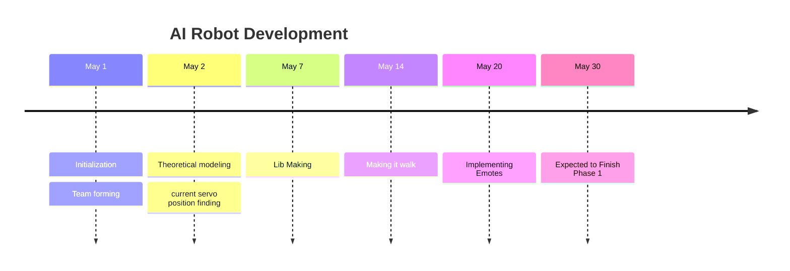

# Development 
There are currently few tasks at hand 
1. Make the Robot Walk 
2. Then add object avoidance
3. Add distance sensing
4. Stream Video through webcam and identify persons.
The development have devided into 4 stages( #update ) for the timebeing 

- [[#Development Phase 1]] -> making the robot walk 


# Development Phase 1 
## Intro 
Our main goal is to make the humanoid robot **walk**. In order to do that we have to do the following thigs first
![[17 servo robot.png|right|300x500]]

1. Find initial positions of each servos
	*During the first step it is found that there is some offset about the pulse width.* 
2. Tweak the servos to get the desired angles .
3. Integrate the whole part to the code 
4. Finaly try to make it walk. 

Threre are **17** servos in total , each servo can rotate from **0** to **180** degrees , it was not clear at first that the [[MG995]] can rotate upto angle **180** or not. But later some source like [this](https://components101.com/motors/mg995-servo-motor) show that it is indeed possible to for the [[MG995|servo]] to rotate upto 180.

```cpp

#define SERVO_ANGLE_MIN 0
#define SERVO_ANGLE_MAX 180
#define SERVO_MIN  102   // .5ms
#define SERVO_MAX  512   // 2.5ms 
#define SERVO_FREQ 50
#define CONTROLLER_I2C_ADDR 0x41
```

^3c3d3c

---
---


>[!blank]
>
>>[!blank|left-small]
>>
>>```cpp
>>Robo la1(PIN_LA1, board1);
>>Robo la2(PIN_LA2, board1);
>>Robo la3(PIN_LA3, board1);
>>Robo ra1(PIN_RA1, board1);
>>Robo ra2(PIN_RA2, board1);
>>Robo ra3(PIN_RA3, board1);
>>Robo lh(PIN_LH, board1);
>>Robo rh(PIN_RH, board1);
>>Robo ll1(PIN_LL1, board1);
>>Robo ll2(PIN_LL2, board1);
>>Robo ll3(PIN_LL3, board1);
>>Robo rl1(PIN_RL1, board1);
>>Robo rl2(PIN_RL2, board1);
>>Robo rl3(PIN_RL3, board1);
>>Robo lf(PIN_LF, board1);
>>Robo rf(PIN_RF, board1);
>>```
>
>>[!blank]
>>![[Pasted image 20250427002640.png]]
 

- There are 17 servo motors in the humanoid robot. 
- Initially planning to use [pca9685](https://cdn-shop.adafruit.com/datasheets/PCA9685.pdf) 
- [ ] Have to find the position of all servo motor  


## 1 Single Servo
There are mainly 2 types of motion for a servo motor , 
1. It's body maybe fixed and it rotor can move
2. Its rotor may be fiex and its body can move 
there are some things to consider in this both cases 
#### Fixed Body 
```yaml
motion_direction: clockwise
```


>[!blank|right-small]
![[Pasted image 20250514183507.png|right]]
> The rotating element is directly attached to the rotor and it will follow the same direction as the rotor. 


Fixed body will be the most common , because it is mostly seen when testing . And when testing we usually write the following

```cpp
Servo s1;
void setup(){
	s1.attach(some_pin);
}
void loop(){
	for (int i = 0 ; i < 180 ; ++ i){
		s1.write(i);
	}
}
```
^d90f88


We usually observe this motion as something(something attached to the rotor) travels from $\begin{bmatrix}-1 & 0\end{bmatrix} \text{ to } \begin{bmatrix}  1 & 0\end{bmatrix}$ 


>[!blank|left-small] 
>**visual representation of vector travelling from [-1,0] to [1,0]**
>![[SingleServoArm.mp4]]


This movement happens if the **rotor** of the motor is not fixed.  And if someone were to touch the rotor and if there enough friction between the rotor and the finger the body will start to move, and the movement of the body will be in oposite direction. 

> Its a little tricky to find which direction will be the body move. One way to visualize this is , try to imagine if you were pushing a car if you have enough strength the car will move forward and if dont it will stay there , but if the soil is not hard , you will be moving backward. 
> Now in the case of motors , if we stop a motor , that will create a lot of heat. (i think) which is not good for the motor , thats why we attach weights which is lower than the torque of the motor (i have to verify this sentence) 
### Fixed Rotor
```yaml
motion_direction: anti_clockwise
```
In this the rotor is fixed , this is mainly seen in linked motors[^1]
[^1]: linked motors in the sense that 2 or more motors connected together and they will form a "Z" like structure 
>[!blank]
>>[!blank|right-medium]
>>![[Pasted image 20250514192210.png]]
>
>>[!blank|left-small] 
>>**visual representation of vector travelling from [-1,0] to [1,0]**
>>![[SingleServoArmUp.mp4]]
>
>

First thing we can see is the direction of rotation is opposite,(due to conservation of force? i think) Now lets look at the code again

![[#^d90f88]]


![[Pasted image 20250514195137.png]]

```cpp
_initial_position = 0 ;
_final_position = 180;
uint8_t pos; 
for ( pos = _initial_position; ++pos; pos < _final_position)
        {
            // 0 -> Start at time zero, and keep the pulse high for angleToPulse(pos) ticks. 
            _servo_obj.setPWM(_this_servo_, 0, angleToPulse(pos));
            delay(DELAY_MS);
        }
        update_current_position(pos);
```


---

## 2 PCA9685  as Driver

```cpp
#define SERVO_MIN  125
#define SERVO_MAX  625
```
This is the value of `SERVOMIN` and `SERVOMAX` found in the internet code , now we have to find the value corresponding to our servo.
We know the [[PCA9685]] has a `12bit` **PWM** 
$$
\text{12 bit adc} = 2^{12} = 4096 \text{ levels}
$$

the [[MG995]] has the following PWM  feature ![[MG995#^17d14e]]  
$$
\text{50 Hz} \to \frac{1}{50} \to 20\text{ ms}
$$
$$
20 ms \to \frac{20}{4096} \to 4.88\mu s
$$
![[MG995#^90bc64]]


$$
0.5ms \to \frac{0.5 ms}{4.88\mu s } \to 102.45
$$
$$
1.5ms \to \frac{1.5 ms}{4.88\mu s } \to 102.45 \times 3 = 307
$$
$$
2.5ms \to \frac{2.5 ms}{4.88\mu s } \to 102.45 \times 5 = 512
$$
*now the new code will become*

```cpp
#define SERVO_MIN  102
#define SERVO_MAX  512
#define SERVO_FREQ 50
#define SERVO_ANGLE_MIN 0
#define SERVO_ANGLE_MAX 180
```


```cpp
void setup() {
  board1.setPWMFreq(SERVO_FREQ);
}
```


```cpp
uint16_t get_pulse(uint8_t _angle){
uint16_t _pulse = map(_angle,SERVO_ANGLE_MIN, SERVO_ANGLE_MAX, SERVO_MIN,SERVO_MAX);
     Serial.print("Angle: ");Serial.print(_angle);
     Serial.print(" pulse: ");Serial.println(_pulse);
     return _pulse;
  }
```


**Usage**
```cpp
#define I2C_ADDR 0x40 
Adafruit_PWMServoDriver the_servo = Adafruit_PWMServoDriver(I2C_ADDR);
 #define /* let*/ first_pin /* of pca9685 */ = 0 ;

for(uint8_t angle = 0 ; angle < ANGLE_MAX ; angle++){
	the_servo.setPWM(first_pin , 0,get_pulse(angle));
}

```

### 2.1 Pin Defenitions
The [[PCA9685]] has 16 output pins, but the thing is our robot has 17 servos so im going to use additional [[PCA9685]] or a dedicated pin(15) for the last servo(head )

<<<<<<< HEAD
| <br><br>Pin Name | Unit       | Value |
| ---------------- | ---------- | ----- |
| PIN_LA1          | Left arm   | 0     |
| PIN_LA2          | Left arm   | 1     |
| PIN_LA3          | Left arm   | 2     |
| PIN_RA1          | Right arm  | 3     |
| PIN_RA2          | Right arm  | 4     |
| PIN_RA3          | Right arm  | 5     |
| PIN_RA3          | Right arm  | 5     |
| PIN_B1           | Left Hip   | 6     |
| PIN_B2           | Right Hip  | 7     |
| PIN_LL1          | Left Leg   | 8     |
| PIN_LL2          | Left Leg   | 9     |
| PIN_LL3          | Left Leg   | 10    |
| PIN_RL1          | Right Leg  | 11    |
| PIN_RL2          | Right Leg  | 12    |
| PIN_RL3          | Right Leg  | 13    |
| PIN_LF           | Left Foot  | 14    |
| PIN_RF           | Right Foot | 15    |
| Pin Name | Unit  | Value |
| -------- | ---- | ----- |
| PIN_LA1      | Left arm  | 0   |
| PIN_LA2      | Left arm  | 1   |
| PIN_LA3      | Left arm  | 2   |
| PIN_RA1      | Right arm | 3   |
| PIN_RA2      | Right arm | 4   |
| PIN_RA3      | Right arm | 5   |
| PIN_RA3      | Right arm | 5   |
| PIN_B1       | Left Hip  | 6   |
| PIN_B2       | Right Hip | 7   |
| PIN_LL1      | Left Leg  | 8   |
| PIN_LL2      | Left Leg  | 9   |
| PIN_LL3      | Left Leg  | 10  |
| PIN_RL1      | Right Leg | 11  |
| PIN_RL2      | Right Leg | 12  |
| PIN_RL3      | Right Leg | 13  |
| PIN_LF       | Left Foot  | 14  |
| PIN_RF       | Right Foot | 15  |

^c18f43
```cpp
#define PIN_LA1 0
#define PIN_LA2 1
#define PIN_LA3 2
#define PIN_RA1 3
#define PIN_RA2 4
#define PIN_RA3 5
#define PIN_B1 6
#define PIN_B2 7
#define PIN_LL1 8
#define PIN_LL2 9
#define PIN_LL3 10
#define PIN_RL1 11
#define PIN_RL2 12
#define PIN_RL3 13
#define PIN_LF 14
#define PIN_RF 15
```

^d85d2b


## 3 Finding the initial position of all servos 
 
$$
\text{let }\theta_{o}  = \text{Initial Position }
$$
**Initial position** in the sense that  the position of the servo when the robot is in the standing position 


![[Pasted image 20250426211133.png|700|600]]


^b7c9fb

### 3.1 Initial Positions 

$$
\begin{align}
\theta_{0}& \to \text{Initial Posiotion} \\
\phi_{0}& \to \text{pulse value correspond to the initial angle (0)}  \to 102(\text{ideal})\\
\phi_{\infty}& \to \text{pulse value correspond to the final anlge (180)} \to 512(\text{ideal})\\
\end{align}
$$


^tableoneotwo


| Servo | Unit       | $\theta_{0}$ | $\pi$    | By Code 1(Web Based)($\theta_{0}$) | $\phi_{0}$ | $\phi_{\infty}$ |
| ----- | ---------- | ------------ | -------- | ---------------------------------- | ---------- | --------------- |
| LA1   | Left arm   | 25           | to front | 10                                 |            |                 |
| LA2   | Left arm   | 0            | to up    | 0                                  |            |                 |
| LA3   | Left arm   | 16           | to up    | 16                                 |            |                 |
| RA1   | Right arm  | 164          | to down  |                                    |            |                 |
| RA2   | Right arm  | 180          | down     |                                    |            |                 |
| RA3   | Right arm  | 167          | down     |                                    |            |                 |
| B1    | Left Hip   | 99           | to right |                                    |            |                 |
| B2    | Right Hip  |              |          |                                    |            |                 |
| LL1   | Left Leg   |              |          |                                    |            |                 |
| LL2   | Left Leg   |              |          |                                    |            |                 |
| LL3   | Left Leg   |              |          |                                    |            |                 |
| RL1   | Right Leg  |              |          |                                    |            |                 |
| RL2   | Right Leg  |              |          |                                    |            |                 |
| RL3   | Right Leg  |              |          |                                    |            |                 |
| LF    | Left Foot  |              |          |                                    |            |                 |
| RF    | Right Foot |              |          |                                    |            |                 |

| Servo | Unit       | $\theta_{0}$ | $\text{when } \theta = 0$ | $\text{when } \theta = \pi$ | $\phi_{0}$ | $\phi_{\infty}$ | $\phi_{k}$ |
| ----- | ---------- | ------------ | ------------------------- | --------------------------- | ---------- | --------------- | ---------- |
| LA1   | Left arm   |              |                           |                             |            |                 |            |
| LA2   | Left arm   |              |                           |                             |            |                 |            |
| LA3   | Left arm   |              |                           |                             |            |                 |            |
| RA1   | Right arm  |              |                           |                             |            |                 |            |
| RA2   | Right arm  |              |                           |                             |            |                 |            |
| RA3   | Right arm  | 30           | hand folds                | hand unfolds                | 102        | 512             | 170        |
| B1    | Left Hip   |              |                           |                             |            |                 |            |
| B2    | Right Hip  |              |                           |                             |            |                 |            |
| LL1   | Left Leg   |              |                           |                             |            |                 |            |
| LL2   | Left Leg   |              |                           |                             |            |                 |            |
| LL3   | Left Leg   |              |                           |                             |            |                 |            |
| RL1   | Right Leg  |              |                           |                             |            |                 |            |
| RL2   | Right Leg  |              |                           |                             |            |                 |            |
| RL3   | Right Leg  |              |                           |                             |            |                 |            |
| LF    | Left Foot  | 99           |                           |                             |            |                 | 327        |
| RF    | Right Foot | 99           |                           |                             |            |                 | 327        |

```cpp
// Servo Vals.h
#define SERVO_ANGLE_MIN 0
#define SERVO_ANGLE_MAX 5000
#define SERVO_MIN  102   // .5ms
#define SERVO_MAX  512   // 2.5ms 
#define SERVO_FREQ 50

```


#### Tests
```dataview
TABLE servo as "ID", start as "start" , stop as "stop" , start_ms as "Start ms" , stop_ms as "Stop ms" , Duty_cycle as "DC"
WHERE file = this.file
```


**pulse tester**
```python
import requests 
url = "http://192.168.137.142/setServo"
def set_position(val,id=0):
	req_params= {
		"id": id,
		"position": val
		}
	response = requests.get(url, params=req_params)
	print(f"Response: {response.text}")
while True:
	val = int(input("Enter position"))
	set_position(val)
	
	if val == 0:
		break;
```

**angle tester**
```python
import requests 
url="http://192.168.31.140/setServo"
```
```python
def get_pulse(val):
	return val * (512 - 102 ) /180 + 102 
def set_position(val,id=0):
	req_params= {
		"id": id,
		"position": val
		}
	response = requests.get(url, params=req_params)
	print(f"Response: {response.text}")

```
```python
while True:
	val = int(input("Enter position"))
	if val == 1000:
		break;
	new_val = get_pulse(val)
	set_position(new_val,id=13)
	
```

```python
LL1=0
LL2=10 
LL3=180-39 
RL1=180
RL2=170
RL3=39
RF=99
LF=99

```

```python 
import time 
set_position(get_pulse(LL1),id=8) # LL1 
time.sleep(1)
set_position(get_pulse(LL2),id=9) # LL2 
time.sleep(1)
set_position(get_pulse(LL3),id=10) # LL3 
time.sleep(1)
set_position(get_pulse(RL1),id=11) # RL1 
time.sleep(1)
set_position(get_pulse(RL2),id=12) # RL2 
time.sleep(1)
set_position(get_pulse(RL3),id=13) # RL3
time.sleep(1)
set_position(get_pulse(LF),id=14) # LF 
time.sleep(1)
set_position(get_pulse(RF),id=15) # RF 
```

```python 
set_position(160,id=12) # RL2 
```


**ideal**
```python
id = 5
zero_degree = {
	"id": id,
	"position": 102
}
one80_degree = {
	"id": id,
	"position": 522
}
```
**min**
```python
response = requests.get(url, params=zero_degree)
print(f"Response: {response.text}")
```
**max**
```python
response = requests.get(url, params=one80_degree)
print(f"Response: {response.text}")
```

##### 1. RA3
- The servo start to respond at [start:: 76] 
> $76 \to 76\times 4.88 \mu s \to 370.88$
*[start_ms:: 370.88]* ^7fe3a5
- also stops to respond at [stop:: 573]
this means the [servo:: RA3] will repond or goes to $0^{\circ}$ when the pulse width is **.37088 ms**  

It also stops responding at [stop:: 573] -> [stop_ms:: 2.796 ms]
$$
573 \to 2.796 ms
$$
Which implies 
$$
\text{Duty cycle} = 2.796 - .370.88 = 2.42512 ms
$$

[duty_cyle:: 2.42512 ms ]

- [initial_position:: ]

#ifdefined #linux | #mac
```bash
curl "http://192.168.137.142/setServo?id=0&position=76"
```
```bash
curl "http://192.168.137.142/setServo?id=0&position=573"
```
#elseif #windows | #Linux | #mac
```python
import requests

url = "http://192.168.137.142/setServo"

min_params = {
    "id": 5,
    "position": 76
}
max_params = {
	"id" : 5,
	"position": 573
}

```


```python
response = requests.get(url, params=min_params)
print(f"Response: {response.text}")
```
```python
response = requests.get(url, params=max_params)
print(f"Response: {response.text}")
```

###### **put to initial**
```python 
get_pulse = lambda x: x * (512 - 102 ) /180 + 102
print(get_pulse(30))
initial_prop = {
	"id": 5,
	"position": get_pulse(30)
}

response = requests.get(url, params=initial_prop)
print(f"Response: {response.text}")
```
##### 2. RA2 
![[#^7fe3a5]]
- [servo:: RA2]
- [start::76]
- [stop:: 576]
$$
576 \to 576 \times 4.88 \micro s = 2810.88 ms
$$
- [start_ms:: 2810.88 ms]
- [duty_cycle:: 2.440 ms ]
- [initial_posiotion:: ]
```python
import requests

url = "http://192.168.137.142/setServo"
min_params = {
    "id": 0,
    "position": 76
}
max_params = {
	"id" : 0,
	"position": 576
}

```

```python
response = requests.get(url, params=min_params)
print(f"Response: {response.text}")
```
```python
response = requests.get(url, params=max_params)
print(f"Response: {response.text}")
```

##### 3. RA1 
It is same as [[#1. RA3|RA3's]] 

- [start::76] , [stop:: 573]
- [start_ms:: 370.88] [stop_ms:: 2.796 ms]
- [duty_cycle:: 2.42512 ms ]
- [initial-position:: ]

##### 4. LA3

- [start::76] , [stop:: 573]
- [start_ms:: 370.88] [stop_ms:: 2.796 ms]
- [duty_cycle:: 2.42512 ms ]
- [initial-position:: ]

##### 5. LA2

- [start::76] , [stop:: 573]
- [start_ms:: 370.88] [stop_ms:: 2.796 ms]
- [duty_cycle:: 2.42512 ms ]
- [initial-position:: ]

##### 6. LA1

- [start::76] , [stop:: 573]
- [start_ms:: 370.88] [stop_ms:: 2.796 ms]
- [duty_cycle:: 2.42512 ms ]
- [initial-position:: ]

##### 7. B1 


- [start::76] , [stop:: 573]
- [start_ms:: 370.88] [stop_ms:: 2.796 ms]
- [duty_cycle:: 2.42512 ms ]
- [initial-position:: ]

##### 8. B2 

- [start::76] , [stop:: 573]
- [start_ms:: 370.88] [stop_ms:: 2.796 ms]
- [duty_cycle:: 2.42512 ms ]
- [initial-position:: ]

##### 9. LL3 
12
- [start::76] , [stop:: 573]
- [start_ms:: 370.88] [stop_ms:: 2.796 ms]
- [duty_cycle:: 2.42512 ms ]
- [initial-position:: (180-39)]
- [constrains:: 39-180]
##### 10. LL2 
11
- [start::76] , [stop:: 573]
- [start_ms:: 370.88] [stop_ms:: 2.796 ms]
- [duty_cycle:: 2.42512 ms ]
- [initial-position:: ]

##### 11. LL1 


- [start::76] , [stop:: 573]
- [start_ms:: 370.88] [stop_ms:: 2.796 ms]
- [duty_cycle:: 2.42512 ms ]
- [initial-position:: ]

##### 12. RL3
13

- [start::76] , [stop:: 573]
- [start_ms:: 370.88] [stop_ms:: 2.796 ms]
- [duty_cycle:: 2.42512 ms ]
- [initial-position:: 39]
- [constrains:: 0-160]

##### 13. RL2 
10

##### 14. RL1 


- [start::76] , [stop:: 573]
- [start_ms:: 370.88] [stop_ms:: 2.796 ms]
- [duty_cycle:: 2.42512 ms ]
- [initial-position:: ]

##### 15. LF 
14

- [start::76] , [stop:: 573]
- [start_ms:: 370.88] [stop_ms:: 2.796 ms]
- [duty_cycle:: 2.42512 ms ]
- [initial-position:: 99]

##### 16. RF 
15
- [start::76] , [stop:: 573]
- [start_ms:: 370.88] [stop_ms:: 2.796 ms]
- [duty_cycle:: 2.42512 ms ]
- [initial-position:: 99]


## 4 Movements
Lets say we want to go from position **a** to **b**. the code will be like this
```cpp
for (pos= _initial_position; ++pos; pos < _final_position){
            _servo_obj.setPWM(_this_servo_, 0, angleToPulse(pos));
            delay(DELAY_MS);
        }
```

1. fist sets the position(`pos`) os the starting position(`_initial_position`)
2. writes(`_servo_obj.setPWM(_this_servo , 0 , angleToPulse(pos))`) 
	1. Calculates the current pulseWidth which is respected to the angle
	2. writes that to the servo.
3. introduces some relay to make the movement smoother and reduces surge current

Here few things to consider 
1. `_final_position` is will be greater than `_initial_position` (**_final_position > _initial_position**) 


### 4.1 Raising Hand

>[!blank|right-small]
>![[(output003)Model3ServoArm_trans_2.mp4]]

In this project , rasising hand is the simplest task, because it only involves moving only one servo `LA1`. 
Now consider the following code again. 
![[#^d90f88]]
This code is for [[#clock wise movement]] , in section [[#2 Finding the initial position of all servos]] and the table 

![[#^b7c9fb]]

For the time beeing consider only `LA1` , `LA2` , `LA3` 

| Servo | Unit     | Position Degrees | 180      |
| ----- | -------- | ---------------- | -------- |
| LA1   | Left arm | 25               | to front |
| LA2   | Left arm | 0                | to up    |
| LA3   | Left arm | 16               | to up    |


#### 4.1.1 Left Arm 

```python
import numpy as np
import matplotlib.pyplot as plt
arm_length = 1  
angles_deg = np.linspace(0, 180, 180) 
angles_rad = np.radians(angles_deg)
x = arm_length * np.cos(angles_rad)
y = arm_length * np.sin(angles_rad)
plt.figure(figsize=(6, 3))
plt.plot(x, y, label='Arm Tip Path', color='blue')
plt.plot([0, x[0]], [0, y[0]], 'r--', label='Start Position')   
plt.plot([0, x[-1]], [0, y[-1]], 'g--', label='End Position')  
plt.gca().set_aspect('equal')
plt.title('Servo Arm Sweep 0° to 180°')
plt.xlabel('X (cm)')
plt.ylabel('Y (cm)')
plt.legend()
plt.grid(True)
plt.show()

```

```python
import numpy as np
import matplotlib.pyplot as plt

# Link lengths (both 1 cm)
L1 = 1.0
L2 = 1.0

# Generate angle combinations
theta1_deg = np.linspace(0, 180, 100)
theta2_deg = np.linspace(0, 180, 100)

theta1_rad = np.radians(theta1_deg)
theta2_rad = np.radians(theta2_deg)

# Meshgrid to compute all combinations of joint angles
T1, T2 = np.meshgrid(theta1_rad, theta2_rad)

# Forward kinematics for 2-link planar arm
# Base -> First Joint (L1) -> Second Joint (L2)
X = L1 * np.cos(T1) + L2 * np.cos(T1 + T2)
Y = L1 * np.sin(T1) + L2 * np.sin(T1 + T2)

# Plot
plt.figure(figsize=(6, 6))
plt.scatter(X, Y, s=1, c='blue')
plt.title("Reachable Workspace of 2-Link Arm")
plt.xlabel("X (cm)")
plt.ylabel("Y (cm)")
plt.axis('equal')
plt.grid(True)
plt.show()

```


$$
i = \begin{bmatrix}
1 & 0  \\
0 & 1
\end{bmatrix}
$$
## 5 Timeline



## 6 References

- [ ] Need to checkout this [link](https://forum.arduino.cc/t/varspeedservo-a-modified-servo-library-with-speed-control/61404/5)
1. https://www.instructables.com/Making-humanoid-robot-from-Flated-water-pipe-and-s/
2. https://projecthub.arduino.cc/ashraf_minhaj/mia-1-open-source-advanced-handmade-humanoid-robot-36429e
3. https://github.com/AndreiBuzdugan/Little-Human-Robot/blob/main/Ultrasonic_Robot.ino
4. https://github.com/hubonit/Humanoid-Robot-with-Arduino
5. https://github.com/hubonit/Humanoid-Robot-with-Arduino/blob/master/GBotV3.ino
6. https://github.com/gunarakulangunaretnam/mr-humanoid
7. https://docs.manim.community/en/stable/
8. https://gemini.google.com/app/2b0e2c2787d08884?hl=en-IN

### ROS Projects
1. https://www.makr.org/2021/scorpio
2. 
