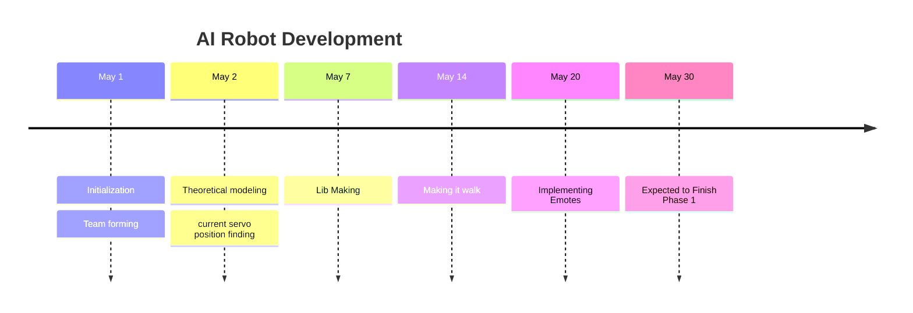

# Development 
There are currently few tasks at hand 
1. Make the Robot Walk 
2. Then add object avoidance
3. Add distance sensing
4. Stream Video through webcam and identify persons.

# Development Phase 1 
- [[Servo Motor Testing]]
Our main goal is to make the humanoid robot **walk** .   
![[17 servo robot.png|right|300x500]]
Threre are **17** servos in total , each servo can rotate from **0** to **180** degrees 


 [[Pasted image 20250427002640.png]]
 

- There are 17 servo motors in the humanoid robot. 
- Initially planning to use [pca9685](https://cdn-shop.adafruit.com/datasheets/PCA9685.pdf) 
- [ ] Have to find the position of all servo motor  

## 1 Single Servo
There are mainly 2 types of motion for a servo motor , 
1. It's body maybe fixed and it rotor can move
2. Its rotor may be fiex and its body can move 
there are some things to consider in this both cases 
#### Fixed Body 
```yaml
motion_direction: clockwise
```


>[!blank|right-small]
![[Pasted image 20250514183507.png|right]]
> The rotating element is directly attached to the rotor and it will follow the same direction as the rotor. 


Fixed body will be the most common , because it is mostly seen when testing . And when testing we usually write the following

```cpp
Servo s1;
void setup(){
	s1.attach(some_pin);
}
void loop(){
	for (int i = 0 ; i < 180 ; ++ i){
		s1.write(i);
	}
}
```
^d90f88


We usually observe this motion as something(something attached to the rotor) travels from $\begin{bmatrix}-1 & 0\end{bmatrix} \text{ to } \begin{bmatrix}  1 & 0\end{bmatrix}$ 


>[!blank|left-small] 
>**visual representation of vector travelling from [-1,0] to [1,0]**
>![[SingleServoArm.mp4]]


This movement happens if the **rotor** of the motor is not fixed.  And if someone were to touch the rotor and if there enough friction between the rotor and the finger the body will start to move, and the movement of the body will be in oposite direction. 

> Its a little tricky to find which direction will be the body move. One way to visualize this is , try to imagine if you were pushing a car if you have enough strength the car will move forward and if dont it will stay there , but if the soil is not hard , you will be moving backward. 
> Now in the case of motors , if we stop a motor , that will create a lot of heat. (i think) which is not good for the motor , thats why we attach weights which is lower than the torque of the motor (i have to verify this sentence) 
### Fixed Rotor
```yaml
motion_direction: anti_clockwise
```
In this the rotor is fixed , this is mainly seen in linked motors[^1]
[^1]: linked motors in the sense that 2 or more motors connected together and they will form a "Z" like structure 
>[!blank]
>>[!blank|right-medium]
>>![[Pasted image 20250514192210.png]]
>
>>[!blank|left-small] 
>>**visual representation of vector travelling from [-1,0] to [1,0]**
>>![[SingleServoArmUp.mp4]]
>
>

First thing we can see is the direction of rotation is opposite,(due to conservation of force? i think) Now lets look at the code again

![[#^d90f88]]


![[Pasted image 20250514195137.png]]

```cpp
_initial_position = 0 ;
_final_position = 180;
uint8_t pos; 
for ( pos = _initial_position; ++pos; pos < _final_position)
        {
            // 0 -> Start at time zero, and keep the pulse high for angleToPulse(pos) ticks. 
            _servo_obj.setPWM(_this_servo_, 0, angleToPulse(pos));
            delay(DELAY_MS);
        }
        update_current_position(pos);
```


---


## 2 Finding the initial position of all servos 
 
$$
\text{let }\theta_{o}  = \text{Initial Position }
$$
**Initial position** in the sense that  the position of the servo when the robot is in the standing position 

We have to find **initial position** of each servo inorder to understand how to operate them. 

![[Pasted image 20250426211133.png|700|600]]

$$

$$

^tableoneotwo

| Servo | Unit       | Position Degrees | 180      |
| ----- | ---------- | ---------------- | -------- |
| LA1   | Left arm   | 25               | to front |
| LA2   | Left arm   | 0                | to up    |
| LA3   | Left arm   | 16               | to up    |
| RA1   | Right arm  | 164              | to down  |
| RA2   | Right arm  | 180              | down     |
| RA3   | Right arm  | 167              | down     |
| B1    | Left Hip   | 99               | to right |
| B2    | Right Hip  |                  |          |
| LL1   | Left Leg   |                  |          |
| LL2   | Left Leg   |                  |          |
| LL3   | Left Leg   |                  |          |
| RL1   | Right Leg  |                  |          |
| RL2   | Right Leg  |                  |          |
| RL3   | Right Leg  |                  |          |
| LF    | Left Foot  |                  |          |
| RF    | Right Foot |                  |          |

^b7c9fb


## 3 Movements
Lets say we want to go from position **a** to **b**. the code will be like this
```cpp
for (pos= _initial_position; ++pos; pos < _final_position){
            _servo_obj.setPWM(_this_servo_, 0, angleToPulse(pos));
            delay(DELAY_MS);
        }
```

1. fist sets the position(`pos`) os the starting position(`_initial_position`)
2. writes(`_servo_obj.setPWM(_this_servo , 0 , angleToPulse(pos))`) 
	1. Calculates the current pulseWidth which is respected to the angle
	2. writes that to the servo.
3. introduces some relay to make the movement smoother and reduces surge current

Here few things to consider 
1. `_final_position` is will be greater than `_initial_position` (**_final_position > _initial_position**) 


### 3.1 Raising Hand

>[!blank|right-small]
>![[(output003)Model3ServoArm_trans_2.mp4]]

In this project , rasising hand is the simplest task, because it only involves moving only one servo `LA1`. 
Now consider the following code again. 
![[#^d90f88]]
This code is for [[#clock wise movement]] , in section [[#2 Finding the initial position of all servos]] and the table 

![[#^b7c9fb]]

For the time beeing consider only `LA1` , `LA2` , `LA3` 

| Servo | Unit     | Position Degrees | 180      |
| ----- | -------- | ---------------- | -------- |
| LA1   | Left arm | 25               | to front |
| LA2   | Left arm | 0                | to up    |
| LA3   | Left arm | 16               | to up    |


#### Left Arm 

```python
import numpy as np
import matplotlib.pyplot as plt
arm_length = 1  
angles_deg = np.linspace(0, 180, 180) 
angles_rad = np.radians(angles_deg)
x = arm_length * np.cos(angles_rad)
y = arm_length * np.sin(angles_rad)
plt.figure(figsize=(6, 3))
plt.plot(x, y, label='Arm Tip Path', color='blue')
plt.plot([0, x[0]], [0, y[0]], 'r--', label='Start Position')   
plt.plot([0, x[-1]], [0, y[-1]], 'g--', label='End Position')  
plt.gca().set_aspect('equal')
plt.title('Servo Arm Sweep 0° to 180°')
plt.xlabel('X (cm)')
plt.ylabel('Y (cm)')
plt.legend()
plt.grid(True)
plt.show()

```

```python
import numpy as np
import matplotlib.pyplot as plt

# Link lengths (both 1 cm)
L1 = 1.0
L2 = 1.0

# Generate angle combinations
theta1_deg = np.linspace(0, 180, 100)
theta2_deg = np.linspace(0, 180, 100)

theta1_rad = np.radians(theta1_deg)
theta2_rad = np.radians(theta2_deg)

# Meshgrid to compute all combinations of joint angles
T1, T2 = np.meshgrid(theta1_rad, theta2_rad)

# Forward kinematics for 2-link planar arm
# Base -> First Joint (L1) -> Second Joint (L2)
X = L1 * np.cos(T1) + L2 * np.cos(T1 + T2)
Y = L1 * np.sin(T1) + L2 * np.sin(T1 + T2)

# Plot
plt.figure(figsize=(6, 6))
plt.scatter(X, Y, s=1, c='blue')
plt.title("Reachable Workspace of 2-Link Arm")
plt.xlabel("X (cm)")
plt.ylabel("Y (cm)")
plt.axis('equal')
plt.grid(True)
plt.show()

```


$$
i = \begin{bmatrix}
1 & 0  \\
0 & 1
\end{bmatrix}
$$
## Timeline



# References


- [ ] Need to checkout this [link](https://forum.arduino.cc/t/varspeedservo-a-modified-servo-library-with-speed-control/61404/5)
1. https://www.instructables.com/Making-humanoid-robot-from-Flated-water-pipe-and-s/
2. https://projecthub.arduino.cc/ashraf_minhaj/mia-1-open-source-advanced-handmade-humanoid-robot-36429e
3. https://github.com/AndreiBuzdugan/Little-Human-Robot/blob/main/Ultrasonic_Robot.ino
4. https://github.com/hubonit/Humanoid-Robot-with-Arduino
5. https://github.com/hubonit/Humanoid-Robot-with-Arduino/blob/master/GBotV3.ino
6. https://github.com/gunarakulangunaretnam/mr-humanoid
7. https://docs.manim.community/en/stable/
8. https://gemini.google.com/app/2b0e2c2787d08884?hl=en-IN

### ROS Projects
1. https://www.makr.org/2021/scorpio
2. 