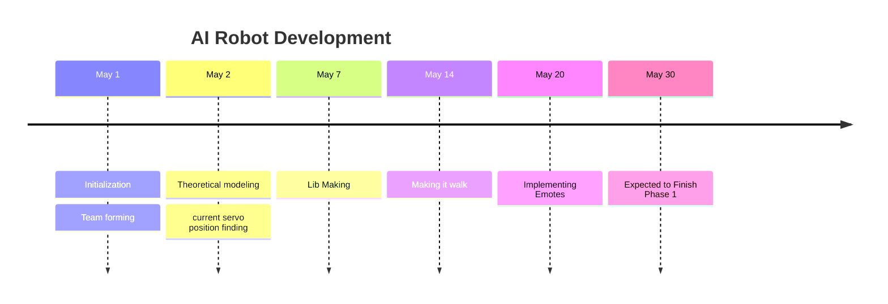

# Development
Our main goal is to make the humanoid robot **walk** .   

 ![[Pasted image 20250427002640.png]]
 

- There are 17 servo motors in the humanoid robot. 
- Initially planning to use [pca9685](https://cdn-shop.adafruit.com/datasheets/PCA9685.pdf) 
- [ ] Have to find the position of all servo motor  

#### Finding the initial position of all servos 

**Initial position** in the sense that  the position of the servo when the robot is in the standing position 

![[Pasted image 20250426211133.png]]

| Servo | Unit       | Position Degrees |
| ----- | ---------- | ---------------- |
| LA1   | Left arm   |                  |
| LA2   | Left arm   |                  |
| LA3   | Left arm   |                  |
| RA1   | Right arm  |                  |
| RA2   | Right arm  |                  |
| RA3   | Right arm  |                  |
| B1    | Left Hip   |                  |
| B2    | Right Hip  |                  |
| LL1   | Left Leg   |                  |
| LL2   | Left Leg   |                  |
| LL3   | Left Leg   |                  |
| RL1   | Right Leg  |                  |
| RL2   | Right Leg  |                  |
| RL3   | Right Leg  |                  |
| LF    | Left Foot  |                  |
| RF    | Right Foot |                  |

## Timeline

