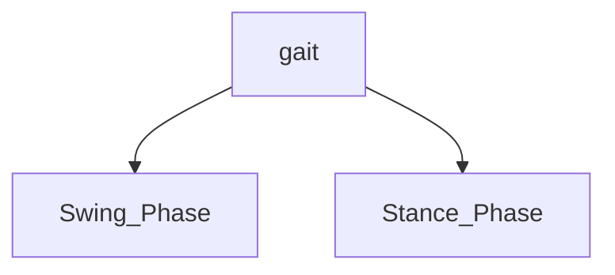

# Walking
The key to walking is to adjust the center of mass. 
-  servo torque limits?
`
```cpp
void WalkForward(){
}
```


## Human Walking
Humanoid walking involves:
- Alternating leg movements (gait cycle)
- Weight shifting between legs
- Arm swinging for balance
- Center of gravity management
### The Gait Cycle

![[Pasted image 20250622213556.png]]


#### Stance Phase (60%)
In this the foot is in contact with the ground 
- Initial contact (heel strike)
- Loading response (foot flat)
- Mid-stance
- Terminal stance (heel off)
- Pre-swing (toe off)
#### Swing Phase  (40%)
Foot is  not in contact with the ground 
- Initial swing
- Mid-swing
- Late swing
![[Pasted image 20250622214203.png]]
