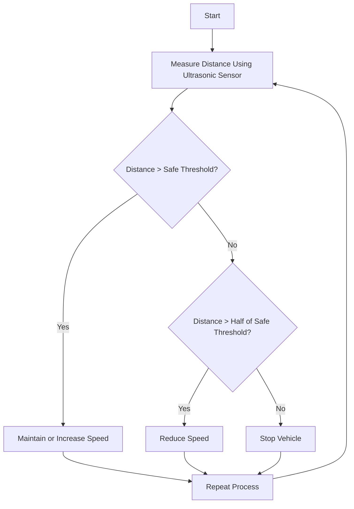

# APAAS
- [[09 Projects/AI-powered accident avoidance System/Versions|Versions]]
- [[01 Projects/AI-powered accident avoidance System/Coding]]

```
raspberry pi:
  username: pi
  password: pi
  wifi:
    essid: pi_wifi
    password: 12345678
```
## Components

**Initial selection**

| Components                                   | Qty | Cost        |
| -------------------------------------------- | --- | ----------- |
| [Raspberry Pi 5](https://amzn.in/d/30wDSem)  | 1   | 8250/-      |
| [Pi Cam](https://amzn.in/d/gbrcEMg)          | 1   | 361/-       |
| 18650 Battery 3.7V                           | 4   | 210/-       |
| [Car Chassis](https://amzn.in/d/c0FgwMO)     | 1   | 678/-       |
| [Boost Converter](https://amzn.in/d/dno182p) | 1   | 296/-       |
| Miscellaneous                                |     | 300/-       |
| Total                                        | -   | 10095/-<br> |


#### 19-03-25

| Components      | Cost |
| --------------- | ---- |
| 3xBattery case  |      |
| Boost Converter | 90/- |
|                 |      |

### **Actuall Sele**

| Sl No. | Component                                                          | Cost      |
| ------ | ------------------------------------------------------------------ | --------- |
| 1      | [L298 Motor Driver](https://amzn.in/d/70eW6LH)                     | ₹ 189/-   |
| 2      | [CP PLUS 64GB microSDXC](https://amzn.in/d/40ZthjA)                | ₹ 549/-   |
| 3      | [Raspberry Pi 5 8GB RAM](https://amzn.in/d/3ER0EV6)                | ₹ 8,135/- |
| 4      | [4-wheel Drive Robot Smart Car Chassis](https://amzn.in/d/aAF5WfR) | ₹ 675/-   |
| 5      | [Raspberry Pi 5Mp](https://amzn.in/d/dqulLAa)                      | ₹ 380/-   |

## Case Study

### Problem Statement

Accidents involving vehicles often occur due to blind spots, lack of pedestrian awareness, and insufficient real-time feedback for drivers. This poses a significant risk to both pedestrians and drivers.

### Initial Solution

==Attach a camera to the car's bonnet== equipped with AI-powered image recognition and real-time processing. This system can ==detect pedestrians, cyclists, and obstacles,== alerting the driver with audible and visual signals. It can also integrate advanced security features such as ==automatic braking, lane departure warnings, and adaptive cruise control==, ensuring pedestrian safety and reducing the likelihood of accidents.

2. Collision Avoidance (CA)
3. AI-based driving assistance system (AI-DAS)
4. Raspberry Pi; OpenCV
5. safety message dissemination
6. multihop broadcast protocol for dissemination^[the action or fact of spreading something] of time-critical emergency messages (EMs) in vehicular ad hoc networks (VANETs)^[https://ieeexplore.ieee.org/document/6675860]
7.  medium access control (MAC)(check this out with the article)

#### Initial Solution Implementation
1. For adaptive cruise control , we have used an [[Interfacing#Ultrasonic Sensor Interfacing|Ultasonic Sensor]]  , to measure the distance to the vehicle ahead. And stop acording to the conditions




2. 