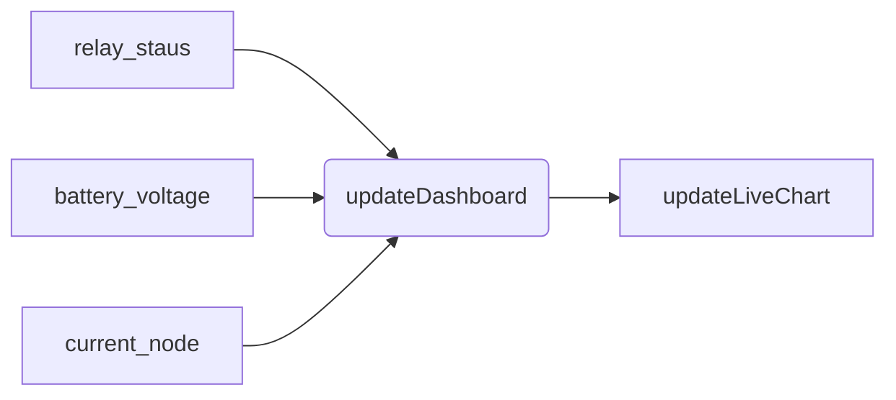

> [!blank|right-small]+ Pages
> There are mainly 4 pages , `Home` , `devices`,`info`, and `about`
>
> - [[Home Page]]
> - [[Device Page]]
> - [[main_page]]
> - [[APIs]]
>   Others
> - [[database]]

# Device Page

The device page should do the following

1. It should show the live reading from the `esp`
2. It should show the past 6 days reading

# Functions
1. updateDashboard()
2. updateLiveChart()
3. updateOldChart_1()
4. updateOldChart_2()
5. updateOldChart_3()
6. updateOldChart_4()
7. updateOldChart_5()
8. updateOldChart_6()

## updateDashboard()



### Get current node 


```javascript
const current_node = document
  .getElementById("current-node")
  .innerHTML.split(":")
  .map((part) => part.trim())[1];
```

### Getting the latest data 
**node**
```js
const current_node = "Chittariparamba";
fetch(`http://localhost:8000/api/data?device_id=${current_node}`)
  .then((response) => {
    // console.log(response);
    return response.json();
  })
  .then((data) => {
    const latest = data[data.length - 1];
    console.log(latest);
  })
  .catch((error) => console.error("Error fetching data:", error));

```
```javascript
fetch(`/api/data?device_id==${current_node}`))
	.then((data) => {
		const latest = data[data.length - 1];
		const batteryElement = document.getElementById("currentbattery-value",);
		batteryElement.textContent = latest.battery_voltage;
	})
	.catch((error) => console.error("Error fetching data:", error));
```

