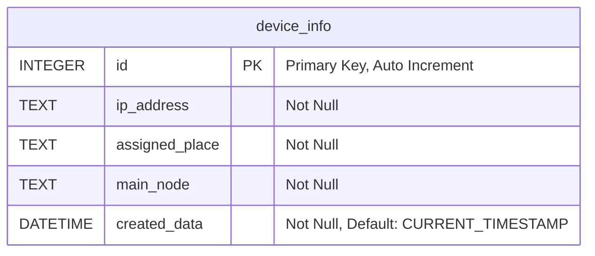
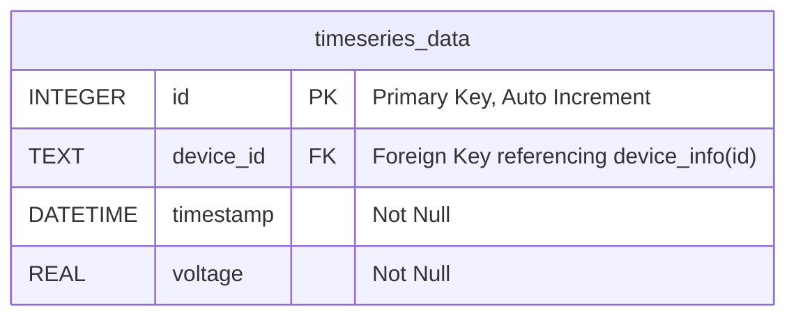
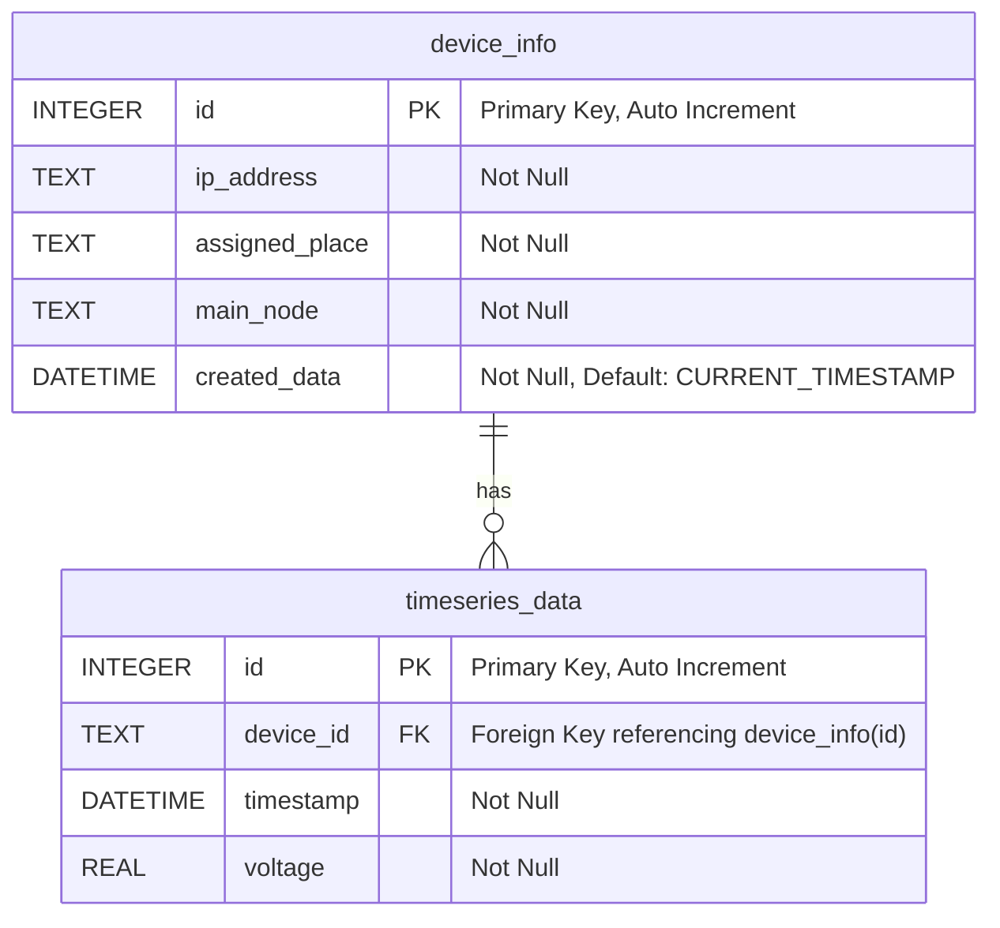

---
tags:
  - website
  - smartcity
dg-publish: true
cssclasses:
  - wide-page
---

# Database 
- [ ] Check if is there any way to minimize the use of database in this project #fix

**Using SQlite3**
```python
import sqlite3
```

```python
sqlite3.register_adapter(datetime, lambda val: val.isoformat())
```
- Used to convert to `ISO 8601` format

## Databses 
There are  2 database 
1. For the device info 
2. and another for the timeseries_data 




---




# Functions
#### 1. Update Random Data  
This is used to test the functionality without actually the microcontroller connected . 

```python
    def update_random_data(self,ip_list):
        self.ip_list = ip_list
        print("Updating random data")
        for ip in self.ip_list:
            print(f"Updating random data for {ip}")
            round_random_voltage = round(random.uniform(8.7, 12), 2)
            self.insert_data(ip ,round_random_voltage)
```
>[!blank|right-small]+ 
>```
>print(ip_list)
>[
>'192.168.1.1',
>'192.168.1.2',
>'192.168.1.3',
>]
>```

It receives a `ip_list` which is the list of ip of all the [[ESP8266]] running . 

#### 2. Inserting Data

```python
    def insert_data(self, device_id, voltage):
        # iam planning to use the ip as the device id .
        timestamp = datetime.now()
        # print(timestamp)
        self.cursor.execute(
            """
        INSERT INTO timeseries_data (device_id, timestamp, voltage)
        VALUES (?, ?, ?)
        """,
            (device_id, timestamp, voltage),
        )
        self.conn.commit()
```
