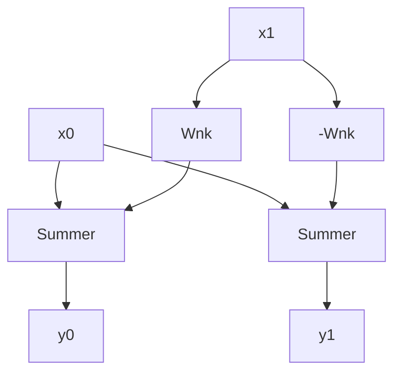

# FFT in Python

```python
import numpy as np

t = np.arange(100)
s = np.sin(0.15 * 2 * np.pi * t)
S = np.fft.fftshift(np.fft.fft(s))
import matplotlib.pyplot as plt

S_mag = np.abs(S)
S_phase = np.angle(S)
plt.plot(t, S_mag, ".-")
plt.plot(t, S_phase, ".-")
plt.show()

```

[Source ](https://pysdr.org/content/frequency_domain.html)

```python
import numpy as np
import matplotlib.pyplot as plt

Fs = 1 # Hz
N = 100 # number of points to simulate, and our FFT size

t = np.arange(N) # because our sample rate is 1 Hz
s = np.sin(0.15*2*np.pi*t)
S = np.fft.fftshift(np.fft.fft(s))
S_mag = np.abs(S)
S_phase = np.angle(S)
f = np.arange(Fs/-2, Fs/2, Fs/N)
plt.figure(0)
plt.plot(f, S_mag,'.-')
plt.figure(1)
plt.plot(f, S_phase,'.-')
plt.show()

```

## Windowing
Windowing is used to avoid sudden transition in first and last samples and which is done by  making the  first and last sample to be equal.
- The way we make up for this cyclic property is through “windowing"
### Common Windowsing Functions

1. Hamming 
2. Hanning 
3. Blackman
4. Keiser 
5. Rectangular -> No Windowing 

![[windows.png]]

```python
s = s * np.hamming(100)

```

## FFT Sizing 
- Between `128 ` to `4096`
- FFT 1,024 out of every 100k samples in a signal and it will still probably look fine, as long as the signal is always on^[https://pysdr.org/content/frequency_domain.html]
## Spectrogram/Waterfall

- Freq over time plot 
- shown by spectrum analyzer 

## FFT Implementation



Where **x0,x1** are the inputs and **y0,y1** are the outputs and $\large W_{N}^k = e^{{j 2 \pi k }\over N}$  --> Twiddle Factor

$$
\begin{align}
y_{0} &=x_{0} + x_{1} W_{N}^k \\ \tag{1}
y_{1} &= x_{0} 0- x_{1} W_{N}^k 
\end{align}
$$


