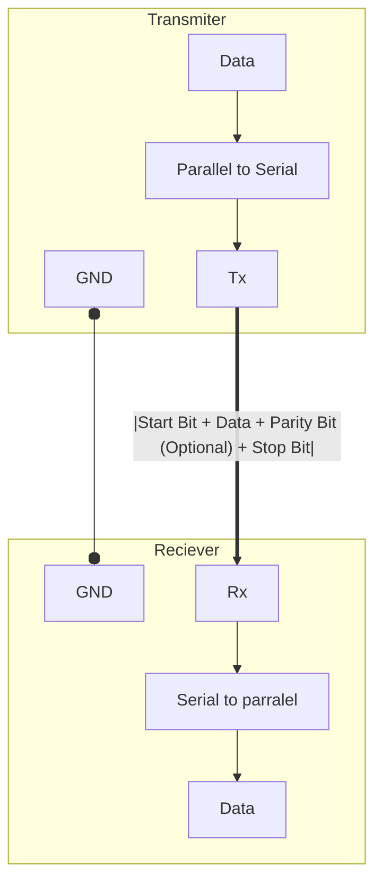

# UART
 - [[#Data Transmission]]
 - [[#References]]
Universal Asynchronous Reciever Transmitter(UART) is a [[Serial Communication]] protocol used to communicate between devices. . It  is used in many applications, such as GPS modules, sensors, and other devices that require communication between devices. for example [[08 Electronics/Embedded Systems/Micro Controllers/Espressif/ESP32 1/ESP32|ESP32]] uses UART to communicate with other devices and  used to a [[USB To TTL]] converter to communicate with the computer, which uses **UART**.

- It is full duplex
- It does not require a clock signal
- It uses start and stop bits to synchronize the data transmission




```python
ODD_PARITY = 0
EVEN_PARITY = 1

class UART:
    def __init__(self):
        self.start_bit = 0
        self.stop_bit = 1
        self.data = []
        self.parity = 0
        self.data_frame = []

    def set_data(self, data):
        self.data = data

    def get_parity(self, is_even):
        if is_even:
            return sum(self.data) % 2  # Even parity
        else:
            return 1 - sum(self.data) % 2  # Odd parity

    def transmit(self, parity_type):
        self.parity = self.get_parity(parity_type == EVEN_PARITY)

        self.data_frame = [
            self.start_bit,
            *self.data,
            self.parity,
            self.stop_bit,
        ]

    def get_tx_data(self):
        return self.data_frame

    def get_og_data(self, tx_data):
        # Validate parity
        received_data = tx_data[1:-2]  # Extract original data
        received_parity = tx_data[-2]
        # HACK: Fix after exam 2025-01-04
        calculated_parity = (
            sum(received_data) % 2
            if tx_data[0] == EVEN_PARITY
            else 1 - sum(received_data) % 2
        )

        if received_parity != calculated_parity:
            raise ValueError("Parity error detected!")

        return received_data

transmitter = UART()
data = [1, 0, 1, 0, 1, 0, 1, 0]  # Example data
transmitter.set_data(data)

transmitter.transmit(ODD_PARITY)

reciever = UART()
received_data_frame = transmitter.get_tx_data()
print("Transmitted Frame:", received_data_frame)

received_data = reciever.get_og_data(received_data_frame)
print("Received Data:", received_data)

```

The UART ==interface does not use a clock signal== to synchronize the transmitter and receiver devices; **it transmits data asynchronously**. Instead of a clock signal, ==the transmitter generates a bitstream based on its clock signal while the receiver is using its internal clock signal to sample the incoming data==.
==The point of synchronization is managed by having the same baud rate on both devices.== Failure to do so may affect the timing of sending and receiving data that can cause discrepancies during data handling. The allowable difference of baud rate is up to 10% before the timing of bits gets too far off.

## Data Transmission
**Prerequisites**
- [[Module 2/Parity]]

- A line is in NRZ(Non-Return to Zero) state => when this line is idle it ==will be logic 1==
- The start is signaled by the transition from logic 1 to 0 of the Tx Line.(for a period 1/BoudRate(reciprocal of boadrate))
- **UART** Sending bits consists of
	1. Start Bit
	2. 8 data bit (5:8 Data bits)
	3. Optional Programmable bit (used as parity)
	4. Stop Bit

> [!NOTE] P-Bit
> P-Bit(Programmable Bit) is a one extra bit before the stop bit t is called **TB8** at transmitter side and **RB8** at receiver side

## Interfacing 
- Connect one's **Tx** to another's **Rx** and vice versa
- and they should share a common ground 

## References
1.https://www.analog.com/en/resources/analog-dialogue/articles/uart-a-hardware-communication-protocol.html
