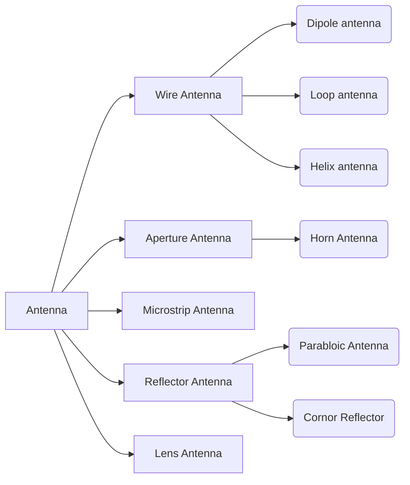
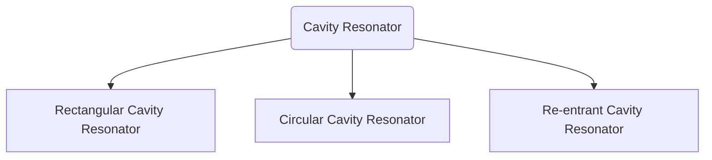

# Micro Wave and Antennas

>[!SUMMARY]+ Table of Contents
>- [[MW#Micro Wave and Antennas|Micro Wave and Antennas]]
>    - [[MW#Syllabus |Syllabus ]]
>    - [[MW#Classes|Classes]]
>    - [[MW#Module 1 |Module 1 ]]
>                - [[MW#Types of antenas|Types of antenas]]
>            - [[MW#Thevenin Equivalent of Antennan System in Tx Mode |Thevenin Equivalent of Antennan System in Tx Mode ]]
>    - [[MW#Module 2|Module 2]]
>            - [[MW#Resonator|Resonator]]
>                - [[MW#Cavity Resonator |Cavity Resonator ]]
>                - [[MW#Q factor|Q factor]]
>            - [[MW#Rectangular Cavity Resonator|Rectangular Cavity Resonator]]
>    - [[MW#Module 2 |Module 2 ]]
>    - [[MW#Module 4 RECTANGULAR RESONATOR AND MICROWAVE TUBES|Module 4 RECTANGULAR RESONATOR AND MICROWAVE TUBES]]
>    - [[MW#References|References]]

- [[MWA Series Exam 2]]

## Syllabus 

### Module 1

- Basic antenna parameters: gain, directivity, beam width and effective aperture calculations, effective height, wave polarization, radiation resistance, radiation efficiency, antenna field zones.
- Duality and Principles of reciprocity
- Helmholtz theorem (derivation required)
- Field, directivity and radiation resistance of a short dipole and half wave dipole (far field derivation).

### Module 2

- Broad band antenna: Principle of Log periodic antenna array and design
- Helical antenna: types and design
- Design of Microstrip Rectangular Patch Antennas and feeding methods
- Principles of Horn, Parabolic dish antenna (expression for E, H and Gain without derivation)
- Mobile phone antenna – Inverted F antenna

### Module 3

- Arrays of point sources
- Field of two isotropic point sources
- Principle of pattern multiplication
- Linear arrays of 'n' isotropic point sources
- Array factor
- Grating lobes
- Design of Broadside, End fire and Dolph Chebyshev arrays
- Concept of Phased array

### Module 4

- Microwaves: Introduction, advantages
- Cavity Resonators: Derivation of resonance frequency of Rectangular cavity
- Single cavity klystron
- Reflex Klystron Oscillators: Derivation of Power output, efficiency and admittance
- Magnetron oscillators: Cylindrical magnetron, Cyclotron angular frequency, Power output and efficiency
- Travelling Wave Tube: Slow wave structures, Helix TWT, Amplification process, Derivation of convection current, axial electric field, wave modes and gain

### Module 5

- Microwave Hybrid circuits: Scattering parameters, Waveguide Tees- Magic tees, Hybrid rings
- Formulation of S-matrix
- Directional couplers: Two hole directional couplers, S-matrix
- Circulators and Isolators
- Phase Shifter
- Microwave Semiconductor Devices: Amplifiers using MESFET
- Principle of Gunn diodes: Different modes, Principle of operation Gunn Diode Oscillators

## Classes
1. [[#Resonator|07.08.2024 9:05AM]]

## Module 1 

**Syllabus**
> Basic antenna parameters:
> >
> > - gain
> > - directivity,
> > - beam width
> > - and effective aperture calculations,
> > - effective height,
> > - wave polarization,
> > - radiation resistance,
> > - radiation efficiency,
> > - antenna field zones.
> > - Duality and Principles of reciprocity,
> > - Helmholtz theorem (derivation required),
> > - Field, directivity and radiation resistance of a short dipole and half wave dipole (far field derivation).

##### Types of antenas

1. Isotropic Antenas
2. Omnidirectional Antena
3. Directive antenas

#### Thevenin Equivalent of Antennan System in Tx Mode 

![[antenna thevenin eq.excalidraw]]
$Vg$ : Voltage Generator 
$Zg$ : Source Impedance 
$Zc$ : Characteristic Impedance of the tx line

## Module 2

#### Resonator
- Used in LC and L and C circuits -> Tuned Circuits and and Oscillators, amplifiers and filters etc..
- Absorbs maximum power when the frequencies are matched -> which is used in [[|lab Experiment]] to determine the frequencies
- At tuned frequencies ($f=f_r$) the **impedance** is real.
- also at resonant frequency ($f = f_r$)
  $$
  Total \ Energy = 2 \times Energy \ Stored \ In \ Resonator
  $$

##### Cavity Resonator 
A length of waveguide (either rectangular,cylindrical or coaxial) shorted at both the ends forms a [[#Resonator]] and it is often called a **Cavity Resonator**

---

- The ==stored electric and magnetic energies inside the resonator decides the equivalent impedance and capacitance== while the ==energy dissipated due to finite conductivity of the cavity walls determine the equivalent resistance of the resonator==[^1]

- The microwave cavities resonates at discrete frequencies called **"Modes of resonance"** 
##### Q factor
The cavity resonator can be also classified according to **Q factor** or **Quality Factor**

- How much energy can it store depends on Q factor.
- Which defines the sharpness of resonance

#### Rectangular Cavity Resonator

![[rectangular waveguide.excalidraw]]

$m,n,p$ -> No of half cycles along the direction $x,y,z$

$$
k = kx^{2}+ ky^{2}+ kz^2
$$

## Module 2 

## Module 4 RECTANGULAR RESONATOR AND MICROWAVE TUBES

## References

[^1]: Chapter 4 , Mircowave Devices and Applications , Dinesh C Dube
