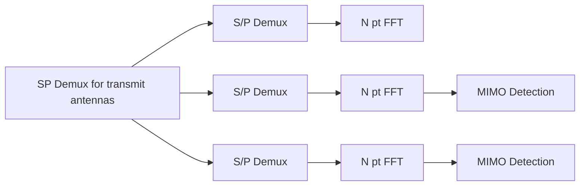
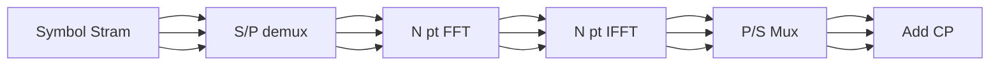
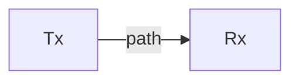
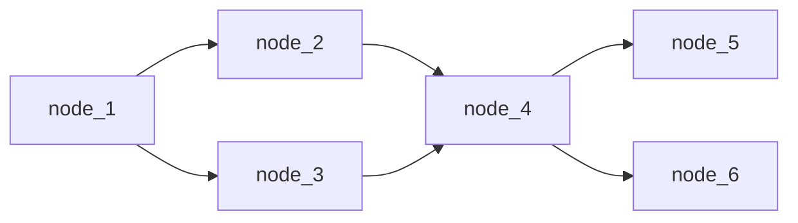
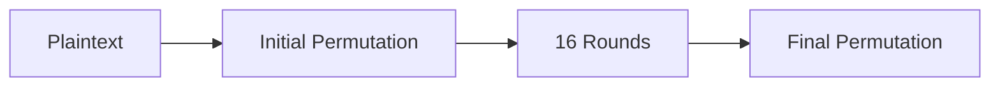
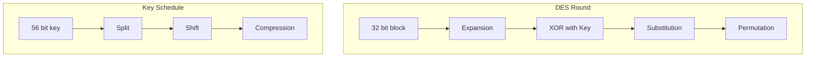
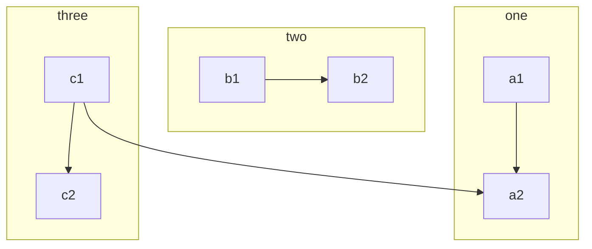

# Class Notes

```tasks
not done
path includes ECT402/Class Notes

```

```tasks
not done
path includes ECT402

```

### 2024-12-17

- Multi carrier Modulation
  _if no noise_
  $$
  y(t) = s(t) =  \sum_{i} X_{i} e^{j 2 \pi f_{i}t}
  $$

<!-- $$ -->
<!-- f_{o}\int_0^{T_{o}}y(t) \left( e^{j 2 \pi f_{i}t}\right) dt = {B\over N} \int_0^{N\over  B} \left(\sum_{i} X_{i} e^{j 2\pi i {B\over N} t}\right) e^{} -->
<!-- $$' -->
<!---->

- [ ] OFDM
- [[Intersymbol Interference]]

## 2024-12-31

### MIMO OFDM(OFDMA)

- Combination of multiple-input multiple-output with OFDM
-



- [ ] Complete

$$
y(n) = \sum_{l=0}^{L-1} H(l)x(n-1) + w(n)
$$

### Effect of Freq Offset in OFDM

- Due to variations in **orthogonality**
- [ ] Inter Carrer Interference (ICI) in OFDM

$$
\large \epsilon = \frac{\Delta f}{{B\over N}}\tag{1}
$$

Where $\epsilon$ -> normalized freq offset

#### Peak to average Power Ratio (PAPR)

$$\text{Peak Power } = \text{Average Power} =  E \large\left\{ |x(f)|^2\right\}= a^2$$

- [ ] Correct

### Single Carrier FDMA(SC-FDMA)

- To reduce the Peak to avg power ratio
- PAPR -> $0dB$

- [ ] Picture



Hypothetical

#### SC_FDMA Reciever

- [ ] Sub Carrier Mapping

### Sub carrier mapping in SC-FDMA

> [!Series]
>
> - [ ] LFDMA & I-FDMA -> {Zero Pad , Interleaving Zeros}

#### PathLoss , Shadowing , Doplar Shift

### 06-01-25

#### Path loss

$$
PL(dB) = 10 \log_{10} \left(\frac{4 \pi d}{\lambda}\right)^2
$$

- inv.prop Wavelength

#### Shadowing

Cause-> **Scattering**, **reflection**,and **diffration** -> results in signal degredation
eg: indor wifi signal cant penetrate through walls

[[#Path loss]] & [[#Shadowing]] -> Large scale fading

#### Multi path effect

- [ ]
- Due to reflections
- Causes: Fading , phase change

#### Diversity Techniques

- Used to compensate for fading channels
- implemented by using two or more receiving antenas,
- done by transmitting ultiple copies

- [[#Space Diversity]]
- [[#Freq Diversity]]
- [[#Angle Diversity]]
- [[#Time Diversity]]

##### Space Diversity



- Multiple antennas are used to receive **Rx**

##### Freq Diversity

- Some freq. fading will be more
- Same info send using multiple carriers
- ie $s_1(t)$ and $s_2(t)$ will carry the same info.

##### Angle Diversity

##### Time Diversity

- Uses different timeslots ,

##### Polarization Diversity

- Uses antennas with different polarization

```mermaid
graph LR

```

---

### 21-02-25

#### 802.11

- DSSS or FHSS -> 802.11(old) -> 1,2 Mbps

##### 802.11a

- Intr OFDM
- 5Ghz Op band
- 54 Mbps

5Ghz bandwidth is devided into 3 -> {UNIT[1:3]}

##### 802.11b

- 2.4GHz
- upto **11Mbps**
- Uses **Complementary COde Keying(CCK)**

##### 802.11g

- 2.4GHz
- 1Mbps to 54Mbps
- Intr FEC(Fwd Error Correction)
- Lower DR{1,2,5.5 & 11}
- High {6,9,12,18,24,36,48,54} <- By using OFDM

| param     | 802.11           | a                                   | b              | g              |     |
| --------- | ---------------- | ----------------------------------- | -------------- | -------------- | --- |
| Freq Band | 2.4 - 2.4835 Ghz | 5.15 - 5.25 Ghz & 5.725 - 5.825 Ghz | same as 802.11 | same as 802.11 |     |
| Av BW     | 83.5Mhz          | 3000Mhz                             | 83.5 Mhz       |                |     |

##### 802.11n

- upto 100Mbps
- Introduced [[MIMO]]

##### 802.11ac( WiFi 5)

- 5Ghz Band
- Multi User MIMO , 256 QAM

##### 802.11 ax(WiFi 6)

- More efficient

#### Hyperlan

- alt{[[#802.11]]}
- div{Hyperlan[1:3], Hyperaccess, HiperLink}

##### Hyperlan1

- 20Mbps in **5GHz** Range

##### 2

- 54Mbps <- Infrastruycture model

##### Hyper access

- Used to provide remote access upto 5Km range

##### Hyper link

used to connect to the backbone



- [ ] Multihub topology with ?
- [ ] Complete WiMax and Wi??? form other notes

## 03-03-25

#### 802.16 WMAN (Metropolitan AN)

- 10GHz - 66Ghz
- IEEE802.16a -> WiMAX

##### Protocol arch

- 20Mhz , 25Mhz in US , 28 in Europe (channel BW)
- uses TDMA (Uplink)

### WiMAX

WiMAX (Worldwide Interoperability for Microwave Access)

- 2-11GHz Bands
- 1.25MHz to 22MHz

- [ ] Fixe vs mobile WiMAX

### Millimeter wave technology

- 10 to 1mm
- 30 - 300 GHz (EHF range)

#### Channel Perfomance at 60Ghz

- [ ] TODO:

=======

### 06-03-25

#### DES (Data Encryption Standard)

AES <- DES

- Block Cipher
- Block size 64 bits , KKey size 56 bits



##### Single Round DES

- Split the 64 bit block into two 32 bit blocks
- Key is split 28 bits each

- [ ] Keep track of permutation?
- [ ] Complete below
- [ ]



##### Avelaanche Effect


