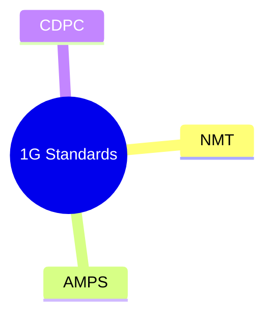

# 1G 
- [Invented:: In 80s]
- It  used [Tech:: Analog Transmission.]
- [Support For:: Voice only]]
- [Frequency:: 824-894MHz]
- [BandWidth:: 30KHz]

**Specs**

```mermaid
mindmap
	root((1G Standards))
		NMT
		AMPS
		CDPC
```