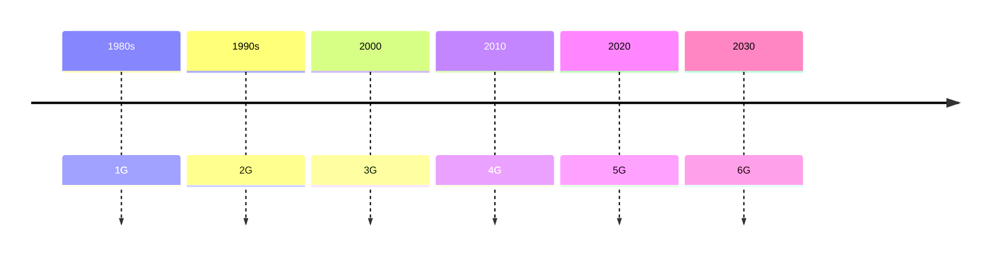
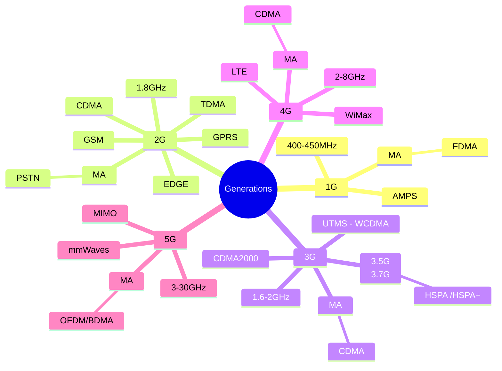
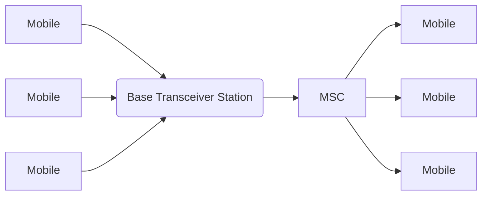

# Module 1
## Module 1 Syllabus 

 - **Introduction to Wireless Communication Systems**
- [x] Generations: 2G, 3G, 4G, 5G. ✅ 2025-04-18
- [x] Wireless LAN, ✅ 2025-04-18
- [x] Bluetooth and Personal Area networks, ✅ 2025-04-18
- [x] Broadband Wireless Access -- WiMAX Technology. ✅ 2025-04-19
- [ ] Wireless Spectrum allocation, Standards.
- **Cellular System Design Fundamentals** 
- [ ] Frequency Reuse, 
- [ ] channel assignment strategies
- [ ] Handoff strategies, 
- [ ] Interference and system capacity, 
- [ ] trunking and grade off service, 
- [ ] improving coverage and capacity – cell splitting,
- [ ] sectoring, microcells.

## Introduction
- At their core, these systems use electromagnetic waves—radio, microwave, sometimes even infrared or millimeter waves—to carry signals across space without needing a physical connection.


- A transmitter takes your information (`voice`, `text`, `video`), converts it into an electrical signal, **and modulates it onto a carrier wave** (a high-frequency signal suitable for transmission).
- That carrier rides through the wireless medium—air, vacuum, sometimes even water.
- A receiver picks it up, demodulates it, and extracts the *original information*.

---

## Generations
Marconi transmitted **Morse code** signals using radio waves wirelessly to a distance of **3.2 KMs** in #1895 





- [[1G]]
- [[2G]]
- [[3G]]
- [[4G]]
- [[5G]]

```dataview
TABLE  
 Invented , max_speed as "Maximum Speed" , Frequency as "Band" , Tech , BandWidth
from #generations 

```

## WLAN
- within an area of building/school etc
- 2.4GHz Band
- the `phy` and `MAC` layer is specified by the IEEE802.11 standard

| Wi-Fi Standards Evolution | Standard | Max Speed   | Frequency | Year Introduced |
| ------------------------- | -------- | ----------- | --------- | --------------- |
| 802.11                    | 2 Mbps   | 2.4 GHz     | 1997      |                 |
| 802.11a                   | 54 Mbps  | 5 GHz       | 1999      |                 |
| 802.11b                   | 11 Mbps  | 2.4 GHz     | 1999      |                 |
| 802.11g                   | 54 Mbps  | 2.4 GHz     | 2003      |                 |
| 802.11n                   | 600 Mbps | 2.4/5 GHz   | 2009      |                 |
| 802.11ac                  | 3.5 Gbps | 5 GHz       | 2014      |                 |
| 802.11ax                  | 9.6 Gbps | 2.4/5/6 GHz | 2019      |                 |
| 802.11be                  | 46 Gbps  | 2.4/5/6 GHz | Est. 2024 |                 |

## Bluetooth
- It also uses the 2.4GHz
- low data rate compared to wifi
- also short distance 
- uses radio waves
## PAN 
*refers to a network of devices connected within a small geographical area*
**eg**: [[#Bluetooth]]

## WiMAX[^1]

[^1]: WiMAX (Worldwide Interoperability for Microwave Access) is a broadband wireless communication technology that provides high-speed internet access over long distances.
- Based on IEEE 802.16 
- 

### Wireless Spectrum allocation, Standards.


## **Cellular System Design Fundamentals**
- It replaces the single big transmitter (high  power) transmitter with many low power transmitter(cells) 

- Making Call



- MSC -> mobile switching center , mobile telecommunication switching center
- Base Transceiver
### Frequency Reuse (Frequency Planning)


The design process of selecting and allocating channel groups for all of the cellular base stations within a system is called frequency reuse or frequency planning. It involves dividing a geographical area into smaller regions, called  cells, and assigning the same set of frequencies to different cells that are spaced sufficiently apart.
### Hand-Off
Q. What are the methods adopted for hand-off procedures

![[Pasted image 20250419190411.png]]
A hard handoff occurs when the old connection is broken before a new connection is activated

A hard handoff is essentially a “break before make” connection.

## Fading 
Q.  how does fading occur , derive the expression for doplar shift
 Fading refers to the variation in signal strength over time or space due to various interference effects
 

## Multiple Access
*It is the application of multiplexing*
1. [[FDMA]]

![[Screenshot_2025_0921_183750.png]]
