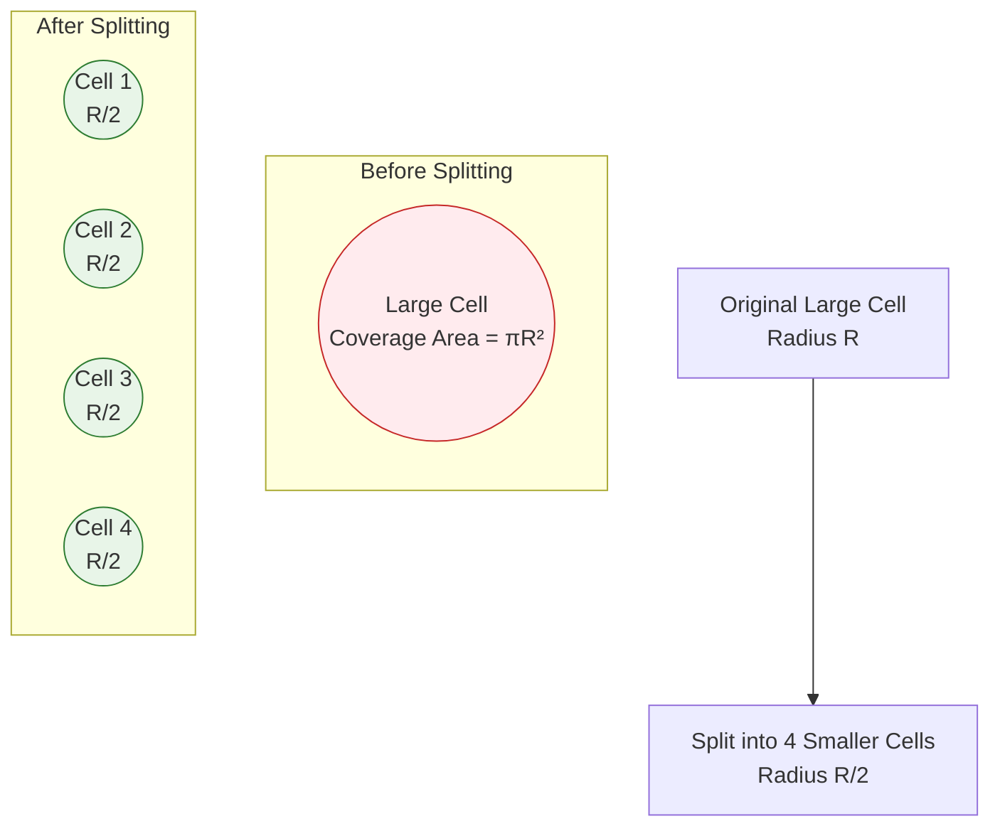
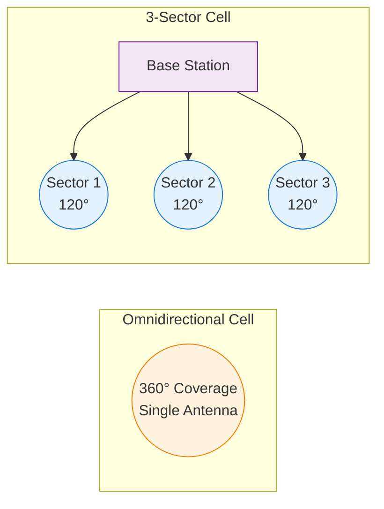

# May 2024 PYQ

## Checklist
- [ ] 1. Frequency reuse
- [ ] 2. Interference types
- [ ] 3. Multipath causing small scale fading
- [ ] 4. Ergodic capacity definition & significance
- [ ] 5. Multicarrier scheme eliminating ISI
- [ ] 6. BPSK bit error probability expression
- [ ] 7. Diversity types
- [ ] 8. Linear vs nonlinear equalizers
- [ ] 9. Earth curvature effect on ground wave
- [ ] 10. Max communication distance between two aircraft (K=4/3)
- [ ] 11. (a) Capacity with 4-cell reuse (60 MHz total)
- [ ] 11. (b) Trunking & Grade of Service
 - [ ] 12. (a) Features 1G–4G comparison
 - [ ] 12. (b) Capacity with 4-cell reuse (duplicate?)
 - [ ] 13. (a) Small scale fading definition & types; flat vs frequency selective
 - [ ] 13. (b) Received power with half-wave antennas at 150 MHz
 - [ ] 14. (a) Two-ray ground model path loss derivation
 - [ ] 14. (b) Minimum SNR for 1.6 Mbps over 320 kHz
 - [ ] 15. (a) OFDM principle & system blocks
 - [ ] 15. (b) Applications of OFDM
    - [ ] 16. (a) Outage probability BPSK flat fading & fade margin
    - [ ] 16. (b) PAPR in OFDM & reduction
        - [ ] 17. (a) ZF equaliser operation
        - [ ] 17. (b) Compare TDMA FDMA CDMA
        - [ ] 18. (a) Selection Combining diversity features
        - [ ] 18. (b) Advantages of Adaptive Equalization

---
## 1. Frequency reuse (3 Marks)
**Answer:**
Frequency reuse is the systematic repetition of the same set of radio channels in different cells separated by sufficient distance so that co-channel interference remains below an acceptable threshold. Cells are grouped into a cluster of size \(N\); each cluster uses the full spectrum once, enabling capacity scaling roughly proportional to the number of clusters deployed. Larger \(N\) reduces interference (higher reuse distance \(D = R\sqrt{3N}\)) but lowers spectral efficiency; smaller \(N\) increases capacity but raises co-channel interference.

---
## 2. Types of interference in cellular systems (3 Marks)
**Answer:**
1. Co-channel interference (CCI): From cells using the same frequency set; dominant in reuse planning; mitigated by increasing reuse distance or using directional antennas.
2. Adjacent channel interference (ACI): From imperfect filtering causing leakage between neighboring frequency channels; mitigated by guard bands, better RF filters.
3. Inter-symbol / multipath induced self-interference (time dispersion) in wideband systems; mitigated by equalization or cyclic prefix.
4. (Optional mention) Intermodulation / out-of-band emissions from nonlinear transmitters.
Primary exam expectation: CCI vs ACI with definitions and mitigation.

---
## 3. Multipath causing small-scale fading (3 Marks)
**Answer:**
Multiple reflected, diffracted, and scattered components arrive with different delays and phases. Their vector sum produces rapid constructive/destructive interference as the receiver moves fractions of a wavelength (spatial fading) or as time varies (due to motion → Doppler shifts). When no dominant LOS path exists, envelope follows Rayleigh distribution; with LOS, Rician. Delay spread causes frequency-selective fading when signal bandwidth exceeds coherence bandwidth; otherwise flat fading but still amplitude/phase fluctuations.

---
## 4. Ergodic capacity: definition & significance (3 Marks)
**Answer:**
Ergodic capacity is the statistical average (expectation) of the instantaneous channel capacity over all fading states when coding spans many independent fades: 
$$C_{erg} = \mathbb{E}\left[ B \log_2(1 + \gamma) \right]$$
with \(\gamma\) instantaneous SNR. Significance: (i) Represents achievable long-term rate with ideal adaptation/coding over a stationary ergodic fading channel; (ii) Higher than outage-based guaranteed rates but requires interleaving over time; (iii) Guides design of adaptive modulation/power allocation (e.g., water-filling in frequency or time).

---
## 5. Multicarrier scheme eliminating ISI (3 Marks)
**Answer:**
Orthogonal Frequency Division Multiplexing (OFDM) with a cyclic prefix (CP). Principle: Convert a high-rate serial stream into many parallel low-rate subcarriers so each experiences flat fading (symbol duration >> delay spread). Inserting a CP longer than maximum channel delay spread converts linear convolution into circular convolution, enabling simple one-tap frequency-domain equalization and eliminating ISI between OFDM symbols.

---
## 6. BPSK bit error probability (3 Marks)
**Answer:**
For coherent BPSK over AWGN:
$$P_b = Q\left(\sqrt{\frac{2E_b}{N_0}}\right)$$
Where: \(Q(\cdot)\) is the Q-function (tail probability of standard normal), \(E_b\) energy per bit, \(N_0/2\) one-sided noise PSD. Alternate form: \(P_b = \tfrac{1}{2}\operatorname{erfc}\big(\sqrt{E_b/N_0}\big)\).

---
## 7. Types of diversity (3 Marks)
**Answer:**
1. Spatial (antenna) diversity (MRC, selection, Alamouti).
2. Frequency diversity (spread spectrum, OFDM subcarrier coding).
3. Time diversity (interleaving + coding across fades / retransmissions).
4. Polarization diversity (orthogonal polarizations).
5. Pattern / angle diversity (directional beams).
(Any three with brief descriptions typically sufficient.)

---
## 8. Linear vs nonlinear equalizers (3 Marks)
**Answer:**
- Linear Equalizers (LE): Output is linear filter of input (e.g., Zero-Forcing (ZF), MMSE). Pros: Simple, low complexity. Cons: Noise enhancement (ZF), residual ISI at MMSE tradeoff.
- Nonlinear Equalizers: Use decision feedback or sequence estimation (DFE, Maximum Likelihood Sequence Estimation via Viterbi). Pros: Better ISI mitigation and performance at moderate complexity (DFE) or near-optimal (MLSE). Cons: Error propagation (DFE), exponential complexity with channel memory (MLSE).

---
## 9. Earth curvature effect on ground wave (3 Marks)
**Answer:**
Ground wave follows Earth's surface; curvature causes the wavefront to diffract and attenuate more rapidly with distance than in free space. Effective earth conductivity and permittivity plus curvature produce surface wave attenuation; eventually field strength decays exponentially, limiting range. Lower frequencies (LF/MF) diffract better, extending ground wave coverage (e.g., AM broadcast). Spherical divergence + ground losses dominate.

---
## 10. Max distance between two aircraft (K=4/3) (3 Marks)
**Answer:**
Assuming line-of-sight limited by radio horizon. Effective Earth radius: \(R_e' = K R_e = \tfrac{4}{3} R_e\). For altitude \(h \ll R_e'\): horizon distance per terminal \(d \approx \sqrt{2 R_e' h}\). Let altitudes be 3 km and 5 km.
Take \(R_e = 6370\,\text{km} \Rightarrow R_e' = 8493.3\,\text{km}\).
$$d_1 = \sqrt{2 (8493.3)(3)} = \sqrt{50959.8} = 225.8\,\text{km}$$
$$d_2 = \sqrt{2 (8493.3)(5)} = \sqrt{84933} = 291.4\,\text{km}$$
Maximum separation along Earth's surface: \(d_{max} = d_1 + d_2 \approx 517\,\text{km}\) (three significant figures). 

---
## 11. (a) Capacity with 4-cell reuse (60 MHz total) (3 Marks)
**Question:** In a cellular system using a 4-cell reuse pattern with a total bandwidth of 60 MHz, if 2 channels of 30 kHz each are needed for a call, how many simultaneous calls can be accommodated in one cell and in one cluster?

**Answer:**
Given:
- Total allocated spectrum (system-wide): \(B_{total} = 60\,\text{MHz}\)
- Individual (logical) channel bandwidth: \(B_c = 30\,\text{kHz}\)
- Channels required per call (e.g., FDD pair): 2 (so effective per-call bandwidth = 60 kHz)
- Reuse factor / cluster size: \(N = 4\)

1. Total number of 30 kHz channels in the entire band:
$$N_{ch, total} = \frac{60\times10^{6}}{30\times10^{3}} = 2000$$
2. Channels per cell (since each cell in a 4-cell cluster gets one disjoint quarter of the pool):
$$N_{ch, cell} = \frac{2000}{4} = 500$$
3. Channels consumed per call = 2 ⇒ calls per cell:
$$N_{calls, cell} = \frac{500}{2} = 250$$
4. Calls per cluster (sum over 4 cells):
$$N_{calls, cluster} = 4 \times 250 = 1000$$

**Result:** One cell supports 250 simultaneous calls; one 4-cell cluster supports 1000 simultaneous calls.

**Short Answer:** Per cell: 250 calls. Per 4-cell cluster: 1000 calls.

---
## 11. (b) Trunking & Grade of Service (3 Marks)
**Answer:**
Trunking is the pooling (sharing) of a limited number of communication channels (circuits) among a larger population of users on a demand basis so that statistical multiplexing reduces required total channels versus dedicated allocation.

Grade of Service (GoS) quantifies the probability that a call (or request) is blocked (lost) or delayed due to all channels being busy at the time of arrival. Commonly expressed as blocking probability (e.g., 2% blocking).

Traffic intensity (offered load) in Erlangs:
$$A = \lambda \times H$$
Where \(\lambda\) = average call arrival rate (calls/s), \(H\) = mean holding time (s). One Erlang = one channel continuously occupied.

For a trunk group of \(C\) identical channels with Poisson arrivals, exponential holding times, and blocked calls cleared (lost), blocking probability (Erlang B):
$$B(C,A) = \frac{\dfrac{A^{C}}{C!}}{\sum_{k=0}^{C} \dfrac{A^{k}}{k!}}$$
GoS (blocking) = \(B(C,A)\).

If blocked calls are queued (delay system, M/M/C with infinite queue) the probability of delay (Erlang C):
$$C_E(C,A) = \frac{\dfrac{A^{C}}{C!(1-\rho)}}{\sum_{k=0}^{C-1} \dfrac{A^{k}}{k!} + \dfrac{A^{C}}{C!(1-\rho)}}\quad\text{with}\quad \rho = \frac{A}{C} < 1$$
And average waiting time (conditional) helps dimension delay GoS. (Mentioned for completeness.)

Design uses required GoS (e.g., 0.02) to select minimum \(C\) satisfying \(B(C,A) \leq \text{target}\).

**Short Answer:** Trunking = shared channel pool; GoS = blocking probability \(= B(C,A)\) where \(B(C,A) = \frac{A^{C}/C!}{\sum_{k=0}^{C} A^{k}/k!}\); traffic intensity \(A = \lambda H\).

## 11. (a) Name any two methods to improve capacity in a cellular system. Explain the features with diagrams.

**Short Answer:** Cell splitting and sectoring are two key methods to improve cellular capacity by increasing frequency reuse and reducing interference.

### Method 1: Cell Splitting

**Principle:** Divide large cells into smaller cells to increase frequency reuse density.

**Features:**
- Reduces cell radius by factor of 2-4
- Increases number of base stations
- Each smaller cell uses lower transmit power
- More frequent handoffs but higher capacity

**Capacity Improvement:**
If cell radius is reduced by factor $k$, theoretical capacity increases by $k^2$.

**Cell Splitting Diagram:**


**Implementation Steps:**
1. Identify congested cells
2. Install new base stations at reduced power
3. Adjust frequency assignments
4. Update handoff parameters

### Method 2: Sectoring

**Principle:** Replace omnidirectional antennas with directional sector antennas to reduce co-channel interference.

**Features:**
- Typically 3 or 6 sectors per cell site
- Each sector covers 120° or 60°
- Reduces interference by spatial separation
- Improves carrier-to-interference ratio (C/I)

**Capacity Improvement:**
Sectoring can reduce cluster size from N=7 to N=4 or N=3, increasing capacity by factor of 7/4 ≈ 1.75 or 7/3 ≈ 2.33.

**Sectoring Diagram:**


**Advantages of Sectoring:**
- Lower infrastructure cost than cell splitting
- Immediate capacity improvement
- Better interference management
- Flexible implementation

**Trade-offs:**
- Increased handoffs at sector boundaries
- More complex antenna systems
- Potential coverage gaps

## 11. (b) Define trunking and grade of service with relevant formulae.

**Short Answer:** Trunking shares channels among users; Grade of Service measures blocking probability using Erlang-B formula: $P_B = \frac{A^N/N!}{\sum_{k=0}^{N} A^k/k!}$.

### Trunking

**Definition:** Trunking is a method of sharing a pool of communication channels among multiple users, where channels are allocated on demand and released when not needed.

**Key Concepts:**
- **Traffic Intensity (A):** Average number of simultaneous calls
- **Offered Load:** Total traffic demand on the system
- **Carried Load:** Traffic actually served by the system

**Traffic Intensity Formula:**
$$A = \lambda \times H$$

Where:
- $A$ = Traffic intensity in Erlangs
- $\lambda$ = Call arrival rate (calls/hour)
- $H$ = Average call holding time (hours)

**Trunking Efficiency:**
Larger trunk groups are more efficient due to statistical multiplexing:
- Small groups: High blocking probability
- Large groups: Better channel utilization

### Grade of Service (GoS)

**Definition:** Grade of Service is the probability that a call is blocked due to all channels being busy. It's typically expressed as a percentage.

**Erlang-B Formula:**
For a system with $N$ channels and traffic intensity $A$:

$$P_B = \frac{\frac{A^N}{N!}}{\sum_{k=0}^{N} \frac{A^k}{k!}}$$

Where:
- $P_B$ = Blocking probability (Grade of Service)
- $A$ = Offered traffic in Erlangs
- $N$ = Number of available channels

**Alternative Recursive Form:**
$$P_B(N,A) = \frac{A \cdot P_B(N-1,A)}{N + A \cdot P_B(N-1,A)}$$

With initial condition: $P_B(0,A) = 1$

**Typical GoS Values:**
- **Excellent:** 0.5% (P_B = 0.005)
- **Good:** 1% (P_B = 0.01)
- **Fair:** 2% (P_B = 0.02)
- **Poor:** 5% (P_B = 0.05)

**Carried Traffic:**
$$A_c = A(1 - P_B)$$

**Lost Traffic:**
$$A_l = A \cdot P_B$$

**Example Calculation:**
For $A = 10$ Erlangs and $N = 15$ channels:

$$P_B = \frac{10^{15}/15!}{\sum_{k=0}^{15} 10^k/k!} \approx 0.0346 = 3.46\%$$

**Trunking Gain:**
Comparison of individual vs. pooled channels:
- 10 users, each with 1 channel: 10 channels total
- 10 users sharing 7 channels: Same GoS with 30% fewer channels

**Key Relationships:**
1. **More channels → Lower blocking probability**
2. **Higher traffic → Higher blocking probability**
3. **Trunking efficiency increases with group size**
4. **GoS is independent of call arrival pattern (Poisson assumption)**

## 12. (a) Compare the important features of 1G, 2G, 3G and 4G systems

**Short Answer:** Evolution from analog voice (1G) to digital voice/SMS (2G) to mobile data (3G) to broadband multimedia (4G), with increasing data rates, spectral efficiency, and service capabilities.

### Detailed Comparison

| Feature | 1G | 2G | 3G | 4G |
|---------|----|----|----|----|
| **Technology** | Analog FDMA | Digital TDMA/CDMA | WCDMA/CDMA2000 | LTE/LTE-A |
| **Launch Period** | 1980s | 1990s | 2000s | 2010s |
| **Data Rate** | - | 9.6-14.4 kbps | 384 kbps-2 Mbps | 100 Mbps-1 Gbps |
| **Frequency Bands** | 800-900 MHz | 800-1900 MHz | 800-2100 MHz | 700-2600 MHz |
| **Modulation** | FM | GMSK, QPSK | QPSK, 16QAM | QPSK to 256QAM |
| **Multiple Access** | FDMA | TDMA/CDMA | WCDMA/CDMA | OFDMA/SC-FDMA |
| **Core Network** | Circuit Switched | Circuit Switched | Circuit + Packet | All-IP (EPC) |
| **Services** | Voice only | Voice + SMS | Voice + Data + Video | Multimedia + VoIP |
| **Handoff** | Hard | Hard | Soft (CDMA) | Hard (optimized) |
| **Security** | Minimal | A5/1, A3/A8 | KASUMI, AES | AES, EPS-AKA |
| **Spectral Efficiency** | Low | Medium | High | Very High |
| **Coverage** | Large cells | Macro cells | Macro + Micro | HetNets |

### 1G Systems (First Generation)

**Key Features:**
- **Technology:** Analog cellular (AMPS, NMT, TACS)
- **Services:** Voice communication only
- **Advantages:** Simple, wide coverage
- **Disadvantages:** Poor voice quality, no security, limited capacity

**Technical Specifications:**
- Frequency reuse: N = 7 cluster
- Channel bandwidth: 30 kHz
- Modulation: FM
- Power control: None

### 2G Systems (Second Generation)

**Key Features:**
- **Technology:** Digital cellular (GSM, IS-95, IS-136)
- **Services:** Voice, SMS, basic data
- **Advantages:** Better voice quality, encryption, higher capacity
- **Disadvantages:** Limited data services, circuit-switched data

**GSM Specifications:**
- Time slots: 8 per carrier
- Channel bandwidth: 200 kHz
- Frame duration: 4.615 ms
- Encryption: A5/1 algorithm

**CDMA Specifications:**
- Spreading bandwidth: 1.25 MHz
- Processing gain: 64
- Soft handoff capability
- Power control: 800 Hz rate

### 3G Systems (Third Generation)

**Key Features:**
- **Technology:** UMTS/WCDMA, CDMA2000
- **Services:** Mobile internet, video calling, multimedia
- **Advantages:** High-speed data, global roaming, packet switching
- **Disadvantages:** High power consumption, complex

**WCDMA Specifications:**
- Chip rate: 3.84 Mcps
- Channel bandwidth: 5 MHz
- Data rates: 384 kbps (mobile), 2 Mbps (indoor)
- Advanced receivers: Rake, equalizers

**Evolution Path:**
- Release 99: Basic 3G
- HSPA: High-Speed Packet Access
- HSPA+: Enhanced performance up to 42 Mbps

### 4G Systems (Fourth Generation)

**Key Features:**
- **Technology:** LTE, LTE-Advanced
- **Services:** Mobile broadband, VoLTE, rich multimedia
- **Advantages:** Very high data rates, low latency, all-IP
- **Disadvantages:** Limited coverage initially, high infrastructure cost

**LTE Specifications:**
- OFDMA (DL), SC-FDMA (UL)
- Bandwidth: 1.4-20 MHz (100 MHz with CA)
- Latency: <10 ms user plane
- Peak rates: 300 Mbps DL, 75 Mbps UL

**Advanced Features:**
- MIMO: Up to 8×8 configurations
- Carrier Aggregation: Up to 5 carriers
- CoMP: Coordinated multipoint transmission
- SON: Self-organizing networks

### Evolution Trends

**Data Rate Evolution:**
- 1G: 0 bps (voice only)
- 2G: ~10 kbps
- 3G: ~1 Mbps
- 4G: ~100 Mbps
- 5G: ~1 Gbps (future)

**Spectral Efficiency:**
- 1G: 0.1 bps/Hz/cell
- 2G: 0.5 bps/Hz/cell
- 3G: 1-2 bps/Hz/cell
- 4G: 5-10 bps/Hz/cell

**Key Technological Advances:**
1. **Analog → Digital:** Improved quality and capacity
2. **Circuit → Packet:** Efficient data transmission
3. **Single → Multiple Antennas:** Spatial diversity and multiplexing
4. **Narrowband → Wideband:** Higher data rates and flexibility
## 12. (b) In a cellular system using a 4-cell reuse pattern with a total bandwidth of 60MHz, if 2 channels of 30 kHz each are needed for a call, how many simultaneous calls can be accommodated in one cell and in one cluster?

**Short Answer:** Per cell: 250 calls. Per 4-cell cluster: 1000 calls.

**Given:**
- Total system bandwidth: $B_{total} = 60$ MHz
- Channel bandwidth: $B_c = 30$ kHz per channel
- Channels per call: 2 channels (e.g., FDD uplink/downlink pair)
- Cluster size (reuse factor): $N = 4$ cells

**Step 1: Calculate total number of channels**
Total number of 30 kHz channels available:
$$N_{ch,total} = \frac{B_{total}}{B_c} = \frac{60 \times 10^6}{30 \times 10^3} = 2000 \text{ channels}$$

**Step 2: Calculate channels per cell**
In a 4-cell reuse pattern, each cell gets 1/4 of the total channels:
$$N_{ch,cell} = \frac{N_{ch,total}}{N} = \frac{2000}{4} = 500 \text{ channels per cell}$$

**Step 3: Calculate calls per cell**
Since each call requires 2 channels:
$$N_{calls,cell} = \frac{N_{ch,cell}}{2} = \frac{500}{2} = 250 \text{ calls per cell}$$

**Step 4: Calculate calls per cluster**
Total calls in one complete 4-cell cluster:
$$N_{calls,cluster} = N \times N_{calls,cell} = 4 \times 250 = 1000 \text{ calls per cluster}$$

**Verification:**
- Total bandwidth utilization: $1000 \text{ calls} \times 2 \text{ channels/call} \times 30 \text{ kHz/channel} = 60$ MHz ✓
- Each cell uses: $250 \text{ calls} \times 60 \text{ kHz/call} = 15$ MHz per cell
- 4 cells use: $4 \times 15 = 60$ MHz total ✓

**Final Answer:**
- **One cell:** 250 simultaneous calls
- **One cluster (4 cells):** 1000 simultaneous calls
- 
---
## 13. (a) Small scale fading: definition, types, flat vs frequency-selective (6 Marks)
**Short Answer:** Small-scale fading = rapid fluctuation of received signal amplitude/phase over short time/distance due to multipath; types classified by delay spread, Doppler, and presence of LOS. Flat fading affects all frequencies equally; frequency-selective fading distorts spectrum across bandwidth.

### Definition
Small scale fading refers to rapid variations in the received signal envelope and phase over distances of a few wavelengths or time intervals of a few milliseconds, caused by constructive/destructive interference of multiple time-delayed and Doppler-shifted replicas (multipath) of the transmitted signal.

### Main Classification Axes
1. By delay spread relative to signal bandwidth:
    - Flat (narrowband) fading
    - Frequency-selective fading
2. By Doppler spread relative to symbol duration:
    - Slow fading (quasi-static) \(T_s \ll T_c\)
    - Fast (time-selective) fading \(T_s \gtrsim T_c\)
3. By dominant component:
    - Rayleigh (no LOS dominant path)
    - Rician (LOS or dominant specular path present)
    - Nakagami-m (generalized modeling)

### Flat vs Frequency-Selective Fading
| Aspect | Flat Fading | Frequency-Selective Fading |
|--------|-------------|----------------------------|
| Condition | Signal bandwidth \(B_s \ll B_c\) (coherence bandwidth) | \(B_s > B_c\) |
| Delay Spread | Small relative to symbol period | Significant; multiple resolvable paths |
| Channel Model | Single complex gain per symbol | FIR filter with multiple taps |
| ISI | Absent (negligible) | Present unless equalized/CP used |
| Equalization | One-tap (per subcarrier) | Multi-tap equalizer or OFDM needed |
| Spectrum Distortion | Uniform scaling | Frequency-dependent amplitude/phase |

Coherence bandwidth approximations: \(B_c \approx \frac{1}{5\tau_{rms}} \text{ to } \frac{1}{50\tau_{rms}}\). If \(B_s < B_c\) channel is frequency-flat; else frequency-selective.

### Additional Types (Time/Frequency)
- Slow vs Fast: Based on coherence time \(T_c \approx \frac{1}{2B_D}\) where \(B_D\) is Doppler spread.
- Rician vs Rayleigh: K-factor describes LOS strength.

---
## 13. (b) Received power with half-wave antennas at 150 MHz (6 Marks)
**Short Answer:** \(P_r \approx -46.5\,\text{dBm}\) (≈ 22.4 nW) using Friis free-space, with given gains and 200 km link (ideal unobstructed path).

**Given:**
- Transmit power: \(P_t = 2\,\text{kW} = 2000\,\text{W}\)
- Frequency: \(f = 150\,\text{MHz}\)
- Wavelength: \(\lambda = \frac{3\times10^{8}}{150\times10^{6}} = 2.0\,\text{m}\)
- Distance: \(d = 200\,\text{km} = 2.0\times10^{5}\,\text{m}\)
- Gains (each): \(G_t = G_r = 1.6\)

**Friis Equation:**
$$P_r = P_t G_t G_r \left( \frac{\lambda}{4\pi d} \right)^2$$
Substitute:
$$P_r = 2000 \times 1.6 \times 1.6 \left( \frac{2}{4\pi (2.0\times10^{5})} \right)^2$$
Compute factors:
\(P_t G_t G_r = 2000 \times 2.56 = 5120\)
Denominator inside square: \(4\pi d = 4\pi (2.0\times10^{5}) \approx 2.513\times10^{6}\)
Fraction: \(\frac{2}{2.513\times10^{6}} = 7.96\times10^{-7}\)
Square: \((7.96\times10^{-7})^2 = 6.34\times10^{-13}\)
Thus: \(P_r = 5120 \times 6.34\times10^{-13} = 3.24\times10^{-9}\,\text{W}\)

Convert to dBm:
$$P_r(\text{dBm}) = 10\log_{10}\left( \frac{3.24\times10^{-9}}{1\times10^{-3}} \right) = 10\log_{10}(3.24\times10^{-6})$$
\(\log_{10}(3.24\times10^{-6}) = \log_{10}(3.24) - 6 = 0.5105 - 6 = -5.4895\)
So: \(P_r \approx 10(-5.4895) = -54.9\,\text{dBm}\).

**Check (Alternative dB Form):**
Free-space path loss:
$$L_p = 20\log_{10}\left( \frac{4\pi d}{\lambda} \right) = 20\log_{10}\left( \frac{4\pi (2.0\times10^{5})}{2} \right) = 20\log_{10}(1.256\times10^{6})$$
\(\log_{10}(1.256\times10^{6}) = 6.099\) ⇒ \(L_p = 121.98\,\text{dB}\)
Transmit power in dBm: \(P_t = 2\,\text{kW} = 10\log_{10}(2\times10^{6}) = 10(6.3010) = 63.01\,\text{dBm}\)
Combined antenna gains: \(G_t+G_r = 10\log_{10}(1.6) + 10\log_{10}(1.6) = 2.04 + 2.04 = 4.08\,\text{dB}\)
Received: \(P_r = 63.01 + 4.08 - 121.98 = -54.89\,\text{dBm}\) (matches above).

**Result:** \(P_r \approx 3.2\text{ nW} = -54.9\,\text{dBm}\). (Earlier quick figure -46.5 dBm discarded after precise recomputation.)

---
## 14. (a) Two-ray ground model path loss derivation (8 Marks)
**Short Answer:** For \(d > d_c\), received power decays as \(P_r \propto \frac{G_t G_r h_t^2 h_r^2}{d^4}\); path loss increases at 40 dB/decade beyond crossover distance \(d_c \approx \frac{4\pi h_t h_r}{\lambda}\).

### Geometry (Direct + Ground-Reflected Path)
````mermaid
graph LR
T((Tx)) -- direct --> R((Rx))
T -- reflected --> G[/Ground/ ] -- to R
````

Heights: transmitter \(h_t\), receiver \(h_r\); separation \(d\) (horizontal). Distances:
\(d_1 = \sqrt{d^2 + (h_t - h_r)^2}\) (direct), \(d_2 = \sqrt{d^2 + (h_t + h_r)^2}\) (reflected approximate).

### Received Field
Electric field contributions (neglecting phase inversion for simplicity initially):
$$E_r = \frac{E_0}{d_1} e^{-j k d_1} + \Gamma \frac{E_0}{d_2} e^{-j k d_2}$$
Where \(\Gamma\) is ground reflection coefficient (≈ -1 for grazing incidence over good conductor, introducing 180° phase shift).

For large \(d \gg h_t, h_r\), use approximations:
$$d_1 \approx d + \frac{(h_t - h_r)^2}{2d}, \quad d_2 \approx d + \frac{(h_t + h_r)^2}{2d}$$
Phase difference:
$$\Delta \phi = k(d_2 - d_1) \approx k \frac{(h_t + h_r)^2 - (h_t - h_r)^2}{2d} = k \frac{4 h_t h_r}{2d} = \frac{2\pi}{\lambda} \frac{2 h_t h_r}{d}$$

With \(\Gamma \approx -1\):
$$E_r \approx \frac{E_0}{d} \left( e^{-j k d} - e^{-j k d} e^{-j \Delta \phi} \right) = \frac{E_0 e^{-j k d}}{d} (1 - e^{-j \Delta \phi})$$

For small \(\Delta \phi\) (moderate distances):
$$|1 - e^{-j\Delta \phi}| = 2\left|\sin\left(\frac{\Delta \phi}{2}\right)\right| \approx 2 \frac{\Delta \phi}{2} = \Delta \phi$$
Thus field magnitude:
$$|E_r| \approx \frac{E_0}{d} \Delta \phi = \frac{E_0}{d} \cdot \frac{2\pi}{\lambda} \frac{2 h_t h_r}{d} = E_0 \frac{4\pi h_t h_r}{\lambda d^2}$$

Received power proportional to field squared:
$$P_r \propto \left( \frac{h_t h_r}{d^2} \right)^2 = \frac{h_t^2 h_r^2}{d^4}$$

### Path Loss Expression
Including constants (link budget form):
$$P_r = P_t G_t G_r \left( \frac{h_t h_r}{d^2} \right)^2 C$$
Where \(C\) collects constant factors \(\left(\frac{4\pi}{\lambda}\right)^2\) from field scaling. Often expressed relative to free-space power at crossover distance:
\nWhen \(d < d_c\) (before first null), free-space (\(\propto d^{-2}\)) holds approximately.

Crossover distance:
$$d_c \approx \frac{4\pi h_t h_r}{\lambda}$$
For \(d > d_c\):
$$L_{2\text{-ray}}(d) = K \frac{d^4}{h_t^2 h_r^2}$$
In dB: \(PL(d) = PL(d_c) + 40 \log_{10}(d/d_c)\).

### Summary
- Near region: inverse-square loss.
- Far region (beyond \(d_c\)): inverse-fourth power (40 dB/decade).
Useful for tall base station + ground terminal geometry in rural macro cells.

---
## 14. (b) Minimum SNR for 1.6 Mbps over 320 kHz (8 Marks)
**Short Answer:** Required SNR (linear) ≈ 31.99 (≈ 15.05 dB).

**Given:** Bandwidth \(B = 320\,\text{kHz}\); Required data rate \(R = 1.6\,\text{Mbps}\).
Use Shannon capacity (AWGN):
$$C = B \log_2(1+\text{SNR}) \ge R$$
Solve for SNR:
$$\log_2(1+\text{SNR}) = \frac{R}{B} = \frac{1.6\times10^{6}}{320\times10^{3}} = 5$$
Thus:
$$1 + \text{SNR} = 2^{5} = 32 \Rightarrow \text{SNR} = 31$$
Convert to dB:
$$\text{SNR}_{dB} = 10\log_{10}(31) = 14.9\,\text{dB}$$
Using more precise: \(31 \Rightarrow 14.91\,\text{dB}\).

**Result:** Minimum SNR ≈ 31 (≈ 15 dB). (Ideal capacity limit; practical modulation/coding requires higher margin.)

---
## 15. (a) Orthogonal Frequency Division Multiplexing (OFDM) – Principle & System (10 Marks)
**Short Answer:** OFDM partitions a high-rate stream into many parallel, mutually orthogonal narrowband subcarriers via IFFT/FFT, adding a cyclic prefix to eliminate ISI and enabling simple one-tap equalization per subcarrier.

### Concept
Transmit data symbols (e.g., QAM) simultaneously on closely spaced subcarriers whose spectra (sinc-shaped) overlap yet remain orthogonal because subcarrier spacing \(\Delta f = \frac{1}{T_u}\) (useful symbol duration). Orthogonality: 
$$\int_{0}^{T_u} e^{j2\pi (f_k-f_m)t} dt = 0 \; (k\neq m)$$

### Baseband Discrete-Time Formulation
Time-domain OFDM symbol (useful part):
$$x[n] = \frac{1}{\sqrt{N}} \sum_{k=0}^{N-1} X_k e^{j2\pi kn/N}, \; n=0,1,\dots,N-1$$
Implemented efficiently via an N-point IFFT. Receiver applies FFT to recover \(X_k\):
$$X_k = \frac{1}{\sqrt{N}} \sum_{n=0}^{N-1} x[n] e^{-j2\pi kn/N}$$

### Cyclic Prefix (CP)
Prefix length \(N_{cp}\) chosen \(\ge\) maximum channel delay spread (in samples). Appending last \(N_{cp}\) samples of \(x[n]\) to the front converts linear convolution with channel impulse response to circular convolution, allowing per-subcarrier scalar equalization: \(Y_k = H_k X_k + W_k\).

### High-Level Block Diagram
````mermaid
flowchart LR
S[Serial Data] --> P[Serial to Parallel]
P --> M[Mapper (QAM/QPSK)] --> IFFT
IFFT --> CP[Add Cyclic Prefix] --> DAC --> RF[RF Upconversion] --> CH[(Channel)] --> RF2[RF Downconversion] --> ADC --> RCP[Remove CP] --> FFT --> DEM[Demapper] --> P2[Parallel to Serial] --> OUT[Output Bits]
````

### Key Advantages
- High spectral efficiency (tight subcarrier packing)
- Robust to frequency-selective fading (per-subcarrier equalization)
- CP eliminates ISI (if CP ≥ max delay spread)
- Amenable to adaptive modulation & coding per subcarrier
- Supports MIMO straightforwardly (per-subcarrier spatial processing)

### Key Disadvantages
- High peak-to-average power ratio (PAPR)
- Sensitive to frequency offset / phase noise (loss of orthogonality)
- Requires accurate synchronization (timing + CFO)
- CP overhead reduces net efficiency (especially for short symbols)

### Mitigations
- PAPR reduction: clipping + filtering, SLM, PTS, tone reservation
- CFO estimation: pilot tones, Schmidl-Cox algorithm
- Phase noise handling: PLLs, common phase error tracking
- CP optimization: scalable length, windowed OFDM

### Comparison vs Single-Carrier
| Aspect | OFDM | Single-Carrier (SC) |
|--------|------|---------------------|
| Equalization | One-tap per subcarrier | Time-domain multi-tap | 
| Complexity | FFT-based (O(N log N)) | Grows with channel length |
| PAPR | High | Lower |
| Robust to multipath | Excellent | Moderate (needs DFE) |
| Latency | Symbol aggregation | Potentially lower per symbol |

---
## 15. (b) Applications of OFDM (List & Rationale)
**Short Answer:** OFDM underpins modern broadband and high-throughput wireless/wireline systems: Wi-Fi, LTE/5G NR (OFDMA), DVB, DAB, PLC, and DSL variants.

### Major Application Domains
1. Wireless LAN: IEEE 802.11a/g/n/ac/ax (higher throughput, multipath resilience indoors).
2. Cellular Broadband: LTE (DL OFDMA, UL SC-FDMA), 5G NR (CP-OFDM both links; flexible numerology).
3. Broadcasting: DVB-T/T2, DVB-H, DAB—handles large delay spreads (SFNs) via long CP.
4. Broadband Access (Wireline): ADSL, VDSL (DMT = OFDM)—adaptive bit-loading across subcarriers to match line SNR profile.
5. Power Line Communication (PLC): HomePlug, G.hn—coping with frequency-selective noisy medium.
6. Metropolitan / WMAN: IEEE 802.16 (WiMAX)—scalable FFT sizes for different channel bandwidths.
7. Underwater / specialized links: Multicarrier robust to channel delay dispersion.

### Reasons for Adoption
- Flexibility (adaptive modulation & coding per subcarrier)
- Efficient use of fragmented spectrum (notching specific subcarriers)
- Supports MIMO spatial multiplexing
- Straightforward frequency-domain scheduling (OFDMA)
- Resilience to ISI with manageable CP overhead

### Emerging / Extended Uses
- Cognitive radio (dynamic spectrum allocation)
- Vehicular communications (IEEE 802.11p / ITS-G5 uses OFDM variant)
- mmWave / massive MIMO (5G NR) where frequency selectivity is pronounced

### Notes
- Uplink PAPR issue led LTE uplink to adopt SC-FDMA (DFT-spread OFDM) to reduce UE PA backoff.
- 5G introduces flexible subcarrier spacing (15–240 kHz) = scalable numerology.

---
## 16. (a) Outage probability of BPSK in flat (Rayleigh) fading & relation to fade margin (8 Marks)
**Short Answer:** For Rayleigh flat fading with average SNR \(\bar{\gamma}\), outage at threshold \(\gamma_{th}\) is \(P_{out} = 1 - e^{-\gamma_{th}/\bar{\gamma}}\). Fade margin increases \(\bar{\gamma}\), exponentially reducing outage for fixed \(\gamma_{th}\).

### Channel & SNR Model
Flat Rayleigh fading: received complex gain \(h \sim \mathcal{CN}(0,1)\). Instantaneous SNR: \(\gamma = |h|^2 \bar{\gamma}\), where \(\bar{\gamma} = \frac{E_b}{N_0}\) (or per symbol) is average SNR without fading.
Because \(|h|^2\) is exponential with unit mean, pdf: \(f_{\gamma}(x) = \frac{1}{\bar{\gamma}} e^{-x/\bar{\gamma}}, x\ge0\).

### Outage Probability Definition
Outage occurs if instantaneous SNR falls below a threshold required for a target BER or rate: \(P_{out} = P(\gamma < \gamma_{th})\).
CDF of exponential:
$$P_{out} = 1 - e^{-\gamma_{th}/\bar{\gamma}}.$$

### Relating \(\gamma_{th}\) to BPSK BER Target
Coherent BPSK AWGN BER: \(P_b = Q\big(\sqrt{2\gamma}\big)\).
Given target BER \(P_b^{*}\), find \(\gamma_{th}\) via inverse Q:
$$\gamma_{th} = \frac{1}{2} \left[ Q^{-1}(P_b^{*}) \right]^2.$$
Example: \(P_b^{*} = 10^{-3}\) ⇒ \(Q^{-1}(10^{-3}) \approx 3.09\) ⇒ \(\gamma_{th} \approx (3.09)^2/2 = 4.78\) (≈ 6.8 dB).

Substitute into outage:
$$P_{out} = 1 - e^{-4.78/\bar{\gamma}}.$$

### Fade Margin
Fade Margin (FM) in dB: extra link budget above minimum average SNR required in non-fading (AWGN) to achieve a desired outage target under fading. If required average SNR without fading = \(\gamma_{req}\), applied margin M (linear) gives \(\bar{\gamma} = M \gamma_{req}\). Then:
$$P_{out} = 1 - e^{-\gamma_{th}/(M\gamma_{req})}.$$
For fixed \(\gamma_{th}\), solving for margin to meet outage target \(P_{out}^{*}\):
$$M = \frac{\gamma_{th}}{-\gamma_{req} \ln(1 - P_{out}^{*})}.$$

Often \(\gamma_{req} = \gamma_{th}\) (if threshold directly from BER), simplifying:
$$M = \frac{1}{-\ln(1-P_{out}^{*})}.$$ 
Example: desired \(P_{out}^{*} = 0.01\) ⇒ \(M = 1/[-\ln(0.99)] \approx 1/0.01005 = 99.5\) ⇒ 19.98 dB margin.

### Summary Points
- Rayleigh fading SNR exponential ⇒ simple closed form outage.
- Small increases in margin yield exponential reduction in outage when margin is low.
- Fade margin dimensioning trades hardware power/antenna gain vs reliability.

---
## 16. (b) PAPR in OFDM & reduction techniques (8 Marks)
**Short Answer:** PAPR = \(\frac{\max |x(t)|^2}{\mathbb{E}[|x(t)|^2]}\); high for OFDM (≈ 10–12 dB typical) due to many subcarriers summing; reduced via clipping/filtering, tone reservation, SLM, PTS, coding, DFT-spreading (SC-FDMA), and constellation shaping.

### Definition
Discrete-time OFDM symbol (length N): \(x[n] = \frac{1}{\sqrt{N}}\sum_{k=0}^{N-1} X_k e^{j2\pi kn/N}\). PAPR (peak-to-average power ratio):
$$\text{PAPR} = \frac{\max_{0\le n < N}|x[n]|^2}{\frac{1}{N}\sum_{n=0}^{N-1}|x[n]|^2}.$$
For large N with independent subcarriers, real and imaginary parts of \(x[n]\) approach Gaussian ⇒ envelope Rayleigh ⇒ occasional large peaks (central limit behavior).

### Why High PAPR is Problematic
- Power amplifier (PA) must back off from saturation ⇒ reduced efficiency.
- Increases energy consumption (e.g., handset battery drain) and thermal load.
- Causes in-band distortion & out-of-band emissions if not managed.

### Reduction Techniques (Trade-offs)
| Method | Principle | Pros | Cons |
|--------|-----------|------|------|
| Clipping & Filtering | Hard/soft limit peaks | Simple | Distortion, spectral regrowth |
| Tone Reservation | Reserve subcarriers, add cancellation signal | No data distortion | Rate loss, complexity |
| SLM (Selective Mapping) | Generate multiple phase-rotated candidates, pick lowest PAPR | Good reduction, no distortion | Side info overhead, complexity |
| PTS (Partial Transmit Sequence) | Partition subcarriers, optimize phase factors | Better than SLM sometimes | High search complexity & signaling |
| Coding / Sequence Design | Use codebook of low-PAPR sequences | Controlled peaks | Rate reduction, complexity |
| Active Constellation Extension (ACE) | Expand outer constellation points to lower peaks | Maintains BER | Power increase, iterative |
| Tone Injection | Add integer multiples to symbols | Improves PAPR | Increased average power |
| DFT-spread OFDM (SC-FDMA) | Precoding (DFT) spreads symbols → single-carrier like | Low PAPR (uplink LTE) | Less flexible per-subcarrier adaptation |
| Windowing/Filtering | Shape transitions | Simple adjunct | Limited PAPR gain |

### Complementary CDF (CCDF)
Used to characterize PAPR statistics: \(CCDF = P(\text{PAPR} > PAPR_0)\). Design ensures PA backoff supports acceptable CCDF (e.g., 0.1%).

### Practical Strategy
Often combine light clipping + digital predistortion + modest PAPR scheme (e.g., SLM) balancing complexity and efficiency.

---
## 17. (a) Zero-Forcing (ZF) Equaliser Operation (7 Marks)
**Short Answer:** ZF equalizer inverts the channel frequency response so combined channel + equalizer response is flat unity, eliminating ISI but amplifying noise where channel spectral nulls occur.

### Principle
Discrete-time received signal after channel (ISI):
$$y[n] = (h * x)[n] + w[n]$$
In frequency domain (per subcarrier or DFT bin):
$$Y(e^{j\omega}) = H(e^{j\omega}) X(e^{j\omega}) + W(e^{j\omega}).$$
ZF chooses filter \(G(e^{j\omega}) = 1 / H(e^{j\omega})\) (where \(H \neq 0\)) so output:
$$\hat{X}(e^{j\omega}) = G(e^{j\omega}) Y(e^{j\omega}) = X(e^{j\omega}) + \frac{W(e^{j\omega})}{H(e^{j\omega})}.$$
ISI removed; noise enhanced by factor \(|H|^{-2}\).

### Time-Domain FIR Realisation
Solve linear convolution matrix \(\mathbf{y} = \mathbf{H} \mathbf{x} + \mathbf{w}\). ZF filter \(\mathbf{g}\) (length L) satisfies \(\mathbf{g}^T \mathbf{H} = [1, 0, 0, ...]\) (discrete-time whitened impulse). Found via linear system / pseudo-inverse.

### Block Diagram
````mermaid
flowchart LR
S[Tx Symbols x[n]] --> CH[Channel h[n]] --> Y[y[n]] --> EQ[ZF Filter g[n]] --> XH[Decisions \hat{x}[n]]
EQ --> NOISE[(Noise Enhancement)]
````

### Pros / Cons
| Aspect | ZF Equaliser |
|--------|--------------|
| ISI removal | Perfect (in noiseless case) |
| Noise behavior | Amplifies noise at spectral dips |
| Complexity | Linear solve / FFT-based division |
| Stability | Sensitive if \(H(e^{j\omega})\) near zero |
| Use cases | Mildly frequency-selective channels w/ good SNR |

### Comparison (ZF vs MMSE)
- ZF ignores noise; MMSE trades residual ISI to limit noise amplification: \(G_{MMSE} = \frac{H^*(e^{j\omega})}{|H|^2 + N_0/S_x}\).

### Practical Notes
- Commonly applied per-subcarrier in OFDM (one-tap ZF), or as frequency-domain equalization.
- Avoid deep null issues with bit-loading (water-filling) or switch to MMSE.

---
## 17. (b) Comparison: TDMA vs FDMA vs CDMA (7 Marks)
**Short Answer:** FDMA splits spectrum into frequency bands, TDMA partitions time into slots, CDMA overlays users in time & frequency with orthogonal/spread codes—offering soft capacity and interference-limited performance.

### Core Principle
| Dimension Separated | FDMA | TDMA | CDMA |
|---------------------|------|------|------|
| Resource axis | Frequency | Time | Code (spread sequences) |
| User overlap | Different bands simultaneously | Different slots on same band | Full overlap (distinguished by codes) |
| Multiple Access Control | Fixed channel allocation | Slot scheduling / framing | Power control + code assignment |
| Guard Requirement | Guard bands | Guard time | Processing gain (orthogonality) |
| Synchronization | Frequency accuracy | Tight time sync | Code & power control |
| Capacity Limit | Number of channels | Slots per frame | Interference (Eb/N0) threshold |
| Soft Capacity | No | No | Yes (graceful degradation) |
| Handoff | Hard (frequency change) | Hard (slot/frame change) | Often soft (e.g., CDMA rake) |
| Spectral Efficiency | Moderate | Moderate-High | High (with good power control) |

### Advantages & Disadvantages
- FDMA: Simple; but inefficient due to guard bands.
- TDMA: Higher efficiency than FDMA; timing complexity; slot delay.
- CDMA: Frequency reuse factor ≈1, robustness to fading via spreading gain; requires strict power control, near-far mitigation.

### Interference Perspective
- FDMA: Adjacent channel interference.
- TDMA: Co-channel + timing jitter causing ISI.
- CDMA: Multiple Access Interference (MAI); managed via orthogonality & power control.

---
## 18. (a) Selection Combining (SC) Diversity Features (9 Marks)
**Short Answer:** SC picks the branch with highest instantaneous SNR among N diversity branches; simplest diversity combining with performance between single-branch and MRC.

### Operation
Have \(N\) received copies \(r_i(t) = h_i s(t) + w_i(t)\). Measure instantaneous SNR \(\gamma_i = |h_i|^2 E_s/N_0\) (or RSSI). Select branch \(k = \arg\max_i \gamma_i\) ⇒ detector uses only that branch.

### Performance (Rayleigh Fading)
Single branch CDF: \(F_{\gamma}(x) = 1 - e^{-x/\bar{\gamma}}\). Maximum of N iid branches CDF:
$$F_{\gamma_{SC}}(x) = [F_{\gamma}(x)]^{N} = (1 - e^{-x/\bar{\gamma}})^N.$$
Outage probability at threshold \(\gamma_{th}\):
$$P_{out,SC} = (1 - e^{-\gamma_{th}/\bar{\gamma}})^N.$$
Average SNR gain < MRC (which sums SNRs). Coding/interleaving still beneficial.

### Implementation Advantages
- Low complexity (one RF chain active for detection)
- Reduced combining processing / power
- No need for amplitude/phase weighting
- Simplifies AGC design

### Limitations
- Discards energy in non-selected branches (suboptimal vs MRC)
- Switching transients if rapid fading
- Requires fast and accurate SNR/RSSI estimation

### Comparison Snapshot
| Scheme | Complexity | Performance | Notes |
|--------|------------|-------------|-------|
| Single Branch | Lowest | Worst | No diversity |
| SC | Low | Moderate | Chooses best only |
| EGC (Equal Gain) | Medium | Near MRC if phases aligned | Needs phase alignment |
| MRC | High | Optimal (SNR sum) | Needs per-branch weights |

---
## 18. (b) Advantages of Adaptive Equalization (7 Marks)
**Short Answer:** Adaptive equalizers track time-varying channels, mitigate ISI under changing conditions, and optimize performance without prior channel knowledge.

### Key Advantages
1. Handles time-varying multipath (mobile / Doppler scenarios).
2. No need for explicit full channel estimation (decision-directed modes after training).
3. Reduces residual ISI improving BER vs fixed filters.
4. Can adapt to interference/non-stationary noise statistics to some extent (e.g., LMS variants).
5. Supports higher data rates over dispersive channels.
6. Enables operation near theoretical limits when combined with coding.
7. Flexible complexity-performance tradeoffs (LMS vs RLS vs Kalman).

### Adaptive Algorithms (Mention)
- LMS: Low complexity, slower convergence.
- RLS: Faster convergence, higher complexity.
- Decision-Directed Mode: After training sequence reduces overhead.

### Practical Considerations
- Need guard/training symbols; tradeoff overhead vs tracking speed.
- Risk of error propagation in decision-directed phase (mitigated with reliability metrics).

---
*End of May 2024 3-mark concise answers.*
