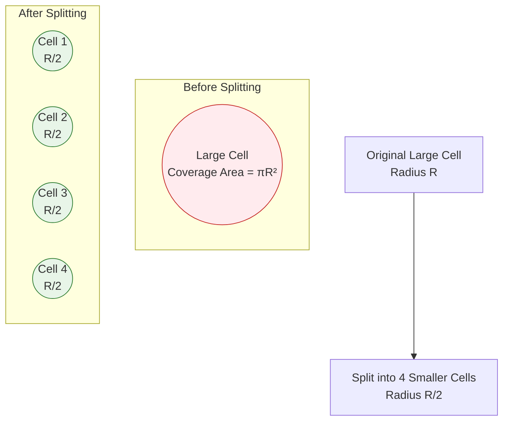
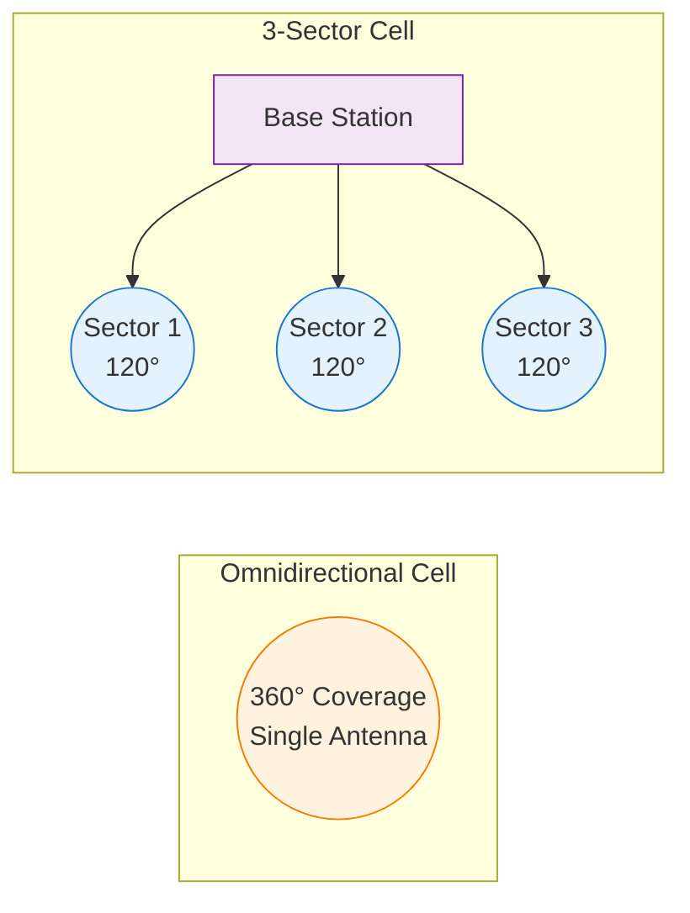

# May 2024 PYQ

## Checklist
- [x] 1. Frequency reuse
- [x] 2. Interference types
- [x] 3. Multipath causing small scale fading
- [x] 4. Ergodic capacity definition & significance
- [x] 5. Multicarrier scheme eliminating ISI
- [x] 6. BPSK bit error probability expression
- [x] 7. Diversity types
- [x] 8. Linear vs nonlinear equalizers
- [x] 9. Earth curvature effect on ground wave
- [x] 10. Max communication distance between two aircraft (K=4/3)
- [x] 11. (a) Capacity with 4-cell reuse (60 MHz total)
- [x] 11. (b) Trunking & Grade of Service

---
## 1. Frequency reuse (3 Marks)
**Answer:**
Frequency reuse is the systematic repetition of the same set of radio channels in different cells separated by sufficient distance so that co-channel interference remains below an acceptable threshold. Cells are grouped into a cluster of size \(N\); each cluster uses the full spectrum once, enabling capacity scaling roughly proportional to the number of clusters deployed. Larger \(N\) reduces interference (higher reuse distance \(D = R\sqrt{3N}\)) but lowers spectral efficiency; smaller \(N\) increases capacity but raises co-channel interference.

---
## 2. Types of interference in cellular systems (3 Marks)
**Answer:**
1. Co-channel interference (CCI): From cells using the same frequency set; dominant in reuse planning; mitigated by increasing reuse distance or using directional antennas.
2. Adjacent channel interference (ACI): From imperfect filtering causing leakage between neighboring frequency channels; mitigated by guard bands, better RF filters.
3. Inter-symbol / multipath induced self-interference (time dispersion) in wideband systems; mitigated by equalization or cyclic prefix.
4. (Optional mention) Intermodulation / out-of-band emissions from nonlinear transmitters.
Primary exam expectation: CCI vs ACI with definitions and mitigation.

---
## 3. Multipath causing small-scale fading (3 Marks)
**Answer:**
Multiple reflected, diffracted, and scattered components arrive with different delays and phases. Their vector sum produces rapid constructive/destructive interference as the receiver moves fractions of a wavelength (spatial fading) or as time varies (due to motion → Doppler shifts). When no dominant LOS path exists, envelope follows Rayleigh distribution; with LOS, Rician. Delay spread causes frequency-selective fading when signal bandwidth exceeds coherence bandwidth; otherwise flat fading but still amplitude/phase fluctuations.

---
## 4. Ergodic capacity: definition & significance (3 Marks)
**Answer:**
Ergodic capacity is the statistical average (expectation) of the instantaneous channel capacity over all fading states when coding spans many independent fades: 
$$C_{erg} = \mathbb{E}\left[ B \log_2(1 + \gamma) \right]$$
with \(\gamma\) instantaneous SNR. Significance: (i) Represents achievable long-term rate with ideal adaptation/coding over a stationary ergodic fading channel; (ii) Higher than outage-based guaranteed rates but requires interleaving over time; (iii) Guides design of adaptive modulation/power allocation (e.g., water-filling in frequency or time).

---
## 5. Multicarrier scheme eliminating ISI (3 Marks)
**Answer:**
Orthogonal Frequency Division Multiplexing (OFDM) with a cyclic prefix (CP). Principle: Convert a high-rate serial stream into many parallel low-rate subcarriers so each experiences flat fading (symbol duration >> delay spread). Inserting a CP longer than maximum channel delay spread converts linear convolution into circular convolution, enabling simple one-tap frequency-domain equalization and eliminating ISI between OFDM symbols.

---
## 6. BPSK bit error probability (3 Marks)
**Answer:**
For coherent BPSK over AWGN:
$$P_b = Q\left(\sqrt{\frac{2E_b}{N_0}}\right)$$
Where: \(Q(\cdot)\) is the Q-function (tail probability of standard normal), \(E_b\) energy per bit, \(N_0/2\) one-sided noise PSD. Alternate form: \(P_b = \tfrac{1}{2}\operatorname{erfc}\big(\sqrt{E_b/N_0}\big)\).

---
## 7. Types of diversity (3 Marks)
**Answer:**
1. Spatial (antenna) diversity (MRC, selection, Alamouti).
2. Frequency diversity (spread spectrum, OFDM subcarrier coding).
3. Time diversity (interleaving + coding across fades / retransmissions).
4. Polarization diversity (orthogonal polarizations).
5. Pattern / angle diversity (directional beams).
(Any three with brief descriptions typically sufficient.)

---
## 8. Linear vs nonlinear equalizers (3 Marks)
**Answer:**
- Linear Equalizers (LE): Output is linear filter of input (e.g., Zero-Forcing (ZF), MMSE). Pros: Simple, low complexity. Cons: Noise enhancement (ZF), residual ISI at MMSE tradeoff.
- Nonlinear Equalizers: Use decision feedback or sequence estimation (DFE, Maximum Likelihood Sequence Estimation via Viterbi). Pros: Better ISI mitigation and performance at moderate complexity (DFE) or near-optimal (MLSE). Cons: Error propagation (DFE), exponential complexity with channel memory (MLSE).

---
## 9. Earth curvature effect on ground wave (3 Marks)
**Answer:**
Ground wave follows Earth's surface; curvature causes the wavefront to diffract and attenuate more rapidly with distance than in free space. Effective earth conductivity and permittivity plus curvature produce surface wave attenuation; eventually field strength decays exponentially, limiting range. Lower frequencies (LF/MF) diffract better, extending ground wave coverage (e.g., AM broadcast). Spherical divergence + ground losses dominate.

---
## 10. Max distance between two aircraft (K=4/3) (3 Marks)
**Answer:**
Assuming line-of-sight limited by radio horizon. Effective Earth radius: \(R_e' = K R_e = \tfrac{4}{3} R_e\). For altitude \(h \ll R_e'\): horizon distance per terminal \(d \approx \sqrt{2 R_e' h}\). Let altitudes be 3 km and 5 km.
Take \(R_e = 6370\,\text{km} \Rightarrow R_e' = 8493.3\,\text{km}\).
$$d_1 = \sqrt{2 (8493.3)(3)} = \sqrt{50959.8} = 225.8\,\text{km}$$
$$d_2 = \sqrt{2 (8493.3)(5)} = \sqrt{84933} = 291.4\,\text{km}$$
Maximum separation along Earth's surface: \(d_{max} = d_1 + d_2 \approx 517\,\text{km}\) (three significant figures). 

---
## 11. (a) Capacity with 4-cell reuse (60 MHz total) (3 Marks)
**Question:** In a cellular system using a 4-cell reuse pattern with a total bandwidth of 60 MHz, if 2 channels of 30 kHz each are needed for a call, how many simultaneous calls can be accommodated in one cell and in one cluster?

**Answer:**
Given:
- Total allocated spectrum (system-wide): \(B_{total} = 60\,\text{MHz}\)
- Individual (logical) channel bandwidth: \(B_c = 30\,\text{kHz}\)
- Channels required per call (e.g., FDD pair): 2 (so effective per-call bandwidth = 60 kHz)
- Reuse factor / cluster size: \(N = 4\)

1. Total number of 30 kHz channels in the entire band:
$$N_{ch, total} = \frac{60\times10^{6}}{30\times10^{3}} = 2000$$
2. Channels per cell (since each cell in a 4-cell cluster gets one disjoint quarter of the pool):
$$N_{ch, cell} = \frac{2000}{4} = 500$$
3. Channels consumed per call = 2 ⇒ calls per cell:
$$N_{calls, cell} = \frac{500}{2} = 250$$
4. Calls per cluster (sum over 4 cells):
$$N_{calls, cluster} = 4 \times 250 = 1000$$

**Result:** One cell supports 250 simultaneous calls; one 4-cell cluster supports 1000 simultaneous calls.

**Short Answer:** Per cell: 250 calls. Per 4-cell cluster: 1000 calls.

---
## 11. (b) Trunking & Grade of Service (3 Marks)
**Answer:**
Trunking is the pooling (sharing) of a limited number of communication channels (circuits) among a larger population of users on a demand basis so that statistical multiplexing reduces required total channels versus dedicated allocation.

Grade of Service (GoS) quantifies the probability that a call (or request) is blocked (lost) or delayed due to all channels being busy at the time of arrival. Commonly expressed as blocking probability (e.g., 2% blocking).

Traffic intensity (offered load) in Erlangs:
$$A = \lambda \times H$$
Where \(\lambda\) = average call arrival rate (calls/s), \(H\) = mean holding time (s). One Erlang = one channel continuously occupied.

For a trunk group of \(C\) identical channels with Poisson arrivals, exponential holding times, and blocked calls cleared (lost), blocking probability (Erlang B):
$$B(C,A) = \frac{\dfrac{A^{C}}{C!}}{\sum_{k=0}^{C} \dfrac{A^{k}}{k!}}$$
GoS (blocking) = \(B(C,A)\).

If blocked calls are queued (delay system, M/M/C with infinite queue) the probability of delay (Erlang C):
$$C_E(C,A) = \frac{\dfrac{A^{C}}{C!(1-\rho)}}{\sum_{k=0}^{C-1} \dfrac{A^{k}}{k!} + \dfrac{A^{C}}{C!(1-\rho)}}\quad\text{with}\quad \rho = \frac{A}{C} < 1$$
And average waiting time (conditional) helps dimension delay GoS. (Mentioned for completeness.)

Design uses required GoS (e.g., 0.02) to select minimum \(C\) satisfying \(B(C,A) \leq \text{target}\).

**Short Answer:** Trunking = shared channel pool; GoS = blocking probability \(= B(C,A)\) where \(B(C,A) = \frac{A^{C}/C!}{\sum_{k=0}^{C} A^{k}/k!}\); traffic intensity \(A = \lambda H\).

## 11. (a) Name any two methods to improve capacity in a cellular system. Explain the features with diagrams.

**Short Answer:** Cell splitting and sectoring are two key methods to improve cellular capacity by increasing frequency reuse and reducing interference.

### Method 1: Cell Splitting

**Principle:** Divide large cells into smaller cells to increase frequency reuse density.

**Features:**
- Reduces cell radius by factor of 2-4
- Increases number of base stations
- Each smaller cell uses lower transmit power
- More frequent handoffs but higher capacity

**Capacity Improvement:**
If cell radius is reduced by factor $k$, theoretical capacity increases by $k^2$.

**Cell Splitting Diagram:**

**Implementation Steps:**
1. Identify congested cells
2. Install new base stations at reduced power
3. Adjust frequency assignments
4. Update handoff parameters

### Method 2: Sectoring

**Principle:** Replace omnidirectional antennas with directional sector antennas to reduce co-channel interference.

**Features:**
- Typically 3 or 6 sectors per cell site
- Each sector covers 120° or 60°
- Reduces interference by spatial separation
- Improves carrier-to-interference ratio (C/I)

**Capacity Improvement:**
Sectoring can reduce cluster size from N=7 to N=4 or N=3, increasing capacity by factor of 7/4 ≈ 1.75 or 7/3 ≈ 2.33.

**Sectoring Diagram:**

**Advantages of Sectoring:**
- Lower infrastructure cost than cell splitting
- Immediate capacity improvement
- Better interference management
- Flexible implementation

**Trade-offs:**
- Increased handoffs at sector boundaries
- More complex antenna systems
- Potential coverage gaps

## 11. (b) Define trunking and grade of service with relevant formulae.

**Short Answer:** Trunking shares channels among users; Grade of Service measures blocking probability using Erlang-B formula: $P_B = \frac{A^N/N!}{\sum_{k=0}^{N} A^k/k!}$.

### Trunking

**Definition:** Trunking is a method of sharing a pool of communication channels among multiple users, where channels are allocated on demand and released when not needed.

**Key Concepts:**
- **Traffic Intensity (A):** Average number of simultaneous calls
- **Offered Load:** Total traffic demand on the system
- **Carried Load:** Traffic actually served by the system

**Traffic Intensity Formula:**
$$A = \lambda \times H$$

Where:
- $A$ = Traffic intensity in Erlangs
- $\lambda$ = Call arrival rate (calls/hour)
- $H$ = Average call holding time (hours)

**Trunking Efficiency:**
Larger trunk groups are more efficient due to statistical multiplexing:
- Small groups: High blocking probability
- Large groups: Better channel utilization

### Grade of Service (GoS)

**Definition:** Grade of Service is the probability that a call is blocked due to all channels being busy. It's typically expressed as a percentage.

**Erlang-B Formula:**
For a system with $N$ channels and traffic intensity $A$:

$$P_B = \frac{\frac{A^N}{N!}}{\sum_{k=0}^{N} \frac{A^k}{k!}}$$

Where:
- $P_B$ = Blocking probability (Grade of Service)
- $A$ = Offered traffic in Erlangs
- $N$ = Number of available channels

**Alternative Recursive Form:**
$$P_B(N,A) = \frac{A \cdot P_B(N-1,A)}{N + A \cdot P_B(N-1,A)}$$

With initial condition: $P_B(0,A) = 1$

**Typical GoS Values:**
- **Excellent:** 0.5% (P_B = 0.005)
- **Good:** 1% (P_B = 0.01)
- **Fair:** 2% (P_B = 0.02)
- **Poor:** 5% (P_B = 0.05)

**Carried Traffic:**
$$A_c = A(1 - P_B)$$

**Lost Traffic:**
$$A_l = A \cdot P_B$$

**Example Calculation:**
For $A = 10$ Erlangs and $N = 15$ channels:

$$P_B = \frac{10^{15}/15!}{\sum_{k=0}^{15} 10^k/k!} \approx 0.0346 = 3.46\%$$

**Trunking Gain:**
Comparison of individual vs. pooled channels:
- 10 users, each with 1 channel: 10 channels total
- 10 users sharing 7 channels: Same GoS with 30% fewer channels

**Key Relationships:**
1. **More channels → Lower blocking probability**
2. **Higher traffic → Higher blocking probability**
3. **Trunking efficiency increases with group size**
4. **GoS is independent of call arrival pattern (Poisson assumption)**

## 12. (a) Compare the important features of 1G, 2G, 3G and 4G systems

**Short Answer:** Evolution from analog voice (1G) to digital voice/SMS (2G) to mobile data (3G) to broadband multimedia (4G), with increasing data rates, spectral efficiency, and service capabilities.

### Detailed Comparison

| Feature | 1G | 2G | 3G | 4G |
|---------|----|----|----|----|
| **Technology** | Analog FDMA | Digital TDMA/CDMA | WCDMA/CDMA2000 | LTE/LTE-A |
| **Launch Period** | 1980s | 1990s | 2000s | 2010s |
| **Data Rate** | - | 9.6-14.4 kbps | 384 kbps-2 Mbps | 100 Mbps-1 Gbps |
| **Frequency Bands** | 800-900 MHz | 800-1900 MHz | 800-2100 MHz | 700-2600 MHz |
| **Modulation** | FM | GMSK, QPSK | QPSK, 16QAM | QPSK to 256QAM |
| **Multiple Access** | FDMA | TDMA/CDMA | WCDMA/CDMA | OFDMA/SC-FDMA |
| **Core Network** | Circuit Switched | Circuit Switched | Circuit + Packet | All-IP (EPC) |
| **Services** | Voice only | Voice + SMS | Voice + Data + Video | Multimedia + VoIP |
| **Handoff** | Hard | Hard | Soft (CDMA) | Hard (optimized) |
| **Security** | Minimal | A5/1, A3/A8 | KASUMI, AES | AES, EPS-AKA |
| **Spectral Efficiency** | Low | Medium | High | Very High |
| **Coverage** | Large cells | Macro cells | Macro + Micro | HetNets |

### 1G Systems (First Generation)

**Key Features:**
- **Technology:** Analog cellular (AMPS, NMT, TACS)
- **Services:** Voice communication only
- **Advantages:** Simple, wide coverage
- **Disadvantages:** Poor voice quality, no security, limited capacity

**Technical Specifications:**
- Frequency reuse: N = 7 cluster
- Channel bandwidth: 30 kHz
- Modulation: FM
- Power control: None

### 2G Systems (Second Generation)

**Key Features:**
- **Technology:** Digital cellular (GSM, IS-95, IS-136)
- **Services:** Voice, SMS, basic data
- **Advantages:** Better voice quality, encryption, higher capacity
- **Disadvantages:** Limited data services, circuit-switched data

**GSM Specifications:**
- Time slots: 8 per carrier
- Channel bandwidth: 200 kHz
- Frame duration: 4.615 ms
- Encryption: A5/1 algorithm

**CDMA Specifications:**
- Spreading bandwidth: 1.25 MHz
- Processing gain: 64
- Soft handoff capability
- Power control: 800 Hz rate

### 3G Systems (Third Generation)

**Key Features:**
- **Technology:** UMTS/WCDMA, CDMA2000
- **Services:** Mobile internet, video calling, multimedia
- **Advantages:** High-speed data, global roaming, packet switching
- **Disadvantages:** High power consumption, complex

**WCDMA Specifications:**
- Chip rate: 3.84 Mcps
- Channel bandwidth: 5 MHz
- Data rates: 384 kbps (mobile), 2 Mbps (indoor)
- Advanced receivers: Rake, equalizers

**Evolution Path:**
- Release 99: Basic 3G
- HSPA: High-Speed Packet Access
- HSPA+: Enhanced performance up to 42 Mbps

### 4G Systems (Fourth Generation)

**Key Features:**
- **Technology:** LTE, LTE-Advanced
- **Services:** Mobile broadband, VoLTE, rich multimedia
- **Advantages:** Very high data rates, low latency, all-IP
- **Disadvantages:** Limited coverage initially, high infrastructure cost

**LTE Specifications:**
- OFDMA (DL), SC-FDMA (UL)
- Bandwidth: 1.4-20 MHz (100 MHz with CA)
- Latency: <10 ms user plane
- Peak rates: 300 Mbps DL, 75 Mbps UL

**Advanced Features:**
- MIMO: Up to 8×8 configurations
- Carrier Aggregation: Up to 5 carriers
- CoMP: Coordinated multipoint transmission
- SON: Self-organizing networks

### Evolution Trends

**Data Rate Evolution:**
- 1G: 0 bps (voice only)
- 2G: ~10 kbps
- 3G: ~1 Mbps
- 4G: ~100 Mbps
- 5G: ~1 Gbps (future)

**Spectral Efficiency:**
- 1G: 0.1 bps/Hz/cell
- 2G: 0.5 bps/Hz/cell
- 3G: 1-2 bps/Hz/cell
- 4G: 5-10 bps/Hz/cell

**Key Technological Advances:**
1. **Analog → Digital:** Improved quality and capacity
2. **Circuit → Packet:** Efficient data transmission
3. **Single → Multiple Antennas:** Spatial diversity and multiplexing
4. **Narrowband → Wideband:** Higher data rates and flexibility
## 12. (b) In a cellular system using a 4-cell reuse pattern with a total bandwidth of 60MHz, if 2 channels of 30 kHz each are needed for a call, how many simultaneous calls can be accommodated in one cell and in one cluster?

**Short Answer:** Per cell: 250 calls. Per 4-cell cluster: 1000 calls.

**Given:**
- Total system bandwidth: $B_{total} = 60$ MHz
- Channel bandwidth: $B_c = 30$ kHz per channel
- Channels per call: 2 channels (e.g., FDD uplink/downlink pair)
- Cluster size (reuse factor): $N = 4$ cells

**Step 1: Calculate total number of channels**
Total number of 30 kHz channels available:
$$N_{ch,total} = \frac{B_{total}}{B_c} = \frac{60 \times 10^6}{30 \times 10^3} = 2000 \text{ channels}$$

**Step 2: Calculate channels per cell**
In a 4-cell reuse pattern, each cell gets 1/4 of the total channels:
$$N_{ch,cell} = \frac{N_{ch,total}}{N} = \frac{2000}{4} = 500 \text{ channels per cell}$$

**Step 3: Calculate calls per cell**
Since each call requires 2 channels:
$$N_{calls,cell} = \frac{N_{ch,cell}}{2} = \frac{500}{2} = 250 \text{ calls per cell}$$

**Step 4: Calculate calls per cluster**
Total calls in one complete 4-cell cluster:
$$N_{calls,cluster} = N \times N_{calls,cell} = 4 \times 250 = 1000 \text{ calls per cluster}$$

**Verification:**
- Total bandwidth utilization: $1000 \text{ calls} \times 2 \text{ channels/call} \times 30 \text{ kHz/channel} = 60$ MHz ✓
- Each cell uses: $250 \text{ calls} \times 60 \text{ kHz/call} = 15$ MHz per cell
- 4 cells use: $4 \times 15 = 60$ MHz total ✓

**Final Answer:**
- **One cell:** 250 simultaneous calls
- **One cluster (4 cells):** 1000 simultaneous calls
- 
---
*End of May 2024 3-mark concise answers.*
