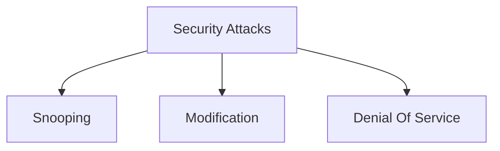

---
tags:
  - academics
  - btech
  - s8
---
# Secure Communication

## Security Attacks

### Types of Attacks
1. **Snooping** - Unauthorized access to data
2. **Modification** - Altering data in transit
3. **Denial of Service** - Preventing legitimate access

## Security Mechanisms

### Routing Control
Controls the path data takes through the network

### Notarization
Third-party verification of data authenticity

### Access Control
Restricts access to authorized users only
- Examples: PINs, passwords

## Security Services and Mechanisms

| Security Services    | Mechanisms                         |
| -------------------- | ---------------------------------- |
| Data Confidentiality | Encipherment and Routing Control   |
| Data Integrity       | Digital Signatures, Hash Functions |
| Authentication       | Passwords, Biometrics, Tokens      |
| Non-repudiation      | Digital Signatures, Notarization   |
| Access Control       | ACLs, PINs, Passwords              |

## Related Topics
- [[Hill Cypher]]

