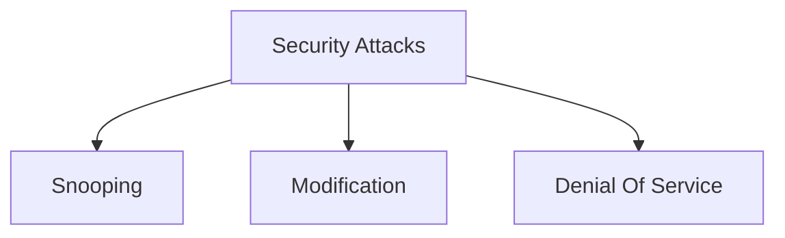

# Secure Communication

### Security Attacks

#### Routing Control

#### Notarization

#### Acces Control

eg : { pins, passwd}

- Relationship between Security Serives and Mechanism

| Security Services    | Mechanisms                        |
| -------------------- | --------------------------------- |
| Data Confidentiality | Encipherment and Routting COntrol |
| Data Integrity       |                                   |
| Authentication       |                                   |
| Non-reproduction     |                                   |
| Access Control       |                                   |

#### 27-01-25
- Hill Cypher
- [[Hill Cypher]]
$$

$$

