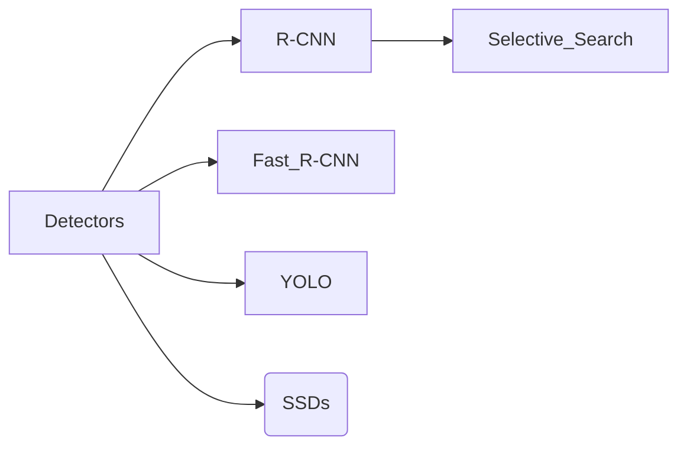

# Object Detection
object detection draws bounding boxes around each detected object, specifying its location.^[1]
"A dataset with annotated objects is critical for understanding and implementing YOLO object detection"^[https://pyimagesearch.com/2018/11/12/yolo-object-detection-with-opencv/]

## Detecting Objects

## References
1. https://www.ultralytics.com/glossary/object-detection

