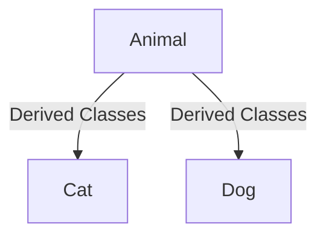

# Inheritance
 This chapter will deal with inheritance  and its imporatance , example etc. Inheritance plays a significant role in oop , we will consider few example where should it be used and why .
 - all the public members in base class B are publicly available in the derived class C
 - 
#syntax 
```cpp
class C : public B
{
private:
	/* Declaration of additional private data members and member functions */
public:
	/* Declaration of additional public data members and member functions */
};
```


```cpp
#include <iostream>
using namespace std;

class Animal {
public:
  void print_intro() { cout << "Im Animal" << endl; }
};
class Cat : public Animal {
public:
  void print_intro() { cout << "Im Cat" << endl; }
};
class Dog : public Animal {
  void print_intro(){ cout << "Im Dog" << endl; }
}
int main() {
  Animal A1;
  A1.print_intro();
  Cat C1;
  C1.print_intro();
  return 0;
}
```

```
Im Animal
Im Cat 
Im Dog 
```



