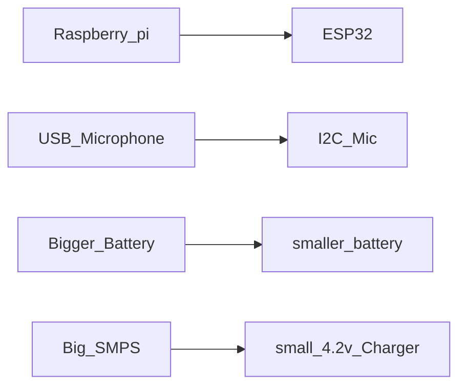

# Embedded Development 
If you are comming from or after fininshing `ethical-hacking/prerequisites/c++` from [this link]() , this is not my actual note instead , this is a customized note that will serve as an introductory guide to emmbedded C++ which is derived from [[01 Embedded C++]]. But i dont recomment reading [[01 Embedded C++]] which is my actual note but some may not understand beacuse it is written by me . 
- [ ] update the link 
Now about this note, everyone who will be participating on the project should read and understand this , this is mainly focused on making fast prototype of electronics project and not recommend for industry use , but this is very similar to how things done in industries .

## 1 What is fast prototying 
Fast prototying  is in a sense that , you are given a problem and you find its solution in a manner that , you will use any type of software or hardware by only means of completing the project. You will not think about anything else like the reliability  of components, or cost of the components etc. Like for example you are given a project in which they ask you to build an automatic dor which unlocks when someone says `open the dor` , simple enough , you will use 
1. Raspberry pi or some microcontroller
2. microphone 
3. actuators like motor or solenoid lock 
4. battery or smps 
these are the main components that will be required to make the project. But if you think about th cost it is almost `5500` (look at the table below) but there will be also miscellaneous  cost which get added to this. 

| Item            | Cost |
| --------------- | ---- |
| Raspberry pi    | 4500 |
| USB Microphone  | 200  |
| Lock            | 250  |
| Battery or SMPS | 500  |
Also you will require some mechanism to attach it to the dor ,or you have to custom make a dor which is easy if you use aluminium fabrication techniques but cost will get added . 
At the end of the day you will end up with working dor which does the following 
- Unlocks the dor when someone says `open the dor` 
Nothing else. But you used a **Raspberry pi** which is an overkill for the project and it an exceptionaly powerfull machine. 

This is good for prototying , and showing the user that this is how it will react and all . But if you actually try to sell this to the user , the user wont be happy about its packaging and all and they also ask how much will it last? . and you cant really answer that question because there is so meny things that can go wrong for example 
1. the smps might die. and if you used power ics or buck boost converters they might die from over heating 
2. The memory card in the raspberry pi can die 
3. The raspberry pi itself can die 
4. lock might get damaged 
There are more things to consider . 
---
Now there is a million dolor question 
1. How can i reduce its cost 
2. How to make it reliable 
These two will be discussed in the following chapters

### Reducing the cost 
Lets consider the previous example again try to replace the componets 

| Item          | Cost |
| ------------- | ---- |
| ESP32         | 300  |
| I2C mic       | 200  |
| Small Battery | 140  |
| charger       | 70   |

We can see that we have reduced the cost to one fifth of the actual cost. But now the developmet becomes complex , but once its done we can easily make multiple copies and change them accordingly to resume the functions if some broke. 

####  Cost reduction with examples 
##### Example 1 
Consider you have an `ESP32` you have to power it using `220V 50Hz`. First thing that comes to your mind will be that's a lot of voltage. YES it is and if we connect it to the esp , the power ic(ACS111) will get damaged , or the chip itself get fried( i will update once i test it.). Second thing that comes to your mind if you are an electronics engineer , that how to make this the normal steps will be like follows 
1. Step down the voltage : use **transformers** to step down the voltage
2. Make it dc using **diodes**
3. Filter spikes using capacitors 
4. use a variable voltage controller to get the decired output 

This flow might change , but 

