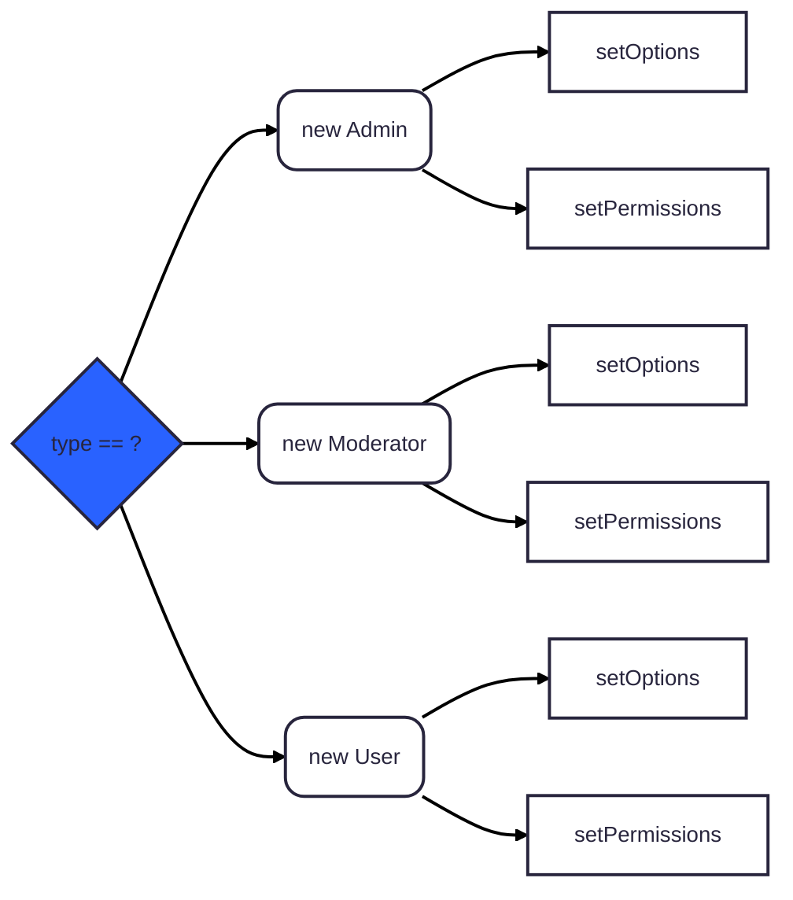

### Factory Method Pattern

> **Factory Method** is a creational design pattern that *provides an interface for creating objects in a superclass, but allows subclasses to alter the type of objects that will be created*.

In this the users dont have to worry about the instantiation logic, they just need to call the factory method and get the object they need. It hides the complexity of object creation and provides a simple interface for users. 

#### ✅ **Benefits:**
- **Easier maintenance** and reuse of code
- **Typical solution** to common object creation problems
- **Flexibility** in object creation without tight coupling

#### ❌ **Drawbacks:**
- **Increased complexity** with multiple subclasses
- **Adds an extra layer of abstraction**
- **Potential for code duplication** in subclasses
- **Increased Coupling** Instances are very coupled to the 

#### ❌ **Without Factory Method**

```ts
const type = "admin"; // or "moderator", "user"
const data = { id : 1, name: "Arun CS" };
let user: User;
switch (type) {
    case "admin":
        user = new Admin(data);
        user.setOptions({ canEdit: true, canDelete: true });
        user.setPermissions(["read", "write", "delete"]);
        break;
    case "moderator":
        user = new Moderator(data);
        user.setOptions({ canEdit: true });
        user.setPermissions(["read", "write"]);
        break;
    case "user":
        user = new User(data);
        user.setOptions({ canEdit: false });
        user.setPermissions(["read"]);
        break;
    default:
        throw new Error("Unknown user type");
}

```

**Usage:**

#### ❌ **Without Factory Method In GO**

```go
type User interface {
    SetOptions(options map[string]interface{})
    SetPermissions(permissions []string)
}
type Admin struct {
    User
}
func (a *Admin) SetOptions(options map[string]interface{}) {
    // Set admin specific options
}
func (a *Admin) SetPermissions(permissions []string) {
    // Set admin specific permissions
}
// Similar for Moderator and User types 

```  

#### ✅ **With Factory Method**

```ts
class UserFactory {
    static createUser(type: string, data: any): User {
        switch (type) {
            case "admin":
                return new Admin(data);
            case "moderator":
                return new Moderator(data);
            case "user":
                return new User(data);
            default:
                throw new Error("Unknown user type");
        }
    }
}

```

**Usage:**

```ts
const user = UserFactory.createUser("admin", { id: 1, name: "
Arun CS" });
user.setOptions({ canEdit: true, canDelete: true });
user.setPermissions(["read", "write", "delete"]);

```

#### ✅ **With Factory Method In GO**

```go
type UserFactory interface {
    CreateUser(userType string, data map[string]interface{}) User
}

type UserFactoryImpl struct{}

func (f *UserFactoryImpl) CreateUser(userType string, data map[string]interface{}) User {
    switch userType {
    case "admin":
        return &Admin{Data: data}
    case "moderator":
        return &Moderator{Data: data}
    case "user":
        return &User{Data: data}
    default:
        panic("Unknown user type")
    }
}

```

**Usage:**

```go
factory := &UserFactoryImpl{}
user := factory.CreateUser("admin", map[string]interface{}{
    "id": 1, 
    "name": "Arun CS",
})
user.SetOptions(map[string]interface{}{
    "canEdit": true, 
    "canDelete": true,
})
user.SetPermissions([]string{"read", "write", "delete"})

```




## Practical Example in API 
  

This document explains how to use the simplified factory pattern without database adapters while maintaining clean architecture.
### Overview

- **SimpleRepositoryFactory**: Creates repository instances using direct GORM dependencies

- **SimpleServiceFactory**: Creates service instances using the repository factory

- **Singleton Database Manager**: Manages database connections efficiently

### Key Benefits


1. **Factory Pattern**: Clean dependency injection and object creation
2. **Singleton Database**: Efficient database connection management
3. **Mixed Repository Support**: Handles both GORM and interface-based repositories seamlessly

  

### Usage Examples

### Basic Usage


```go
// Get database connection
dbManager := initializers.GetDatabaseManager()
db := dbManager.GetDB()
// Create factories
repoFactory := factory.NewSimpleRepositoryFactory(db)
serviceFactory := factory.NewSimpleServiceFactory(repoFactory, db)
// Create services
staffProfileService := serviceFactory.CreateStaffProfileService()
staffQualificationService := serviceFactory.CreateStaffQualificationService()
```
### Convenience Factory
```go
// One-liner factory creation
serviceFactory := factory.NewGormSimpleServiceFactory(db)
```
### Individual Repository Creation
```go
repoFactory := factory.NewSimpleRepositoryFactory(db)
// Create specific repositories
staffRepo := repoFactory.CreateStaffRepository()
staffDetailRepo := repoFactory.CreateStaffDetailRepository()
staffQualificationRepo := repoFactory.CreateStaffQualificationsRepository()
```
### Available Services

  

#### From SimpleServiceFactory:
- `CreateStaffProfileService()` - Manages staff profiles
- `CreateStaffQualificationService()` - Manages staff qualifications  
- `CreateProfileDataMapper()` - Maps profile DTOs to models
- `CreateStaffDataMapper()` - Maps staff DTOs to models
#### From SimpleRepositoryFactory:

- `CreateStaffRepository()` - Core staff operations
- `CreateStaffDetailRepository()` - Staff detail operations
- `CreateStaffAdditionalDetailRepository()` - Additional details
- `CreateStaffExtraDetailRepository()` - Extra details
- `CreateStaffServiceBreakRepository()` - Service breaks
- `CreateStaffPayScaleRepository()` - Pay scale management
- `CreateStaffProfileRepository()` - Profile operations
- `CreateStaffQualificationsRepository()` - Qualification operations

### Database Connection Management

The singleton database manager handles:
- **Connection pooling** for efficient resource usage
- **Auto-migration** for database schema updates
- **Health checks** for monitoring database status
- **Environment-based configuration** (MySQL/MariaDB/SQLite)

```go
// Check database health
if err := dbManager.Health(); err != nil {
    log.Fatalf("Database health check failed: %v", err)
}
```

### Repository Implementation Details
The factory automatically handles different repository constructor signatures:
- **Direct GORM repositories** (StaffAdditionalDetail, StaffExtraDetail, etc.) - Use `*gorm.DB` directly
- **Interface-based repositories** (Staff, StaffDetail, StaffQualifications) - Use database adapter internally
This mixed approach allows for gradual migration while maintaining compatibility.
### Migration from Complex Factory
If you were using the previous complex factory with database adapters:
### Before:

```go
dbAdapter := interfaces.NewGormDatabaseAdapter(db)
repoFactory := factory.NewRepositoryFactory(dbAdapter)
serviceFactory := factory.NewServiceFactory(repoFactory, dbAdapter)
```
#### After:

```go
repoFactory := factory.NewSimpleRepositoryFactory(db)
serviceFactory := factory.NewSimpleServiceFactory(repoFactory, db)
// Or simply:
serviceFactory := factory.NewGormSimpleServiceFactory(db)
```
### Error Handling
Always check for database connection health:
```go
dbManager := initializers.GetDatabaseManager()
if err := dbManager.Health(); err != nil {
    return fmt.Errorf("database not available: %v", err)
}
```

  

### Configuration
The database manager reads configuration from environment variables:
```bash
DB_TYPE=sqlite                    # or "mysql", "mariadb"
DATABASE_URL=./test.db           # SQLite path or MySQL DSN
```

For MySQL/MariaDB:

```bash
DB_TYPE=mysql
DATABASE_URL=user:password@tcp(localhost:3306)/database?charset=utf8mb4&parseTime=true&loc=Local
``` 
