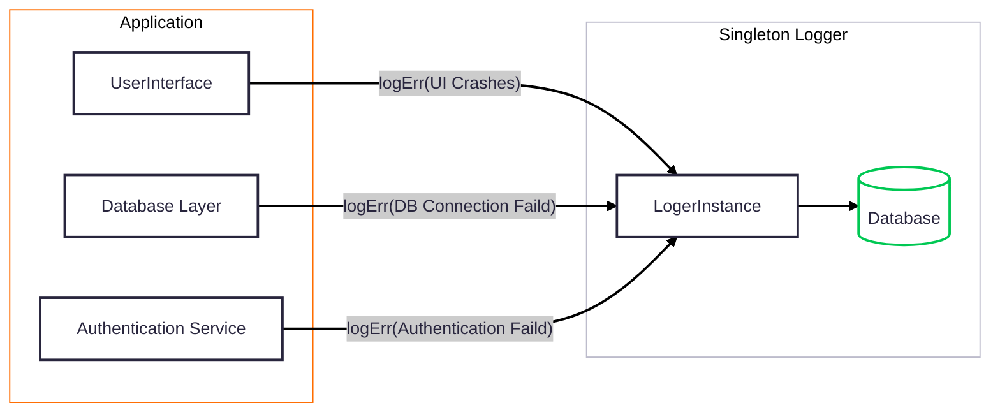

###  1️⃣ Singleton Pattern
Its like a global variable of instances like every part of the application can access it , it also makes it dificult to test and debug. But easy to use.

```ts
// Multi logger
const logger1 = new Logger();
const logger2 = new Logger();

// Single Logger 
const logger = Logger.getInstance();

```



>[!warning]- **Without Singleton**
>
>```mermaid
>---
>config:
>  theme: redux
>  layout: dagre
>---
>flowchart LR
> subgraph s1["Application"]
>        n1["UserInterface"]
>        n2["Database Layer"]
>        n3["Authentication Service"]
>  end
> subgraph s2["Multiple Loggers"]
>        n4["Logger Instance 1"]
>        n6["Logger Instance 2"]
>        n7["Logger Instance 3"]
>        n5["Log File 1"]
>  end
>    n2 -- "logErr()" --> n4
>    n4 -- "format 1" --> n5
>    n1 -- "logErr()" --> n6
>    n3 -- "logErr()" --> n7
>    n6 -- "format 2" --> n5
>    n7 -- "format 3" --> n5
>    
>    n4@{ shape: rect}
>    n5@{ shape: db}
>    style n4 fill:#757575
>    style n6 fill:#757575
>    style n7 fill:#757575
>    style n5 stroke:#00C853,fill:transparent
>    style s2 fill:transparent
>    style s1 stroke:#FF6D00,fill:transparent
>```
