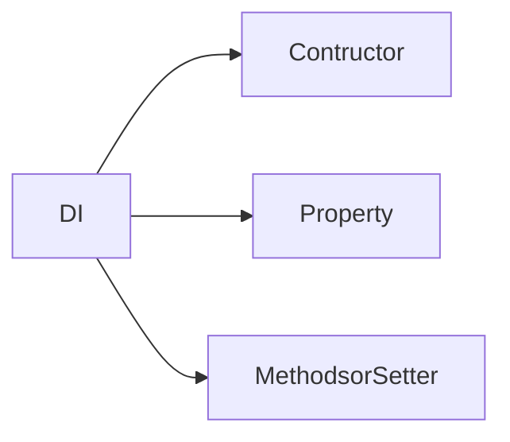

# Dependency Injunction
- [[uber-go-fx]]
It is used to implement the [[Inversion of control]] principle. In DI, the dependencies of an object (i.e. the objects it relies on) are **provided externally** rather than created internally by the object itself


>[!TODO]- Donts
>- dependencies hard-wired into a function

```go

```

```tasks 
not done 
path includes Design Patterns/Dependency Injunction

```

```dataview
LIST 
From #design_pattern and #dependency_injunction

```

- [ ] Check out DI in containers 

use a container for managing objects ?
Constructor Injection and Setter Injection ? 

- [ ] Checkout microservices architecture 

#### ✅ Benefits:

Helps you to **decouple** the external logic of your implementation 

---

*An important point of injecting dependencies is to avoid injecting implementations (structs), you should inject abstractions (interfaces).* ? 

- [ ] Checkout Dependency Inversion Principle ? 

>  An important point of injecting dependencies is to avoid injecting implementations (structs), you should inject abstractions (interfaces). It’s the letter D of S.O.L.I.D: Dependency Inversion Principle. It allows you to switch easily the implementation of some dependency and, you could change the real implementation for a mock implementation. It's fundamental for unit testing. - [Source](https://medium.com/avenue-tech/dependency-injection-in-go-35293ef7b6)

> Example of **Constructor-based Dependency Injection**

```go 
type SomeRepo interface{}
type SomeLogger interface{}
type SomeMessageBroker interface{}

type SomeService struct {
	repo SomeRepo
	logger SomeLogger 
	broker SomeMessageBroker 
}

func NewSomeService ( repo SomeRepo , logger SomeLogger , broker SomeMessageBroker)SomeService{
	return &SomeService{
		repo: repo,
		logger: logger,
		broker: broker,
	}
} 

```

In this , the `NewSomeService` requires (dependencies) `repo`, `logger`, `broker` return an instance of `SomeService` , dependencies are all passed in via **interfaces**, which is a common and idiomatic way to do DI in Go. ?? 
- Promotes [[Dependency Inversion Principle]]
## Types 

1. **Constructor Injection**
	- Dependencies are passed into the constructor.
	- Promotes immutability and makes the code more testable.
2. **Setter Injection**
	- Dependencies are set via exported methods after the object is created.
3. **Interface Injection**
	- Not common in Go. An external component defines the injection logic, more common in other languages like Java.



### Constructor Injunction 

```go
func NewStaffProfileService(
	staffProfileRepository repository.StaffProfileRepository,
	staffRepo repository.StaffRepository,
	staffDetailRepo repository.StaffDetailRepository,
	staffAdditionalDetailRepo repository.StaffAdditionalDetailRepository,
	staffPayScaleRepo repository.StaffPayScaleRepository,
	serviceBreakRepo repository.StaffServiceBreakRepository,
) StaffProfileService {
	return &staffProfileService{
		staffProfileRepository:    staffProfileRepository,
		staffRepo:                 staffRepo,
		staffPayScaleRepo:         staffPayScaleRepo,
		staffDetailRepo:           staffDetailRepo,
		staffAdditionalDetailRepo: staffAdditionalDetailRepo,
		serviceBreakRepo:          serviceBreakRepo,
	}
}

```

> These kinds allow you to change dependencies in runtime, so by design, they aren’t immutable. But if you need to change the implementation of some dependency, you don’t need to recreate everything. You can just override what you need. It may be useful if you have a feature flag that changes an implementation inside your service. - [Source](https://medium.com/avenue-tech/dependency-injection-in-go-35293ef7b6)

### Method Injunction 

```go
type staffProfileService struct {
	staffProfileRepository    repository.StaffProfileRepository
	staffRepo                 repository.StaffRepository
	staffDetailRepo           repository.StaffDetailRepository
	staffAdditionalDetailRepo repository.StaffAdditionalDetailRepository
	staffPayScaleRepo         repository.StaffPayScaleRepository
	serviceBreakRepo repository.StaffServiceBreakRepository
}

```

## How? 
Using dependency injection container. 
- [ ] Checkout [[DI Container ]]

- [ ] Checkout mannual construciton
> Manually
> Manually construction is an objective way to do it. You declare, create, and inject your dependencies step by step. I think it’s clean and there isn’t any magic happening behind the scenes. The problem is as your dependencies get complex you need to deal with complexity by yourself. You may see your func main() getting with hundreds of lines of code and harder to maintain. - [Source](https://medium.com/avenue-tech/dependency-injection-in-go-35293ef7b6)

Eg:

```go
type staffProfileService struct {
	staffRepo                 repository.StaffRepository
	staffDetailRepo           repository.StaffDetailRepository

}
func NewStaffProfileService(
	staffRepo repository.StaffRepository,
	staffDetailRepo repository.StaffDetailRepository,
) StaffProfileService {
	return &staffProfileService{
		staffRepo:                 staffRepo,
		staffPayScaleRepo:         staffPayScaleRepo,
	}
}

```

## Implementation 

###  Injection During Initialization
- dependencies are provided to an object when it’s **initialized** 
-  A function is used to initialize the object and the dependencies are declared as the parameters of this function.
[Source](https://www.jetbrains.com/guide/go/tutorials/dependency_injection_part_one/injection/)

```go
type staffAdditionalDetailRepository struct {
	db *gorm.DB
	ctx *gin.Context
}
func NewStaffAdditionalDetailRepository(db *gorm.DB, ctx *gin.Context) StaffAdditionalDetailRepository {
	return &staffAdditionalDetailRepository{db: db, ctx: ctx}
}

```

In this , the `staffAdditionalDetailRepository` depentds on `db` and `ctx` which is injected via the `NewStaffAdditionalDetailRepository()` function .

### Property Injection
Dependencies are set after the object is created

```go
type staffAdditionalDetailRepository struct {
	db *gorm.DB
	ctx *gin.Context
}
func(r *staffAdditionalDetailRepository) SetDB (db *gorm.DB) {
	r.db = db
}
func(r *staffAdditionalDetailRepository) SetCtx (ctx *gin.Context) {
	r.ctx = ctx 
}
	

```

### Interface Injection (aka method injection.)
*the dependency is represented by an interface that the object depends on*
>  The dependency is then set by providing the implementation of that interface

```go
type StaffAdditionalDetailRepository interface {
	Create(tx *gorm.DB, staffAdditionalDetail *model.StaffAdditionalDetail) error
	Delete(id int) error
}

```

Here the `StaffAdditionalDetailRepository` requires , methods `Create()` and `Delete()` to be implemented 


## Exp:


