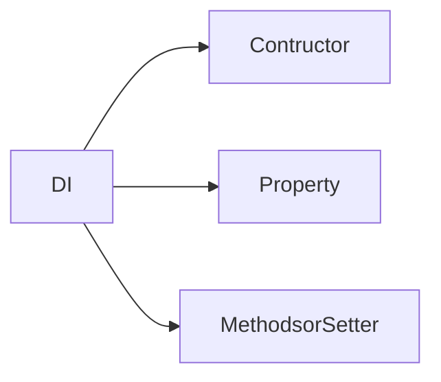

# Dependency Injunction

```tasks 
not done 
path includes Design Patterns/Dependency Injunction
```


```dataview
LIST 
From #design_pattern and #dependency_injunction
```


- [ ] Check out DI in containers 


use a container for managing objects ?
Constructor Injection and Setter Injection ? 

- [ ] Checkout microservices architecture 

#### ✅ Benefits:

Helps you to **decouple** the external logic of your implementation 

---

*An important point of injecting dependencies is to avoid injecting implementations (structs), you should inject abstractions (interfaces).* ? 

- [ ] Checkout Dependency Inversion Principle ? 

>  An important point of injecting dependencies is to avoid injecting implementations (structs), you should inject abstractions (interfaces). It’s the letter D of S.O.L.I.D: Dependency Inversion Principle. It allows you to switch easily the implementation of some dependency and, you could change the real implementation for a mock implementation. It's fundamental for unit testing. - [Source](https://medium.com/avenue-tech/dependency-injection-in-go-35293ef7b6)

```go 
type SomeRepo interface{}
type SomeLogger interface{}
type SomeMessageBroker interface{}

type SomeService struct {
	repo SomeRepo
	logger SomeLogger 
	broker SomeMessageBroker 
}

func NewSomeService ( repo SomeRepo , logger SomeLogger , broker SomeMessageBroker)SomeService{
	return &SomeService{
		repo: repo,
		logger: logger,
		broker: broker,
	}
} 
```


## Types 


### Constructor Injunction 
```go
func NewStaffProfileService(
	staffProfileRepository repository.StaffProfileRepository,
	staffRepo repository.StaffRepository,
	staffDetailRepo repository.StaffDetailRepository,
	staffAdditionalDetailRepo repository.StaffAdditionalDetailRepository,
	staffPayScaleRepo repository.StaffPayScaleRepository,
	serviceBreakRepo repository.StaffServiceBreakRepository,
) StaffProfileService {
	return &staffProfileService{
		staffProfileRepository:    staffProfileRepository,
		staffRepo:                 staffRepo,
		staffPayScaleRepo:         staffPayScaleRepo,
		staffDetailRepo:           staffDetailRepo,
		staffAdditionalDetailRepo: staffAdditionalDetailRepo,
		serviceBreakRepo:          serviceBreakRepo,
	}
}
```

> These kinds allow you to change dependencies in runtime, so by design, they aren’t immutable. But if you need to change the implementation of some dependency, you don’t need to recreate everything. You can just override what you need. It may be useful if you have a feature flag that changes an implementation inside your service. - [Source](https://medium.com/avenue-tech/dependency-injection-in-go-35293ef7b6)

### Method Injunction 

```go
type staffProfileService struct {
	staffProfileRepository    repository.StaffProfileRepository
	staffRepo                 repository.StaffRepository
	staffDetailRepo           repository.StaffDetailRepository
	staffAdditionalDetailRepo repository.StaffAdditionalDetailRepository
	staffPayScaleRepo         repository.StaffPayScaleRepository
	serviceBreakRepo repository.StaffServiceBreakRepository
}
```

## How? 
Using dependency injection container. 
- [ ] Checkout DI Container 


