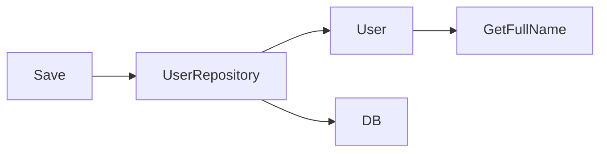

# SOLID Principles
- [[Factory Design Pattern]]
- [[Programming Practice]]

| Principle                                                                              | Meaning                                                                        | Related Design Patterns                                           |
| -------------------------------------------------------------------------------------- | ------------------------------------------------------------------------------ | ----------------------------------------------------------------- |
| **S** – [[#1. Single Responsibility Principle (SRP)\|Single Responsibility Principle]] | A class should have **only one reason to change**.                             | [[Factory Design Pattern\|Factory]] , [[Builder]] , [[]] Observer |
| **O** – Open/Closed Principle                                                          | Classes should be **open for extension but closed for modification**.          | Strategy, Decorator, Template Method                              |
| **L** – Liskov Substitution Principle                                                  | Subclasses should be usable wherever the parent class is.                      | All polymorphism-based patterns                                   |
| **I** – Interface Segregation Principle                                                | Use **small, specific interfaces** rather than big general ones.               | Adapter, Proxy                                                    |
| **D** – Dependency Inversion Principle                                                 | High-level modules should not depend on low-level ones — **use abstractions**. | Dependency Injection, Facto                                       |
|                                                                                        |                                                                                |                                                                   |

## 1. Single Responsibility Principle (SRP) 
> Principle states that a class or module should **have only one reason** to change

^7527e8

>  The essence of the Single Responsibility Principle lies in the limitation of responsibilities of an entity (class, function, package, or module). It should concentrate on a single task and encapsulate all the elements necessary for executing the specified task.
>  - [Source](https://medium.com/@radhakrishnan.nit/single-responsibility-principle-in-golang-89a4a75f6fc4)
- it encourages developers to create modular and reusable code by dividing each component into a single responsibility. This helps in making the code more maintainable, testable, and easier to understand,

```go
type User struct {
    FirstName string
    LastName  string
}
func (u *User) GetFullName() string {
    return u.FirstName + " " + u.LastName
}
func (u *User) Save() error {
    // Save user to the database
    // ...
}

```

- the `User` struct now handles **both** data and persistence. 

```go
type User struct {
    FirstName string
    LastName  string
}
func (u *User) GetFullName() string {
    return u.FirstName + " " + u.LastName
}
type UserRepository struct {
    // DB connection or context
}
func (r *UserRepository) Save(u *User) error {
    // Save user to the database
    // ...
}

```

### Explanation 
  What this implicitly says is that 
1. One model , structure etc only used for single purpose -> "a type should have a single responsibility" 
In this 

```go
func (u *User) GetFullName() string {  
}  
func (u *User) Save() error {  
}

```

In this , the `User` has 2 responsibilities (*methods attached*) Which serves entirely different purpose for example 
1. `func (u *User) GetFullName() string` : This will return the **FullName** 
2. `func (u *User) Save() error`: This will save the user to the data base 
In this case, the `User` struct has two responsibilities: managing user data and saving it to the database

In the second one 

```go
func (u *User) GetFullName() string {  
}  
  
type UserRepository struct {  
}  
  
func (r *UserRepository) Save(u *User) error {  
}

```



Now the responsibilities are separated 
- The `UserRepository` handles the database actions and 
- The `User` has only one method , attached `GetFullName`
### How this will help?
Consider these 3 operations 

![[SOLID principle Flow.png]]
Here , 
- **Handler**: Handler handles the http stuff , request , responses . 
- **Service**: **Handler** calls the **Service** for things like , **Create a new User** or **Delete a new User** etc.
- **Repo**: Repository handles all the database related things like **Inserting auser into the database** , and getting a user from the database , stuff like that ,
 
In developer perspective think of it as like following a good pattern where you can easily mock , ie you can just change the db and it wont effect other than the Repo , and you can simply call another function or something like that to cope.  

- **Domain-Driven Design (DDD)**, Version 2 is preferred

### Repositories 
- Each repository should handle operations **related to one aggregate or entity**.  ^f6b894

## 2. Open/Closed Principle (OCP)
should be open for extension but closed for modification.

###  Without ❌ 

```go
type Circle struct {  
Radius float64  
}  
  
func Area(shape interface{}) float64 {  
switch s := shape.(type) {  
case *Rectangle:  
return s.Width * s.Height  
case *Circle:  
return math.Pi * math.Pow(s.Radius, 2)  
default:  
return 0  
}  
}

```

###  ✅ With OCP 

```go
type Shape interface {  
Area() float64  
}  
func (r *Rectangle) Area() float64 {  
return r.Width * r.Height  
}  
func (c *Circle) Area() float64 {  
return math.Pi * math.Pow(c.Radius, 2)  
}

```

Understanding this will require a significant experience with go 
In go the definition of interface is   (ment by ) ![[Go#^d2e304]] 

### Repositories 

- If repositories are modular, adding features like validation, logging, or alternate storage becomes easier without modifying core logic. ^f778d0

## 4. Interface Segregation Principal
[Source](https://maddevs.io/blog/solid-interface-segregation-principle-in-golang/)
> An interface is a contract defining a set of methods without specific implementation(kinda like prototype.)

>A client should never be forced to implment an interface that ut doesn;t use , or client shouldn't be forced to depned on methods they do not use. 

Never Create a God Object 

>[!Note]- **God Object**
>Its an **object** that references a large number of distinct types, has too many unrelated or uncategorized methods, or some combination of both. More [[God Object]] 

> [!blank|right-small] 
> **See also**
> [[Anti Pattern]]
> [[Big Ball Of Mud]]
> [[Poltegeist]]
> [[Magic Number]]

## Y? 
- They are easier to test, maintain, and support.
- Can be used to make bigger more complex , interfaces. 

- [ ] Include Examples 
