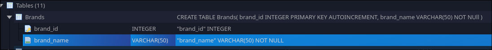

# GORM
- [[Eager Loading]]
- [[Using SOLID Principle]]
- [[Relations]]

```bash
go get -u gorm.io/gorm
go get -u gorm.io/driver/sqlite

```

#sampleCode 

```go
package main

import (
  "context"
  "gorm.io/driver/sqlite"
  "gorm.io/gorm"
)

type Product struct {
  gorm.Model
  Code  string
  Price uint
}

func main() {
  db, err := gorm.Open(sqlite.Open("test.db"), &gorm.Config{})
  if err != nil {
    panic("failed to connect database")
  }

  ctx := context.Background()

  // Migrate the schema
  db.AutoMigrate(&Product{})

  // Create
  err = gorm.G[Product](db).Create(ctx, &Product{Code: "D42", Price: 100})

  // Read
  product, err := gorm.G[Product](db).Where("id = ?", 1).First(ctx) // find product with integer primary key
  products, err := gorm.G[Product](db).Where("code = ?", "D42").Find(ctx) // find product with code D42
 
  // Update - update product's price to 200
  err = gorm.G[Product](db).Where("id = ?", product.ID).Update(ctx, "Price", 200)
  // Update - update multiple fields
  err = gorm.G[Product](db).Where("id = ?", product.ID).Updates(ctx, map[string]interface{}{"Price": 200, "Code": "F42"})

  // Delete - delete product
  err = gorm.G[Product](db).Where("id = ?", product.ID).Delete(ctx)
}

```

```go
package main

import (
  "gorm.io/driver/sqlite"
  "gorm.io/gorm"
)

type Product struct {
  gorm.Model
  Code  string
  Price uint
}

func main() {
  db, err := gorm.Open(sqlite.Open("test.db"), &gorm.Config{})
  if err != nil {
    panic("failed to connect database")
  }

  // Migrate the schema
  db.AutoMigrate(&Product{})

  // Create
  db.Create(&Product{Code: "D42", Price: 100})

  // Read
  var product Product
  db.First(&product, 1) // find product with integer primary key
  db.First(&product, "code = ?", "D42") // find product with code D42

  // Update - update product's price to 200
  db.Model(&product).Update("Price", 200)
  // Update - update multiple fields
  db.Model(&product).Updates(Product{Price: 200, Code: "F42"}) // non-zero fields
  db.Model(&product).Updates(map[string]interface{}{"Price": 200, "Code": "F42"})

  // Delete - delete product
  db.Delete(&product, 1)
}

```



## Working with Brands Table

> [!info] Table Structure
> - `brand_id`: int (primary key)
> - `brand_name`: varchar(50)

```go
package main

import (
  "gorm.io/driver/sqlite"
  "gorm.io/gorm"
)

// Brand model for brands table
type Brand struct {
  BrandID   int    `gorm:"primaryKey;column:brand_id"`
  BrandName string `gorm:"type:varchar(50);column:brand_name"`
}

// TableName specifies the table name
func (Brand) TableName() string {
  return "brands"
}

func main() {
  db, err := gorm.Open(sqlite.Open("test.db"), &gorm.Config{})
  if err != nil {
    panic("failed to connect database")
  }

  // Migrate the schema (creates table if not exists)
  db.AutoMigrate(&Brand{})

  // Create - Insert new brand
  brand := Brand{BrandName: "Nike"}
  db.Create(&brand)
  
  // Create multiple brands
  brands := []Brand{
    {BrandName: "Adidas"},
    {BrandName: "Puma"},
    {BrandName: "Under Armour"},
  }
  db.Create(&brands)

  // Read - Find by ID
  var foundBrand Brand
  db.First(&foundBrand, 1) // find brand with brand_id = 1
  
  // Read - Find by name
  var nikeBrand Brand
  db.Where("brand_name = ?", "Nike").First(&nikeBrand)
  
  // Read - Get all brands
  var allBrands []Brand
  db.Find(&allBrands)
  
  // Read - Find brands with LIKE
  var sportsBrands []Brand
  db.Where("brand_name LIKE ?", "%Adidas%").Find(&sportsBrands)

  // Update - Single field
  db.Model(&foundBrand).Update("brand_name", "Nike Updated")
  
  // Update - Multiple fields
  db.Model(&foundBrand).Updates(Brand{BrandName: "Nike Pro"})
  
  // Update with map
  db.Model(&foundBrand).Updates(map[string]interface{}{
    "brand_name": "Nike Elite",
  })

  // Delete - Soft delete (if using gorm.Model)
  db.Delete(&foundBrand)
  
  // Delete - Hard delete by ID
  db.Unscoped().Delete(&Brand{}, 1)
  
  // Delete - With condition
  db.Where("brand_name = ?", "Puma").Delete(&Brand{})
}

```

> [!tip] GORM Tags Explained
> - `primaryKey`: Marks the field as primary key
> - `column:brand_id`: Maps to specific database column name
> - `type:varchar(50)`: Specifies the database column type
> - `TableName()` method: Overrides default table naming convention

> [!example] Query Examples
> ```go
> // Count brands
> var count int64
> db.Model(&Brand{}).Count(&count)
> 
> // Find with limit
> var limitedBrands []Brand
> db.Limit(5).Find(&limitedBrands)
> 
> // Find with order
> var orderedBrands []Brand
> db.Order("brand_name ASC").Find(&orderedBrands)
> 
> // Check if record exists
> var exists Brand
> result := db.Where("brand_name = ?", "Nike").First(&exists)
> if result.Error == gorm.ErrRecordNotFound {
>     // Brand not found
> }
> ```

>[!important]
>
> ```go
> db.Limit(1).Find(&brands)
> db.Find(&brands).Limit(1)
> ```

> They are both not same , the first one does the job but the second one dont find out why ?  
> - [ ] Find why the second one is not working?

#### Geting First One.

```go
package main

import (
	"fmt"

	"gorm.io/driver/sqlite"
	"gorm.io/gorm"
)

type Brands struct {
	BrandID   int    `gorm:"primaryKey;column:brand_id"` // Fixed typo: BandID -> BrandID
	BrandName string `gorm:"type:varchar(50);column:brand_name"`
}

func (Brands) TableName() string {
	return "Brands"
}

func main() {
	db, err := gorm.Open(sqlite.Open("Car_Database.db"), &gorm.Config{})
	if err != nil {
		fmt.Println(err)
	}
	
	var brands Brands
	db.Limit(1).Find(&brands)
	fmt.Println(brands)
}

```

## Checking if Records Exist

> [!info] Different ways to check if a record exists in GORM

```go
package main

import (
	"errors"
	"fmt"
	"gorm.io/driver/sqlite"
	"gorm.io/gorm"
)

type Brands struct {
	BrandID   int    `gorm:"primaryKey;column:brand_id"`
	BrandName string `gorm:"column:brand_name"`
}

func (Brands) TableName() string {
	return "Brands"
}

func main() {
	db, _ := gorm.Open(sqlite.Open("Car_Database.db"), &gorm.Config{})

	// Method 1: Using First() and checking for ErrRecordNotFound
	var brand Brands
	result := db.Where("brand_id = ?", 999).First(&brand)
	
	if errors.Is(result.Error, gorm.ErrRecordNotFound) {
		fmt.Println("Brand not found!")
	} else if result.Error != nil {
		fmt.Println("Database error:", result.Error)
	} else {
		fmt.Println("Brand exists:", brand)
	}

	// Method 2: Using Count to check existence
	var count int64
	db.Model(&Brands{}).Where("brand_name = ?", "NonExistentBrand").Count(&count)
	
	if count == 0 {
		fmt.Println("Brand with name 'NonExistentBrand' does not exist")
	} else {
		fmt.Printf("Found %d brands with that name\n", count)
	}

	// Method 3: Using Take() (similar to First but doesn't add ORDER BY)
	var brandTake Brands
	err := db.Where("brand_id = ?", 1).Take(&brandTake)
	
	if errors.Is(err.Error, gorm.ErrRecordNotFound) {
		fmt.Println("Brand with ID 1 not found")
	} else {
		fmt.Println("Brand found:", brandTake)
	}

	// Method 4: Check if record exists (helper function)
	exists := recordExists(db, "brand_name = ?", "Nike")
	if !exists {
		fmt.Println("Nike brand does not exist")
	}
}

// Helper function to check if record exists
func recordExists(db *gorm.DB, condition string, args ...interface{}) bool {
	var count int64
	db.Model(&Brands{}).Where(condition, args...).Count(&count)
	return count > 0
}

```

> [!example] Why `db.Find(&brands).Limit(1)` doesn't work?
> ```go
> // This doesn't limit the query
> db.Find(&brands).Limit(1)  // Limit is applied AFTER Find executes
> 
> // This properly limits the query  
> db.Limit(1).Find(&brands)  // Limit is applied BEFORE Find executes
> ```

> 
> **Reason**: GORM chain methods must be in the correct order. `Find()` executes the query immediately, so any methods after it are ignored.

> [!tip] Best Practices for Existence Checks
> - Use `First()` with error checking for single records
> - Use `Count()` when you need to know the exact number
> - Use `Take()` when you don't care about ordering
> - Create helper functions for common existence checks
> - Always handle `gorm.ErrRecordNotFound` properly

> [!warning] Common Mistakes
> - Not checking for `gorm.ErrRecordNotFound` 
> - Using `Find()` instead of `First()` for single records
> - Placing `Limit()` after `Find()`
> - Ignoring other database errors besides "not found"

## Multiple IDs
Extracted from [[Gin#^acd852]]

```go
var users []User  
result := db.Find(&users, uintIDs)   
if result.Error != nil {  
// Handle error  
}

```

Alternative

```go
var users []User
result := db.Where("id IN ?", uintIDs).Find(&users)

```

## Error Handling 

```

ErrRecordNotFound

```

*Only For*  ->  `First`, `Last`, `Take`.

### Errors 

```go
if db.RowsAffected == 0 && db.Statement.RaiseErrorOnNotFound && db.Error == nil {
	db.AddError(ErrRecordNotFound)
}

```

## Transactions 
- First Check if the staff with `staff_id(string)` exists 
	- if exists return return `staffPrimaryKey` and `nil` as the `errro`
	- if not return `0` and `err`
- now retrieve `staffDetails` using the primary key of the `staff` just obtained .
