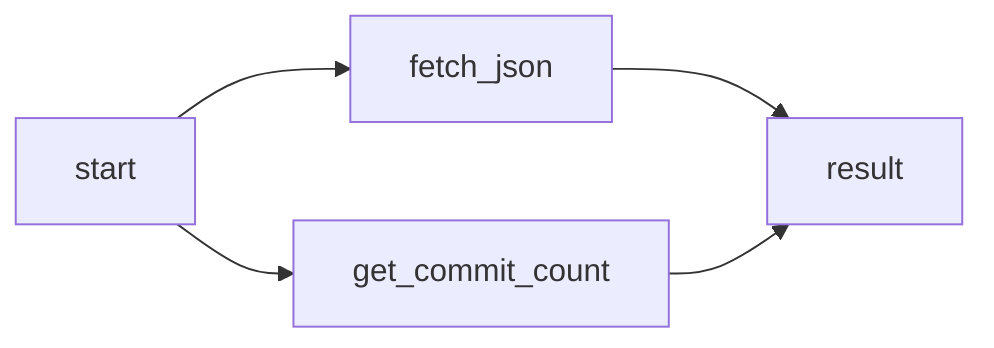

# GO Routines

```go
name 
```
```go
package main

import (
	"fmt"
	"time"
)

func say(s string) {
	for i := 0; i < 5; i++ {
		time.Sleep(1000 * time.Millisecond)
		fmt.Println(s, i)
	}
}

func main() {
	go say("first")
	say("second")
}
```

```
first 0
second 0 // here
second 1
first 1
first 2
second 2
second 3
first 3
first 4
second 4

```
- Example 2
```go
package main

import (
	"fmt"
	"time"
)

func parseJSON(c chan int) {
	fmt.Println("Parsing JSON")
	time.Sleep(3 * time.Second)
	c <- 2 // send sum to c
	fmt.Println("Finished Parsing JSON")
}

func getCommitCount(count chan int) {
	fmt.Println("Getting Commits form github")
	time.Sleep(3 * time.Second)
	count <- 10
	fmt.Println("Finished Getting Commits form github")
}

func main() {
	startTime := time.Now()
	usernames := make(chan int)
	count := make(chan int)
	go parseJSON(usernames)
	go getCommitCount(count)
	theUserNames, RemoteCommitCount := <-usernames, <-count // receive from c
	fmt.Printf(" %v \n%v", theUserNames, RemoteCommitCount)
	pgDuration := time.Since(startTime)
	fmt.Printf("\nProgram Finished in %s", pgDuration)
}
```


> [!success]+ **Output**
> ```
> Parsing JSON
> Getting Commits form github
> Finished Parsing JSON
>  2
> 10Finished Getting Commits form github
> 
> Program Finished in 3.000550698s%
> ```

In this example the flow goes like this




## File Processing using Go Routines
Requirement is to read a `json` file and get a specific element from the file , since the file processing takes too much time it is best to use [[Concurrency]] for this , it may be as follows

- read the `json` file , start new job 
- tell the function which depents on job to wait for it to finish 
