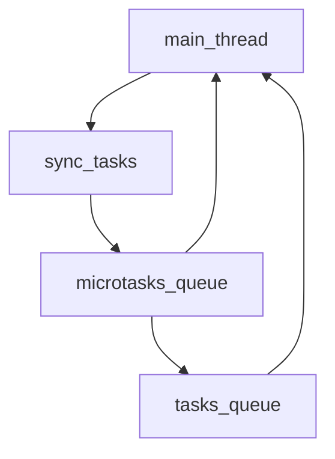

# Asynchronous Programming

```js
console.log("1");
setTimeout(() => {
    console.log("2");
}
, 0);
Promise.resolve().then(() => {
    console.log("3");
}
);
console.log("4");

```

```

1
4
3
2

```

The **synchronous[^1]** task is executed first , then the microtask runs with the current loop , then the task 

