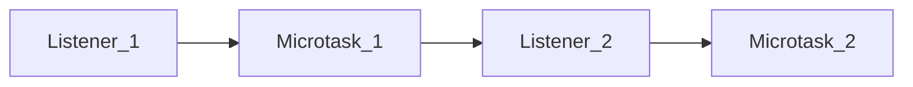
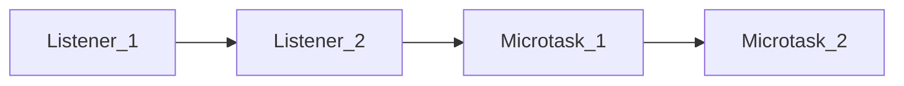

# QUEUES
- Tasks
- Animation callbacks
- Microtasks 
	- Blocks rendering
	- It can not continue until that queue is completely emptied

<iframe width="560" height="315" src="https://www.youtube.com/embed/cCOL7MC4Pl0?si=4wsCSNMwv9-H6Zsc" title="YouTube video player" frameborder="0" allow="accelerometer; autoplay; clipboard-write; encrypted-media; gyroscope; picture-in-picture; web-share" referrerpolicy="strict-origin-when-cross-origin" allowfullscreen></iframe>

```js
button.addEventListener('click' , () => {
Promise.resolve().then(() => console.log('Microtask 1'));
console.log('Listen 1');
});
button.addEventListener('click' , () => {
Promise.resolve().then(() => console.log('Microtask 2'));
console.log('Listen 2');
});

```



```js
button.addEventListener('click' , () => {
Promise.resolve().then(() => console.log('Microtask 1'));
console.log('Listen 1');
});
button.addEventListener('click' , () => {
Promise.resolve().then(() => console.log('Microtask 2'));
console.log('Listen 2');
});
button.click();

```



>[!summary] Summary 
>The javascripts that executes in the web is single threaded, due to beeing single threaded it is essential to not block the execution. So the programmers have to carefully execute in sequence to avoid the blocking code.
