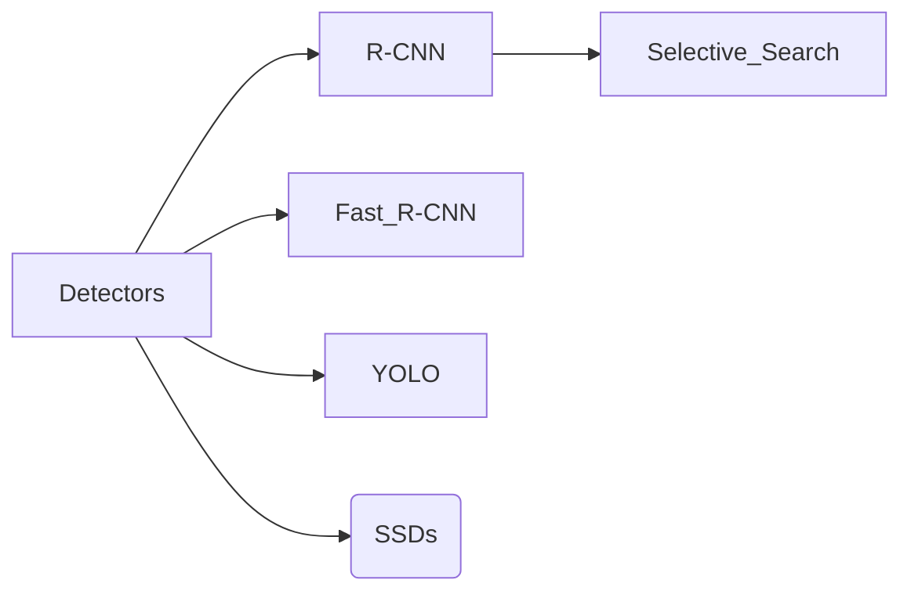

# Object Detection
object detection draws bounding boxes around each detected object, specifying its location.^[https://www.ultralytics.com/glossary/object-detection]

**Prerequisites**
- [[CNN]]
- [[Intersection over Union|Intersection over Union (IoU)]]
- [[Mean average precision(mAP)]]

There are 2 process
1. Classification: Identifies what objects are present
2. Localization: where it is present , and draws a bounding box around them.

## Detecting Objects

