# Object Oriented Programming Python

*This will be entirely focused on object oriented python.*

>[!info]- What is Object Oriented Programming?
>In treats real-world entities as objects and groups related data and functionality together. In traditional programming languages like [[03 Coding/01 C/C]] the data and functions are seperate and treated differently but in OOP they are grouped together as objects. 

>[!info]- Why Object Oriented Programming?
>In my personal opinion when dealing with real world entities or *things* in general oop makes so much sense. Consider the following 
>You have these functions  
>```c
>int get_age();
>string get_name();
>void get_date_of_birth();
>void print_details();
>```

>In functional programming languages like **C** you will pass a reference to a struct , which will be like follows
>```c
>struct Person {
>	int age;
>	string name;
>	string place_of_birth;
>	date date_of_birth;
>};
>```

>In **C** you will do like 
>```c
>get_name(&person1)
>get_age(&person1)
>get_date_of_birth(&person1)
>print_details(&person1)
>```

>And in oop we do something like following, trust me dealing with pointers is hard for starters
>```python
>person.get_name()
>person.get_age()
>person.get_date_of_birth()
>person.print_details()
>```

>Using functional language with something to group together data like `struct` is great but some like to group functions too like c++ structs which allows to pack functions too. . and i do like the features comes with Object Oriented Programming like **inheritance**, **polymorphism** etc. Which makes sense and updating the codebase much easier. You can always change the logic of the function without changing the interface. It is possible in functional programming languages too but it is not as easy as in OOP.

**Class**: Is a blueprint for creating objects
**Object**: Is an instance of a class

## Class  and Objects
*A class consists of set of attributes and methods.* 
So if you did a little bit of python before you might have already seen classes and objects , you might not realize but when you use basic things like `x = 5` in that `x` is an object of class `int`. To test the theory do the following

```python
print(type(1)) # class 'int'
print(type("Hello")) # class 'str'
print(type(1.5)) # class 'float'

```

^341f6e

>[!success]- **Output**
>```

><class 'int'>
><class 'str'>
><class 'float'>
>```

**Now how can we create new classes?** Look at the following

```python
class Person:
	def print_age(self,age):
		print(f"Age is {age}")  # Method

```

This defines a class named `Person` with a method `print_age`. But in python most of the time when your creatiing a class you will also define an `__init__` method which is called the **initializer**. It is used to initialize the attributes of the class. so the following example is more appropriate. 

#example :

```python
class Person:
	def __init__(self, name, age):
		self.name = name  # Attributes
		self.age = age    # Attributes
	def print_age(self):
		print(f"Age is {self.age}")  # Method

```

Here `Person` is a class  and `name` and `age` are attributes. `print_age` is a method of the class.

**How to create an object?**

```python
P1 = Person("Arun",23)
P2 = Person("Arun Again",24)

```

You can create objects in this manner , and in the first creationm (P1) the `"Arun"` is passed as `name` and `23` is passed as `age`  and they will be assigned to `self.name` and `self.age` respectively.

**`self`**: `self` is a reference to the current instance of the class. It allows you to access attributes and methods of the class in Python.
You will learn about `__init__` method in detail below.

**Now how to access a method**:

```python
P1.print_age()  # This will print "Age is 23"

```

#completeCode 1

```python
class Person:
    def __init__(self, name, age):
        self.name = name  # Attributes
        self.age = age    # Attributes
    def print_age(self):
        print(f"Age is {self.age}")  # Method
P1 = Person("Arun",23)
P2 = Person("Arun Again",24)
P1.print_age()  

```

^caffc4

And if you now do  the `type()` thing herer you get something like `__main__.Person` which means it is a class named `Person` in the current module `__main__`. 

```python
print(type(P2))

```

>[!example]- Extra
>```python
>def fn():
>	pass
>print(type(fn))  # <class 'function'>
>```

### Methods
*Method is a function that belongs to a class.* 

Consider this previous example ![[#^341f6e]] if these `str` , `int` and `float` are classes , do they have methods? Yes
![[02 Academics/Btech/S7/Python For Engineers/Class Notes#Strings|Class Notes]]
You can see that there are lots of methods available for `str` class. If you check [this](https://docs.python.org/3/library/stdtypes.html) you can get lots of examples of methods available for different builtin types. 

### Initializer 
The `__init__` method is a special method in Python classes. It is called when an object of the class is instantiated. It initializes the attributes of the class.
Now consider the same code
![[#^caffc4]]

and consider the first **method** `__init__`:

```python
def __init__(self, name, age):
	self.name = name  # Attributes
	self.age = age    # Attributes

```

This function will be called when the object is created and it will take `name` and `age` as parameters and assign them to `self.name` and `self.age` respectively. You can do other things too here for example ;
#completeCode 2

```python
class Rectangle:
	def __init__(self, length, breadth):
		self.length = length
		self.breadth = breadth
		self.area = self.length * self.breadth 
	def print_area(self):
		print(f"Area is {self.area}")
R1 = Rectangle(2, 5)
R1.print_area() 

```

>[!success]- **Output**
>```

>Area is 10
>```

See , the `__init__` is just like a regular function and it can call another function etc . But it will have an aditional argument `self`  and it will be called when the object is created. So you do the essential things there like initializing attributes which will be used later.

>[!question]- **Can you create a class without `__init__`**?
> Yes
>```python
>class Empty:
>	pass
>	def print_something(self):
>		print("Something")
>E = Empty()
>E.print_something() 
>```

>[!question]- **Can you initialize without `__init__`** ? 
> Yes
>```python
>class Empty:
>	def print_something(self):
>		print("Something")
>	def initialize_attributes(self):
>		self.name = "Arun"
>		self.age = 23
>E = Empty()
>E.initialize_attributes()
>print(E.name)  #  "Arun"
>```

### `__str__` Method
The `__str__` method is a special method in Python that is used to define a string representation of an object. When you call `print()` on an object, Python will automatically call the `__str__` method to get the string representation of that object.
First try running this

```python
print(P1)

```

>[!success]- **Output**
>```

><__main__.Person object at 0x7bc68371da90>
>```

you will get something like `<__main__.Person object at 0x7bc68371da90>` but what if you can get something helpfull by printing the object itself. 

Now check this code.
#completeCode 3 ^364ad2

```python
class Person:
	def __init__(self, name, age):
		self.name = name
		self.age = age
	def __str__(self):
		return f"Person Name: {self.name}"
Arun = Person("Arun", 23)
print(Arun) 

```

^4e1375

>[!success]- **Output**
> ```

> Person Name: Arun
>```

Here we have defined a `__str__` method which returns a string when called. 

[^1]: parent class in the sense that from where it is inheriting. 

## Encapsulation
**Def:** *Bundling data and methods within a class, restricting direct access to some components.* 
**Why:** There are many resons to restrict acess to objects internal data , which results in better integrity and all that. 

Lets Look at the previous example(`#completeCode 3`). 

```python
class Person:
	def __init__(self, name, age):
		self.name = name
		self.age = age
Arun = Person("Arun", 23)
arun_age = Arun.age

```

```python
print(arun_age)  # 23

```

>[!success]- **Output**
>```

>23
>```

In this you were able to access the attributes `age` by directly using `<object_name><method_operator><attribute_name>` (`Arun.age`) . Well in theory **encapsulation** means *restricting direct access* to some attributes. 
Now look at the following code . I have modified only the attributes names anadded a **double underscore** as a prefix to names.( i've just changed `self.name` to `self.__name` and `self.age` to `self.__age`. )

```python
class Person:
	def __init__(self, name, age):
		self.__name = name
		self.__age = age

```

Imagine, you want to access `Arun`'s age , and you do something like this

```python
arun_age = Arun.__age
print(arun_age)

```

>[!success]- **Output**
>```

>'Person' object has no attribute '__age'
>```

this error message is actually a `AttributeError` which means that the attribute you are tring to acess is private or that attribute is not exist . And renaming variable like this makes them private and it is called **name mangling**. But actually there is a way to access them even if they are private

```python
arun_age = Arun._Person__age
print(arun_age)

```

>[!success]- **Output**
>```

>23
>```

>[!Summary]
> - Encapsulation is a way to restrict direct access to some attributes.
> - adding `__` to the beginning of the attribute name makes it private.
> - You can access private attributes by using `_ClassName__attribute_name` syntax. (Not recommented) 

Instead you should do something like this 💯 , Which is best practice.

```python
class Person:
	def __init__(self, name, age):
		self.__name = name
		self.__age = age
	def get_age(self):
		return self.__age
Arun = Person("Arun", 23)
arun_age = Arun.get_age()
print(arun_age)

```

>[!success]- **Output**
>```

>23
>```

>[!important] private methods
>You can also make methos private to just add the `__` to the beginning of the method name.

## Inheritance
As the name says it **inherits** the attributes and methods of the parent class.[^1]

#syntax 

```python
class child_class(parent_class):
	# code

```

>[!question]- **Why**
> Because it is like the inheritance in the realworld and makes sense. Like a real chile often inherits the properties of the parent. if not consider money as a property , their chile will inherit the money too.😅

#example  
Let say we have a class `Animal` and we want to create a class `Dog` which inherits the properties of `Animal`. and then create a class named `Cat` which inherits the properties of `Animal`.  Then create a new class named `GermanShepherd` which inherits the properties of `Dog`. and according to [this](https://pawsindia.com/pages/german-shepherd) gernal the the `GermanShepherd` is good in search and rescue. 

```python`


Now `GrmanShepherd` will have the properties of `Dog` and `Animal`. 

```python
class Animal:
	def __init__(self, name):
			self.name = name
class Dog(Animal):  # Inherits from Animal
	def bark(self):
		print(f"{self.name} Barks!")
class Cat(Animal):  # Inherits from Animal
	def meow(self):
		print(f"{self.name} Meows!")
class GermanShepherd(Dog):  # Inherits from Dog
	def search(self):
		print(f"{self.name} is Searching!")
	def rescue(self):
		print(f"{self.name} is Rescuing!")

```

if we visualize it 

```mermaid
mindmap
	root((🦁 Animal))
		{{Name}}
		)😺 Cat(
			(😸 meow)
		)🐶 Dog(
			(🦮 bark)
			))🐕‍🦺 German Sheperd((
				(🔎search)
				(🚑rescue)
    

```



and if take the German Sheperd alone it will now have the attribute `name` and methods `bark`, `search`, and `rescue`. 

```mermaid
mindmap
	root((🐕‍🦺 German
			shepherd))
		{{Name}}
		(🦮 bark)
		(🔎 search)
		(🚑 rescue)

```



at the center we have the `Animal` class and the the `Cat` and `Dog` classes are inheriting the properties of `Animal` class. 
now we can do things like

```python
Buddy = GermanShepherd("Buddy")
Buddy.bark()  # Buddy Barks!
Buddy.search()  # Buddy is Searching!
Buddy.rescue()  # Buddy is Rescuing!

```

#completeCode 4

```python
class Animal:
	def __init__(self, name):
			self.name = name
class Dog(Animal):  # Inherits from Animal
	def bark(self):
		print(f"{self.name} Barks!")
class Cat(Animal):  # Inherits from Animal
	def meow(self):
		print(f"{self.name} Meows!")
class GermanShepherd(Dog):  # Inherits from Dog
	def search(self):
		print(f"{self.name} is Searching!")
	def rescue(self):
		print(f"{self.name} is Rescuing!")
Buddy = GermanShepherd("Buddy")
Buddy.bark() 
Buddy.search() 
Buddy.rescue()  

```

>[!success]- **Output**
>```

>Buddy Barks!
>Buddy is Searching!
>Buddy is Rescuing!
>```

### Types of Inheritance
1. Single Inheritance: A class inherits from one parent class.
2. Multiple Inheritance: A class inherits from multiple parent classes.
3. Multilevel Inheritance: A class inherits from another class which in turn inherits from another class like a --> b --> c.
4. Hierarchical Inheritance: Multiple classes inherit from a single parent class.
5. Hybrid Inheritance: A combination of two or more types of inheritance.
#### Single Inheritance
*A class inherits from one parent class.*


```python
class A:
	def some_method(self):
		print("Some Method")
class B(A):
	def some_another_method(self):
		print("Some Another Method")

```

#### Multiple Inheritance
*A class inherits from multiple parent classes.*


```python
class A:
	def some_method(self):
		print("Some Method")
class B:
	def some_another_method(self):
		print("Some Another Method")
class C(A, B): 
	def some_yet_another_method(self):
		print("Some Yet Another Method")

```

#### Multilevel Inheritance
 A class inherits from another class which in turn inherits from another class like a --> b --> c.


```python
class A:
	def some_method(self):
		print("Some Method")
class B(A):
	def some_another_method(self):
		print("Some Another Method")
class C(B): 
	def some_yet_another_method(self):
		print("Some Yet Another Method")

```

#### Hierarchical Inheritance
*Multiple classes inherit from a single parent class.*


```python
class A:
	def some_method(self):
		print("Some Method")
class B(A):
	def some_another_method(self):
		print("Some Another Method")
class C(A): 
	def some_yet_another_method(self):
		print("Some Yet Another Method")
class D(A):
	def again_some_method(self):
		print("Again Some Method")

```

#### Hybrid Inheritance
*A combination of two or more types of inheritance.*


```python
class A:
	def s1(self):
		print("s1")
class B(A):
	def s2(self):
		print("s2")
class C(A):
	def s3(self):
		print("s3")
class D(B):
	def s4(self):
		print("s4")
class E(C):
	def s5(self):
		print("s5")
class F(C):
	def s6(self):
		print("s6")

```

You get the idea

### `__super__` Method

The `super()` function is used to call methods from a parent class. It allows you to access inherited methods that have been overridden in a child class.

Lets consider the following programm from [[02 Academics/Btech/S7/Python For Engineers/Class Notes|Class Notes]] 
![[02 Academics/Btech/S7/Python For Engineers/Class Notes#^46ec55|Class Notes]]
the inheritance is like this 


Lets consider the first class(parent class) `Person`

```python
class Person:
    def __init__(self, fname, lname):
        self.firstname = fname
        self.lastname = lname
    def printname(self):
        print(self.firstname, self.lastname)
Person1 = Person("Some Guy", "PP")
Person1.printname()

```

In that program they are asked to create a child class from the parent class(`Person`) and add graduation year to the child class ,it will be something like this

```python
class Student(Person):
	def __init__(self, fname, lname, year):
		self.firstname = fname
		self.lastname = lname
		self.graduationyear = year
	def print_details(self):
		print(f"{self.firstname} {self.lastname} , Graduation Year: {self.graduationyear}")
student1 = Student("Arun", "PP", 2025)
student1.print_details()

```

it works perfectly fine right ? but you have entirely re written the `__init__` method all over again

```python
self.firstname = fname
self.lastname = lname
self.graduationyear = year

```

but the first attributes `firstname` and `lastname` were already defined in the parent class `Person` . So it is waste to re define them agin there somes the `super()` method
now look at the following code
 #completeCode 5

```python
class Person:
    def __init__(self, fname, lname):
        self.firstname = fname
        self.lastname = lname
    def printname(self):
        print(self.firstname, self.lastname)
class Student(Person):
	def __init__(self, fname, lname, year):
		super().__init__(fname, lname)  
		self.graduationyear = year
	def print_details(self):
		print(
			self.firstname,  
		    self.lastname , 
		    "Graduation Year: ", 
		    self.graduationyear)
		    
student1 = Student("Arun", "PP", 2025)
student1.print_details()

```

>[!success]- **Output**
>```

>Arun PP Graduation Year:  2025
>```

This will not seem like much now but if the `__init__` was huge it will start to make a difference. 

To make it more meanig full we are going to modify the method `print_details` to make use of parent method too. 

#completeCode 6

```python
class Person:
    def __init__(self, fname, lname):
        self.firstname = fname
        self.lastname = lname
    def printname(self):
        return f"{self.firstname}, {self.lastname}"
class Student(Person):
	def __init__(self, fname, lname, year):
		super().__init__(fname, lname)  
		self.graduationyear = year
	def print_details(self):
		print( super().printname(),
		"Graduation Year: ",
		self.graduationyear)
		    
student1 = Student("Arun", "PP", 2025)
student1.print_details()

```

>[!success]- **Output**
>```

>Arun, PP Graduation Year:  2025
>```

if we compare these two codes (`#completeCode 6` and `#completeCode 5`) last one(`#completeCode 6`) is more pythonic[^2]. 

## Polymorphism
*Objects of different classes responding to the same method call in class-specific ways.*

Lets take the classic example of area of shapes

```python
class Rectange:
	def __init__(self, length, breadth):
		self.length = length
		self.breadth = breadth
	def area(self):
		return self.length * self.breadth
class Circle:
	def __init__(self, radius):
		self.radius = radius
	def area(self):
		return 3.14 * self.radius * self.radius
R1 = Rectange(3,4)
C1 = Circle(3)
print(R1.area())  
print(C1.area())  

```

>[!success]- **Output**
>```

>12
>28.259999999999998
>```

You can see that we are using the same method `.area()` for both `Rectangle` and `Circle` classes, but they return different results based on their specific implementations or we can they the act based on which class they are this is know as **polymorphism** . 

One of the usefull thing about **polymorphism** is that you dont have to use/remember different method names , just by naming whats suits the most like `area` `circumstances` and call without thinking , ie. you dont have to care about if it is a `circle` or `Rectangle` it will work as expected. 

## Abstraction
*Hiding complex implementation details and showing only the essential features of an object.*

In **Abstraction** the programmer hides complex implementation(the step by step procedure) and shows only what is necessary . For example consider the following program 

```python
from math import sqrt
print(sqrt(25))

```

>[!success]- **Output**
>```

>5
>```

the only thing you need to know is that there is a function alled `sqrt()` which is provided by the **module** `math` and the `sqrt()` function will return the square root of the number you pass to it. As time progresses you will learn about a huge number of functions anmd use it to get you job done , and if you are lucky you will make a module that will be used by others. And when making that module , you will make sure that it is super easy to work with  and you will  use small function names like `put()` `get()` something like that . And abstraction does the same thing. You might have a hundred lines under the funtion `put()` but in a user perspective you only have to care about what are the argumens that the function is expecting and what it will return, that in theory is **Abstraction**

[^2]: writing code in a way that embraces the principles and idioms of the Python programming language. Simply put *making use of all the features* the python provides.