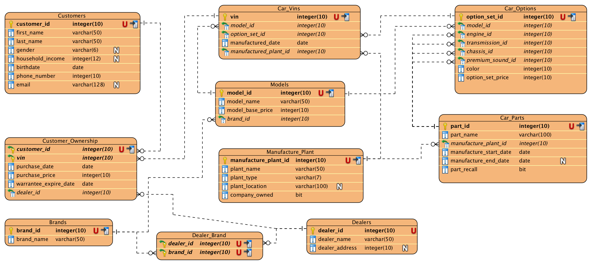

# SQL 

### JOINs

`JOIN` statements combine tables 

Types
`INNER JOIN:` the default join
`LEFT JOIN` / `RIGHT JOIN`
`FULL JOIN`, or `UNION`
`OUTER JOIN:` the opposite of `INNER JOIN`


Yellow: What will be returned. 

Inner Join: 
$$
Y = A \cap B
$$

Left Join:
$$
Y = A \cup (A \cap B)
$$

Right Join:
$$
Y = B \cup (A \cap B)
$$
Outer Join:
$$
Y = A \cup B
$$
Union/Full Join:
$$
Y = A \cup B
$$

```sql
SELECT * FROM sakila.film_actor;

```

> [!info] What this query does:
> - `SELECT *`: Retrieves **all columns** from the table
> - `FROM sakila.film_actor`: Specifies the table `film_actor` in the `sakila` database
> - **Result**: Returns every row and every column from the film_actor table

> [!example] Sample Output Structure
> ```

> actor_id | film_id | last_update
> ---------|---------|------------
> 1        | 1       | 2006-02-15 05:05:03
> 1        | 23      | 2006-02-15 05:05:03
> 1        | 25      | 2006-02-15 05:05:03
> ...      | ...     | ...
> ```

### JOIN Examples

```sql
-- INNER JOIN: Only matching records from both tables
SELECT f.title, a.first_name, a.last_name 
FROM sakila.film f
INNER JOIN sakila.film_actor fa ON f.film_id = fa.film_id
INNER JOIN sakila.actor a ON fa.actor_id = a.actor_id;

-- LEFT JOIN: All films, even those without actors
SELECT f.title, a.first_name, a.last_name 
FROM sakila.film f
LEFT JOIN sakila.film_actor fa ON f.film_id = fa.film_id
LEFT JOIN sakila.actor a ON fa.actor_id = a.actor_id;

-- RIGHT JOIN: All actors, even those not in films
SELECT f.title, a.first_name, a.last_name 
FROM sakila.film f
RIGHT JOIN sakila.film_actor fa ON f.film_id = fa.film_id
RIGHT JOIN sakila.actor a ON fa.actor_id = a.actor_id;

```

> [!tip] Key Points
> - Always use proper JOIN conditions with `ON`
> - Use table aliases (`f`, `a`, `fa`) for cleaner queries
> - The `film_actor` table is a junction table connecting films and actors

### Basic Queries - Brands Table

> [!info] Table Structure
> **Brands Table:**
> - `brand_id`: Primary key (integer)
> - `brand_name`: Brand name (varchar)

```sql
-- Select all brands
SELECT * FROM Brands;

-- Select specific columns
SELECT brand_id, brand_name FROM Brands;

-- Select with WHERE condition
SELECT * FROM Brands WHERE brand_id = 1;

-- Select by brand name
SELECT * FROM Brands WHERE brand_name = 'Nike';

-- Select with LIKE pattern matching
SELECT * FROM Brands WHERE brand_name LIKE '%Adidas%';

-- Select with multiple conditions
SELECT * FROM Brands WHERE brand_id > 5 AND brand_name LIKE 'A%';

-- Select with ORDER BY
SELECT * FROM Brands ORDER BY brand_name ASC;
SELECT * FROM Brands ORDER BY brand_id DESC;

-- Select with LIMIT
SELECT * FROM Brands LIMIT 10;

-- Count total brands
SELECT COUNT(*) FROM Brands;

-- Select distinct brand names (if duplicates exist)
SELECT DISTINCT brand_name FROM Brands;

```

> [!example] Sample Output
> ```

> brand_id | brand_name
> ---------|------------
> 1        | Nike
> 2        | Adidas
> 3        | Puma
> 4        | Under Armour
> ```

### CRUD Operations on Brands

```sql
-- CREATE (Insert)
INSERT INTO Brands (brand_name) VALUES ('Nike');
INSERT INTO Brands (brand_id, brand_name) VALUES (1, 'Adidas');

-- Multiple inserts
INSERT INTO Brands (brand_name) VALUES 
    ('Puma'), 
    ('Under Armour'), 
    ('Reebok');

-- READ (Select) - examples above

-- UPDATE
UPDATE Brands SET brand_name = 'Nike Pro' WHERE brand_id = 1;
UPDATE Brands SET brand_name = 'New Brand Name' WHERE brand_name = 'Old Brand';

-- DELETE
DELETE FROM Brands WHERE brand_id = 1;
DELETE FROM Brands WHERE brand_name = 'Puma';

```

### Common SQL Query Issues

> [!warning] Problematic Query
> ```sql
> SELECT * FROM Brands WHERE id = 1 ORDER BY Brands .  brand_id LIMIT 1
> ```

> [!bug] Issues with this query:
> 1. **Column name mismatch**: Using `id` instead of `brand_id`
> 2. **Extra space in table reference**: `Brands .  brand_id` has unnecessary spaces
> 3. **Redundant clauses**: Using both `WHERE id = 1` and `LIMIT 1` for single record

> [!success] Corrected versions:
> ```sql
> -- Fix 1: Correct column name
> SELECT * FROM Brands WHERE brand_id = 1;
> 
> -- Fix 2: Remove extra spaces in ORDER BY
> SELECT * FROM Brands WHERE brand_id = 1 ORDER BY brand_id LIMIT 1;
> 
> -- Fix 3: Most efficient for single record by primary key
> SELECT * FROM Brands WHERE brand_id = 1;
> 
> -- Fix 4: If you need ORDER BY for multiple results
> SELECT * FROM Brands ORDER BY brand_id LIMIT 1;
> ```

> [!tip] Best Practices
> - Always use the correct column names from your table schema
> - Remove unnecessary spaces around operators and table/column references
> - When querying by primary key, you don't usually need ORDER BY and LIMIT
> - Use `DESCRIBE Brands;` or `SHOW COLUMNS FROM Brands;` to verify column names

### SQL to GORM Equivalent

> [!info] Converting SQL queries to GORM (Go)

**SQL Query:**

```sql
SELECT * FROM Brands WHERE brand_id = 1;

```

> [!bug] Incorrect GORM Syntax
> ```go
> // This will cause error: "Brands" is not a type
> brands, _ := gorm.G["Brands"](db).Where("brand_id = ?", 1).First(ctx)
> ```

> [!success] Correct GORM Implementation
> ```go
> package main
> 
> import (
>     "context"
>     "fmt"
>     "gorm.io/driver/sqlite"
>     "gorm.io/gorm"
> )
> 
> // Define the Brand struct first
> type Brand struct {
>     BrandID   int    `gorm:"primaryKey;column:brand_id"`
>     BrandName string `gorm:"column:brand_name"`
> }
> 
> // Specify table name
> func (Brand) TableName() string {
>     return "Brands"
> }
> 
> func main() {
>     db, err := gorm.Open(sqlite.Open("Car_Database.db"), &gorm.Config{})
>     if err != nil {
>         panic("failed to connect database")
>     }
>     
>     // Method 1: Find single record
>     var brand Brand
>     result := db.Where("brand_id = ?", 1).First(&brand)
>     if result.Error != nil {
>         fmt.Println("Error:", result.Error)
>         return
>     }
>     fmt.Println(brand)
>     
>     // Method 2: Find all records
>     var brands []Brand
>     db.Find(&brands)
>     fmt.Println(brands)
> }
> ```

> [!example] Common SQL to GORM Mappings
> | SQL | GORM |
> |-----|------|
> | `SELECT * FROM Brands` | `db.Find(&brands)` |
> | `WHERE brand_id = 1` | `.Where("brand_id = ?", 1)` |
> | `ORDER BY brand_name` | `.Order("brand_name")` |
> | `LIMIT 10` | `.Limit(10)` |
> | `COUNT(*)` | `.Count(&count)` |

> [!warning] Key Points
> - Always define a struct type before using it with GORM
> - Use proper error handling instead of ignoring errors with `_`
> - The `gorm.G["Brands"]` syntax is not valid - you need a proper struct
> - Use `TableName()` method to specify custom table names

> [!bug] Common GORM Scan Error
> ```

> sql: Scan error on column index 1, name "brand_name": unsupported Scan, 
> storing driver.Value type string into type *[50]string
> ```

> [!warning] Incorrect Struct Definition
> ```go
> type Brand struct {
>     BrandID   int       `gorm:"primaryKey;column:brand_id"`
>     BrandName [50]string `gorm:"column:brand_name"` // WRONG: Array type
> }
> ```

> [!success] Correct GORM Implementation
> ```go
> package main
> 
> import (
>     "fmt"
>     "gorm.io/driver/sqlite"
>     "gorm.io/gorm"
> )
> 
> // Correct struct definition
> type Brand struct {
>     BrandID   int    `gorm:"primaryKey;column:brand_id"`
>     BrandName string `gorm:"column:brand_name"` // Use string, not array
> }
> 
> // Specify table name
> func (Brand) TableName() string {
>     return "Brands"
> }
> 
> func main() {
>     db, err := gorm.Open(sqlite.Open("Car_Database.db"), &gorm.Config{})
>     if err != nil {
>         panic("failed to connect database")
>     }
>     
>     // Find single record
>     var brand Brand
>     result := db.Where("brand_id = ?", 1).First(&brand)
>     if result.Error != nil {
>         fmt.Println("Error:", result.Error)
>         return
>     }
>     fmt.Printf("Brand: ID=%d, Name=%s\n", brand.BrandID, brand.BrandName)
>     
>     // Find all records
>     var brands []Brand
>     db.Find(&brands)
>     for _, b := range brands {
>         fmt.Printf("ID: %d, Name: %s\n", b.BrandID, b.BrandName)
>     }
> }
> ```

> [!tip] Data Type Mapping
> | SQL Type | Go Type | GORM Tag |
> |----------|---------|----------|
> | `varchar(50)` | `string` | `gorm:"type:varchar(50)"` |
> | `int` | `int` | `gorm:"type:int"` |
> | `text` | `string` | `gorm:"type:text"` |
> | `boolean` | `bool` | `gorm:"type:boolean"` |

> [!note] Key Fixes
> - Use `string` type for varchar columns, not arrays like `[50]string`
> - GORM automatically handles string length constraints
> - The scan error occurs when Go types don't match SQL column types
> - Always use basic Go types (string, int, bool) for database columns

### Relations

1. [[# **One-to-One**]]
2. [[#**One-to-Many**]]
3. [[#**Many-to-Many**]]

```sql
siteid = :defsite

```

which means `site.siteid = maxuser.defsite` 

#### One-To-One
>  Each record in Table A is associated with one and only one record in Table B

- Include a [foreign key](https://www.geeksforgeeks.org/sql/foreign-key-constraint-in-sql/) in one of the tables that references the primary key of the other table.
Its like when the a `user` has only a `user profile` and the `userprofile` must have a `user`.

```SQL
CREATE TABLE users (
    user_id INT PRIMARY KEY,
    username VARCHAR(50));
CREATE TABLE user_profiles (
    profile_id INT PRIMARY KEY,
    user_id INT UNIQUE,
    profile_data VARCHAR(255),
    FOREIGN KEY (user_id) REFERENCES users(user_id));

```

```sql
type User struct {
    UserID   int           `gorm:"primaryKey;column:user_id"`
    Username string        `gorm:"size:50"`
    Profile  UserProfile   `gorm:"constraint:OnUpdate:CASCADE,OnDelete:SET NULL;foreignKey:UserID;references:UserID"`
}

type UserProfile struct {
    ProfileID   int    `gorm:"primaryKey;column:profile_id"`
    UserID      int    `gorm:"uniqueIndex;column:user_id"`
    ProfileData string `gorm:"size:255"`
}

```

### Database Relationship Symbols (ERD Notation)

> [!info] Entity Relationship Diagram (ERD) Symbols

**Common Relationship Symbols:**

| Symbol | Meaning | Description |
|--------|---------|-------------|
| `-\|--` | One-to-One | One record relates to exactly one record |
| `-\|<` | One-to-Many | One record relates to many records |
| `>\|<` | Many-to-Many | Many records relate to many records |
| `-o-` | Zero or One | Optional relationship (0 or 1) |
| `-\|\|-` | One or Many | At least one record must exist |

> [!example] Reading the Symbols
> ```

> Table A -|-- Table B    (One-to-One)
> Table A -|< Table B     (One-to-Many: A has many B)
> Table A >|< Table B     (Many-to-Many)
> Table A -o- Table B     (Zero or One relationship)
> Table A -||< Table B    (One or Many: A has one or many B)
> ```

> [!note] Crow's Foot Notation
> - `|` represents "one" (exactly one)
> - `<` or `>` represents "many" (crow's foot)
> - `o` represents "zero" (optional)
> - `||` represents "one or more" (mandatory)

**Examples:**

```

User -|< Order          # One User can have Many Orders
Order >|- Product       # Many Orders can have One Product
Student >|< Course      # Many Students can take Many Courses
Person -|-- Passport    # One Person has exactly One Passport

```

> [!tip] How to Read Relationships
> 1. Start from the left table
> 2. Read the symbol from left to right
> 3. The what about its other end? -|---o< means ?

> symbol tells you how many records in the right table relate to one record in the left table

Example: `Customer -|< Order` means "One Customer can have Many Orders"

---



> [!example] What does `-|---o<` mean?
> 
> **Symbol:** `TableA -|---o< TableB`
> 
> - The left end (`-|`) means: Each record in TableB must be related to **exactly one** record in TableA.
> - The right end (`o<`) means: Each record in TableA can be related to **zero or many** records in TableB.
> 
> **In plain English:**
> - One record in TableA can have zero or many related records in TableB.
> - Each record in TableB must have exactly one related record in TableA.
> 
> **Example:**
> - `Customer -|---o< Order` means:
>   - A customer can have zero or many orders.
>   - Each order must belong to exactly one customer.
> 
> This is a classic one-to-many (optional) relationship.

#### Example 


Which means that *Every Customer_Ownership must be a customer* 

##### Key Relationships

###### One-to-Many Relationships:

1. Brands → Models: One brand can have multiple models
2. Models → Car_Vins: One model can have multiple individual cars
3. Models → Car_Options: One model can have multiple option sets
4. Car_Options → Car_Vins: One option set can be applied to multiple cars
5. Manufacture_Plant → Car_Vins: One plant can manufacture multiple cars
6. Manufacture_Plant → Car_Parts: One plant can produce multiple parts
Dealers → Customer_Ownership: One dealer can sell to multiple customers

###### Many-to-Many Relationships:

1. Dealers ↔ Brands: Dealers can sell multiple brands, brands can be sold by multiple dealers (via Dealer_Brand junction table)
2. Customers ↔ Car_Vins: Customers can own multiple cars, cars can have multiple owners over time (via Customer_Ownership) 
 - If this is true then it it should look like this? 

> `Customer -|---o< Car_Vins`
but what if its looks like this?

> `Customer >o---|- Car_Vins`
> This means that a customer can have zero or many cars, and each car must have exactly one customer. This is a one-to-many relationship where the car is mandatory for the customer.