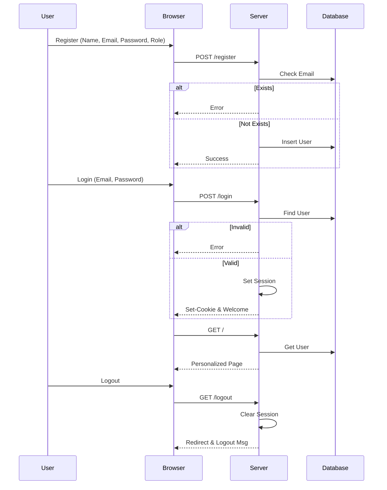
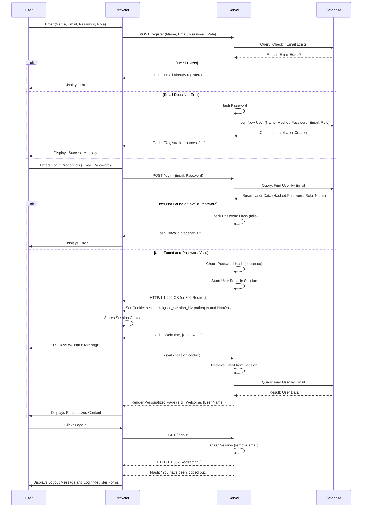

# With Database

## Flow Diagram

> Start

- user submits

```mermaid
sequenceDiagram
  participant User
  participant Browser
  participant Server
  participant Database

  User->>Browser: Register (Name, Email, Password, Role)
  Browser->>Server: POST /register
  Server->>Database: Check Email
  alt Exists
    Server-->>Browser: Error
  else Not Exists
    Server->>Database: Insert User
    Server-->>Browser: Success
  end

  User->>Browser: Login (Email, Password)
  Browser->>Server: POST /login
  Server->>Database: Find User
  alt Invalid
    Server-->>Browser: Error
  else Valid
    Server->>Server: Set Session
    Server-->>Browser: Set-Cookie & Welcome
  end

  Browser->>Server: GET /
  Server->>Database: Get User
  Server-->>Browser: Personalized Page

  User->>Browser: Logout
  Browser->>Server: GET /logout
  Server->>Server: Clear Session
  Server-->>Browser: Redirect & Logout Msg

```

```mermaid
sequenceDiagram
  participant User
  participant Browser
  participant Server
  participant Database
	 User->>Browser: Enter (Name, Email, Password, Role)
	 Browser->>Server: POST /register (Name, Email, Password, Role)
     Server->>Database: Query: Check if Email Exists
     Database-->>Server: Result: Email Exists?
     alt Email Exists
	 Server-->>Browser: Flash: "Email already registered."
	 Browser->>User: Displays Error
     else Email Does Not Exist
	 Server->>Server: Hash Password
	 Server->>Database: Insert New User (Name, Hashed Password, Email, Role)
	 Database-->>Server: Confirmation of User Creation
	 Server-->>Browser: Flash: "Registration successful!"
	 Browser->>User: Displays Success Message
     end

     User->>Browser: Enters Login Credentials (Email, Password)
     Browser->>Server: POST /login (Email, Password)
     Server->>Database: Query: Find User by Email
     Database-->>Server: Result: User Data (Hashed Password, Role, Name)
     alt User Not Found or Invalid Password
         Server->>Server: Check Password Hash (fails)
         Server-->>Browser: Flash: "Invalid credentials."
         Browser->>User: Displays Error
     else User Found and Password Valid
         Server->>Server: Check Password Hash (succeeds)
         Server->>Server: Store User Email in Session
         Server-->>Browser: HTTP/1.1 200 OK (or 302 Redirect)
         Server-->>Browser: Set-Cookie: session<signed_session_id> patheq fs and HttpOnly
         Browser->>Browser: Stores Session Cookie
         Server-->>Browser: Flash: "Welcome, [User Name]!"
         Browser->>User: Displays Welcome Message

         Browser->>Server: GET / (with session cookie)
         Server->>Server: Retrieve Email from Session
         Server->>Database: Query: Find User by Email
         Database-->>Server: Result: User Data
         Server-->>Browser: Render Personalized Page (e.g., Welcome, [User Name]!)
         Browser->>User: Displays Personalized Content
     end

     User->>Browser: Clicks Logout
     Browser->>Server: GET /logout
     Server->>Server: Clear Session (remove email)
     Server-->>Browser: HTTP/1.1 302 Redirect to /
     Server-->>Browser: Flash: "You have been logged out."
     Browser->>User: Displays Logout Message and Login/Register Forms

```

## Working
