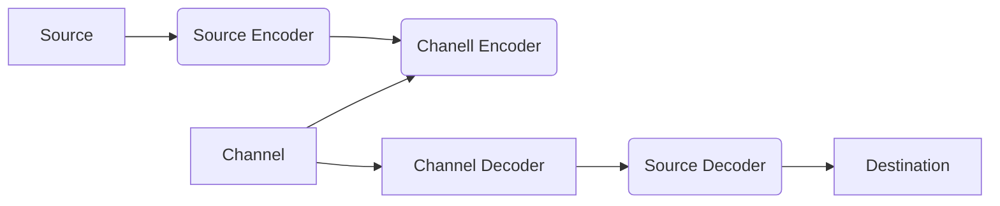

# Digital Communication

```mermaid
graph LR
A[Source]
B[Destination]
SE(Source Encoder)
SD(Source Decoder)
CE(Chanell Encoder)
CD[Channel Decoder]
C[Channel]

C--> CE & CD

A --> SE --> CE
CD --> SD --> B
```

