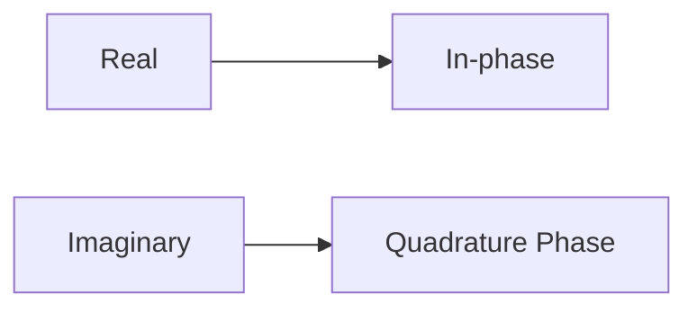

# Quadrature Signal
**Quadrature signal** or 
 - [[Eulers Formula]]
A quadrature signal is a signal in which *whose value at some instant can be specified by a single complex number having 2 parts , real and imaginary*

| Name                        | Equation                      |
| --------------------------- | ----------------------------- |
| Rectangular form(Cartesian) | $c=a+jb$                      |
| Trignometic Form            | $c=M[\cos(\phi)+j\sin(\phi)]$ |
| Polar Form                  | $c=Me^{j\phi}$                |
| Magnitude Form              | $c=M\angle\phi$               |
$$
M= |c| = \sqrt{ a^2 + b^2 }
$$
## Phase Angle ($\phi$)
It is the ratio of real part by imaginary part
$$
\phi = \frac{real}{imaginry}
$$
or
$$
\phi = \tan^{-1}\left( \frac{b}{a} \right)
$$
[Source](https://www.ieee.li/pdf/essay/quadrature_signals.pdf)
- [ ]  Negative Frequencies ? 

- They are also called complex signals 
- used in  **quadrature processing**, they are 
>- Digital communications systems,
>- radar systems,
>- time difference of arrival processing in radio direction finding schemes
>- coherent pulse measurement systems,
>- antenna beamforming applications,
>- single sideband modulators,

"and they provide additional processing power through the coherent measurement of the phase of sinusoidal signals"

## Properties of Complex numbers 
*Whenever any number is multiplied by j the result is a counterclockwise rotation of 90*
![[Drawing 2024-12-26 01.45.05.excalidraw]]
"If you have a single complex number, represented by a point on the complex plane, multiplying that number by j or by e jπ/2 will result in a new complex number that's rotated 90 o counterclockwise (CCW) on the complex plane"
![[Pasted image 20241226015603.png]]

