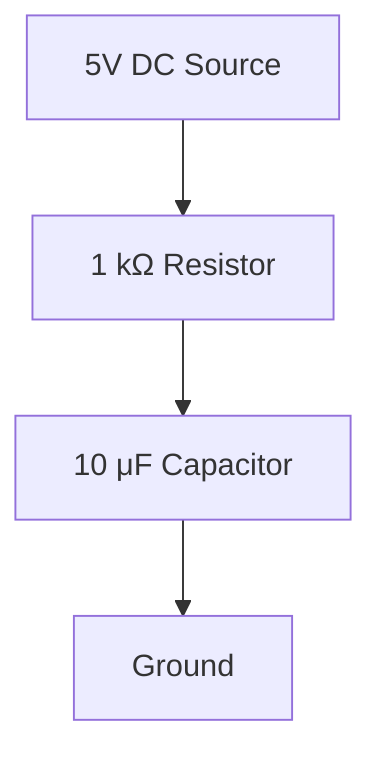

# Derivation

Derivation, in mathematics, refers to the process of finding the derivative of a function. The derivative measures the rate of change of a function with respect to its variable.

## Key Concepts

> [!info] Key Concepts
> - **Derivative**: The instantaneous rate of change.
> - **Notation**: Often denoted as \( f'(x) \), \( \frac{dy}{dx} \), or \( \frac{d}{dx} \).
> - **Rules**: Includes power rule, product rule, quotient rule, and chain rule.

## Example

> [!example] Example
> For $f(x) = x^2$, the derivative is $f'(x) = 2x$.
>
> Using the power rule: $\dfrac{d}{dx}x^n = n x^{n-1}$, so $\dfrac{d}{dx}x^2 = 2x$.
>
> Limit definition:
> $$
> f'(x)=\lim_{h\to 0}\frac{(x+h)^2 - x^2}{h}
> =\lim_{h\to 0}\frac{2xh+h^2}{h}=2x.
> $$

This concept is fundamental in calculus for applications like optimization and physics.

## Real-Life Example

> **Real-life example — car motion**
>
> Let the car's position be $s(t)$ (meters) at time $t$ (seconds). The instantaneous velocity is
>
> $v(t)=\dfrac{ds}{dt}$.
>
> Example: if $s(t)=t^{2}$, then
>
> $v(t)=\dfrac{d}{dt}\bigl(t^{2}\bigr)=2t\ \text{m/s}$.
>
> So at $t=3\ \text{s}$, $v(3)=6\ \text{m/s}$. The sign of $v(t)$ gives the direction; its magnitude gives the speed.

#math #calculus #derivative

# Electronics

> Electronics relies heavily on derivatives because many circuit laws and dynamic behaviors are expressed as time‑rate‑of‑change relationships.

## Key links between derivation and electronics
- Charge and current: $i(t)=\dfrac{dq(t)}{dt}$.
- Capacitor: $i(t)=C\,\dfrac{dv_C(t)}{dt}$ (current is derivative of voltage).
- Inductor: $v_L(t)=L\,\dfrac{di(t)}{dt}$ (voltage is derivative of current).
- Circuit differential equations: e.g. series RC with input $v_{in}(t)$ and capacitor voltage $v_C(t)$:
    $$
    v_{in}(t)=R\,C\,\frac{dv_C}{dt}+v_C(t).
    $$
    RLC example (charge q): $L\frac{d^2q}{dt^2}+R\frac{dq}{dt}+\frac{1}{C}q=v_{in}(t)$.
- Frequency (phasor) domain: time derivatives map to multiplication by $j\omega$, yielding impedances $Z_L=j\omega L$ and $Z_C=\dfrac{1}{j\omega C}$.

## Practical consequences
- Transient analysis and natural/resonant behavior are solved with differential equations.
- Active differentiator circuits (op‑amp differentiators) approximate $\dfrac{d}{dt}$ but amplify high‑frequency noise—practical designs limit bandwidth.
- Control and signal processing: derivative action in PID controllers and edge detection in filters rely on the derivative concept.

These connections make calculus (derivatives) fundamental to analyzing, designing, and understanding dynamic electronic systems.

## Charge and current — derivative and integral
- Fundamental relation: $i(t)=\dfrac{dq(t)}{dt}$ (units: 1 A = 1 C/s).
- Inverse (accumulation): $q(t)=q(t_0)+\displaystyle\int_{t_0}^{t} i(\tau)\,d\tau$ — initial charge $q(t_0)$ matters.
- Example (polynomial): if $q(t)=5t^{2}\ \mathrm{C}$, then $i(t)=\dfrac{dq}{dt}=10t\ \mathrm{A}$ (at $t=2\ \mathrm{s}$, $i=20\ \mathrm{A}$).
- Example (sinusoid): if $i(t)=I_{0}\sin(\omega t)$, then $q(t)=-\dfrac{I_{0}}{\omega}\cos(\omega t)+q_{0}$.
- Capacitor relation (connects voltage): $q=C\,v_{C}\Rightarrow i=C\,\dfrac{dv_{C}}{dt}$. Hence
    $$
    v_{C}(t)=v_{C}(t_{0})+\dfrac{1}{C}\displaystyle\int_{t_{0}}^{t} i(\tau)\,d\tau.
    $$
- Inductor relation: $v_{L}=L\,\dfrac{di}{dt}$ (voltage ↔ time‑rate‑of‑change of current).
- Sign and reference: pick a positive current direction and voltage polarity — signs in $\dfrac{dq}{dt}$ follow that convention (important for KCL/KVL and boundary conditions).
- Discrete/measurement note: with sampling $\Delta t$, approximate $i\approx\Delta q/\Delta t$; numerical differentiators amplify noise, numerical integrators smooth it.
- Physical intuition: derivative = instantaneous flow (how fast charge changes); integral = accumulated charge from past currents.
- Practical use: apply these when forming circuit differential equations and when converting between time and frequency domains ($\dfrac{d}{dt}\leftrightarrow j\omega$).

### Practical Example: Charging a Capacitor in an RC Circuit

Consider an RC circuit with a 10 μF capacitor and a 1 kΩ resistor connected to a 5 V DC source. Initially, the capacitor is uncharged ($v_C(0) = 0$ V). The voltage across the capacitor follows $v_C(t) = V(1 - e^{-t/RC})$, where $RC = 10$ ms.

- Current through the resistor: $i(t) = \dfrac{dq}{dt} = C \dfrac{dv_C}{dt} = (10 \times 10^{-6}) \times 5 \times \dfrac{1}{10 \times 10^{-3}} e^{-t/RC} = 5 \times 10^{-3} e^{-t/0.01}$ A (5 mA at t=0, decaying exponentially).
- Charge on capacitor: $q(t) = C v_C(t) = 10 \times 10^{-6} \times 5 (1 - e^{-t/0.01}) = 5 \times 10^{-5} (1 - e^{-t/0.01})$ C.
- At t=10 ms, $v_C \approx 3.16$ V, $i \approx 1.84$ mA, $q \approx 31.6$ μC.
- This demonstrates how derivatives relate to instantaneous rates (current as rate of charge accumulation) and integrals to total accumulation (voltage from integrated current).

