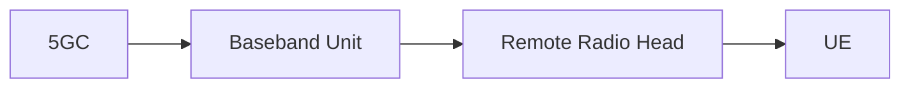

# 5G Network Architecture

**UE**-> User Equipment 
**Downlink Direction**: When the user receives(gNodeB --> User)
**Uplink Direction**: When the user transmitts (UE --> gNodeB)

**Base Station(gNodeB)**: Remote Radio Head + Baseband Unit

#### History
1. **1G**: Based on analog transmission (AM FM)
	- AMPS(Advanced Mobile Phone System) Developed within North America
	- NMT(Nordic Mobile Telephony) By Network operators of Nordic 
	- TACS(Total Access Communication System) , used by UK
>- Only Voice Service
2. **2G**: Introduced Digital Transmission 
	- **GSM**(Global System For Mobile Communication) By European Countries 
	- D-AMPS(Digital AMPS) ,North America 
	- PDC(Personal Digital Cellular) , Japan