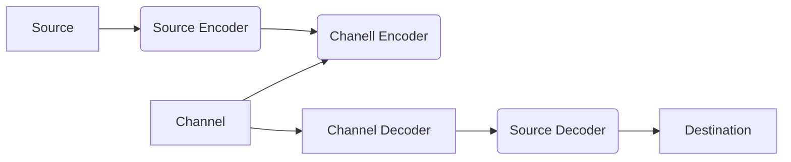
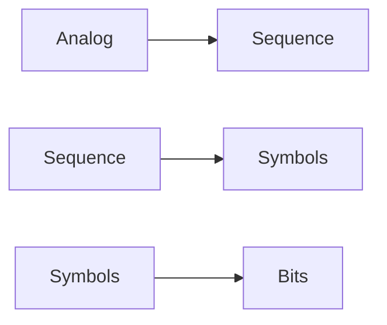

# Digital Communication

- In 1948 **Claude Shannon** 
- Communication system is complex , which is in the sence that there are so meny softwares and so meny hardwares. (The amount of hardware and the amount of software we are dealing with is huge).
- Although we can understand because it is highly structured.
**Q:** What is the role of structuring in digital communication and how does it help to design and maintain large communication system. 
So in a structured system the developers(engineers) should not be worried about other part of the system which is also called a layered design. In which each aspect of system is design and maintained by individual teams. For example in communication system there are channel encoding , source encoding , etc. but the engineer that doing the channel encoding does not have to worrie about source encoding , he only have to know what type of object or signal that is comming as input is it 0's and 1's or it is some complex signals ? etc.

---
In source we are dealing with **how much size?** and in channel we are dealing with **how meny bps can you send** ?^[Robert G Galkger founde of LDPC Codes]

### Source Coding 

**Encoding**

Almost all the signal or quantities what ever you call it, will be in analog form . So the first thing we have to do is to convert them into digital form, because we have to store it. Right? 
Which is kinda not true , because in old days some videos tapes contains audio as pure analog thing embedded in the film , or take an example of a music casset. What changed? 
- Why do we prefer digital? 
- What does the digital do better than analog? 
One thing i have realized that analog is the purest form and when converting it to digital we lose too much detail, take an example of a audio waveform . If we use a 12 bit adc and 44.1K sampling rate we actually get a decent amount of audio quality , but whats the catch? There is always a catch . 
1. Loses information when converting into digital . 
But what does we gain from it ?
1. We are able to store so much in very little physical size . 
2. etc.etc.
And Source encoding plays a huge role in this. Whether in communication or just storing .


**Decoding**
- [ ] Complete this 


## Modulation Schemes
Modulation schemes are interesting , better (higher order) modulation schemes try to transmit maximum amount of data as possible eg [[QPSK]] transmitts twise data as [[BPSK]]
**When to Choose one or the other**?
what i have understand is that when the noise is more or the effect of noise is more , we try to reduce the speed or transmit less different signal , because a in some sense `1 or 0` is more distinguishable than `1 , .5 , .25 , 0`. Also we have to consider the [[Bandwidth SNR Trade off]] 

Few points to remember 
- Noise is unavoidable 
- we want to maximize the data rate
- Use full bandwidth effectively. 

![[Bandwidth SNR Trade off#Bandwidth SNR Trade off]]

"**The word Complex is an extraordinarly complex word , none of us know what it means because it means so meny things**"

```python
import numpy as np 
print(np.pi)
```


### Complex Systems

1. Low cost with high complexity requires large volume, long development time, and careful design.
2. Complex systems are often dont work or are not robust
3. Special applications, since they involve small numbers, must extend the chips used in more general systems with relatively simple extensions.


## Source Coding 
**Requirements**: Probability

#### Why Binary interface
- Standardization
- Layering
- No perfomance loss 
