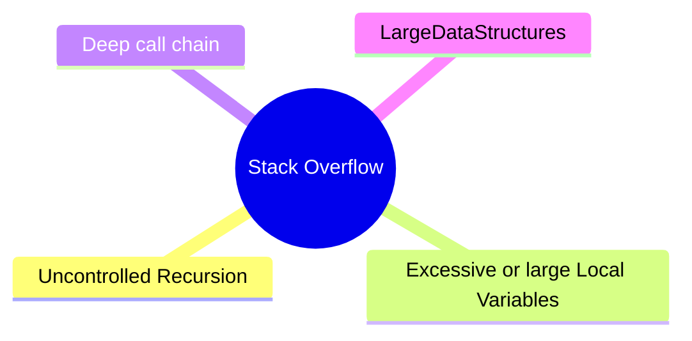

# Memory Segments

Process: It is an instance of a program in execution , with its memory and resources

Processes can not access physical RAM directly

- They operate on virtual memory ? and it is mapped to physical memory by the operating system.
- physical memory and virtual memory are devided into blocks of same size , pages and frames {for virtual pages , frames for phy RAM}

```mermaid
________________
|              |
|  OS Kernal   |
|              |
|              |
|______________|
|              |
|    Stack     |
|              |
|______________|
|              |
|    Heap      |
|______________|
|     BSS      |
|______________|
|    Data      |
|______________|
|  Text/Code   |
|              |
|______________|
```

Why this division?

1. Security: Maintain access permission and privilage levels
2. Memory Management: Efficient allocation and deallocation of memory
3. Isolation: Prevent processes from interfering with each other
4. Access Patterns: Sequential vs random access patterns

- Stack: Sequential access, LIFO
- Heap: Random access, dynamic allocation

### Memory Segments

- **Text/Code Segment**: Contains the compiled code of the program. It is read-only to prevent accidental modification.
- **Data Segment**: Contains global and static variables that are initialized by the programmer. It is further divided into:
  - **Initialized Data Segment**: Contains variables that are initialized with a value.
  - **Uninitialized Data Segment (BSS)**: Contains variables that are declared but not initialized. It is zero-initialized by the system.
- **Heap Segment**: Used for dynamic memory allocation. It grows and shrinks as needed during program execution.
- **Stack Segment**: Used for function call management, local variables, and control flow. It grows downwards in memory.
- **OS Kernel Segment**: Contains the operating system kernel code and data structures. It is protected and not accessible by user processes.

Data & BSS segmentation reduces executable size and improves performance by allowing the OS to load only the necessary parts into memory.
How?

- Initialized variables needs to be explicitly loaded into memory, while uninitialized variables can be zeroed out in the BSS segment. So the uninitialized variables do not want to be stored in the executable file, reducing its size.

### Heap

The heap is a region of memory used for dynamic memory allocation. It allows programs to request and release memory at runtime, which is useful for data structures like linked lists, trees, and graphs.

- Relies on memory allocator to manage memory available to the program during runtime.
- Memory allocator tracks which blocks of memory are free and which are in use,
- When the program requests memory, the allocator finds a suitable block and marks it as in use or occupied.
- When the program releases memory, the allocator marks the block as free, allowing it to be reused later.

```c
#include <stdio.h>
#include <stdlib.h>
int main() {
    int *arr = (int *)malloc(10 * sizeof(int)); // Allocate memory for 10 integers
    if (arr == NULL) {
        printf("Memory allocation failed\n");
        return 1;
    }

    for (int i = 0; i < 10; i++) {
        arr[i] = i * 10;
    }

    for (int i = 0; i < 10; i++) {
        printf("%d ", arr[i]);     }
    printf("\n");

    free(arr);
    return 0;
}
```

> [!important]- What happens if you forget to free the memory?
> When a program use memory on the heap and forgot to free it , that memory remins unusable until the program terminates. This is called a memory leak, and it can lead to increased memory usage and eventually cause the program to run out of memory.

#### Heap vs Stack

- The heap grows upwards in memory, meaning that new allocations increase the size of the heap.
- The stack grows downwards, meaning that new function calls and local variable allocations decrease the size of the stack.

### Stack overflow

A stack overflow occurs when a program uses more stack space than is available, typically due to excessive recursion or large local variable allocations.

- When a program calls a function , the function's local variables and return address are pushed onto the stack. So when thigs like recursive calls happen more and more stack space will be used and everntually the stack will run out.



### Memory Management in Stack

When a function is called, a new stack frame is created for that function. The stack frame contains:

- Local variables
- Function parameters
- Return address

#### Stack pointer

The stack pointer is a special register that points to the top of the stack. It is updated as functions are called and return, ensuring that the stack grows and shrinks correctly.
