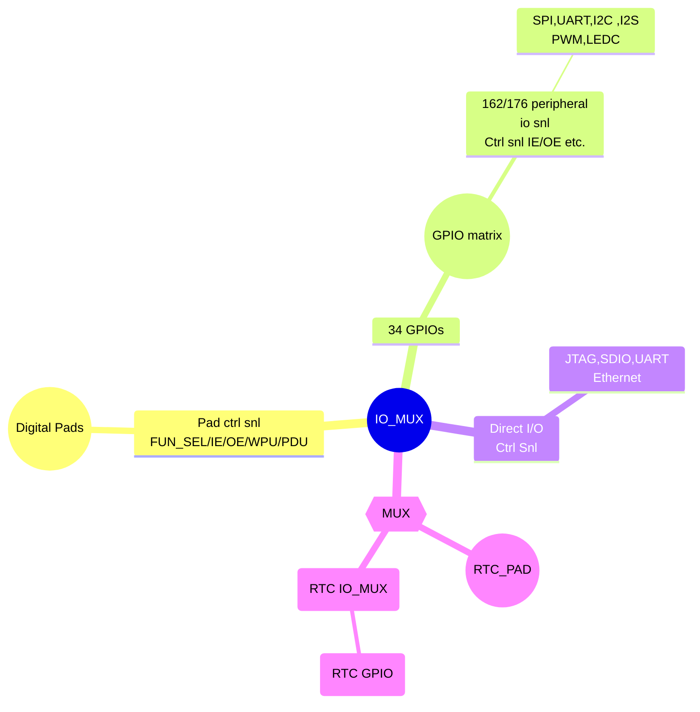

# ESP32
- [Introduction](#introduction)
- [Programming](#programming)
- [[#Pinout[ 1]|Pinout]] 
  - [ESP IDF](03%20Electronics/Embedded%20Systems/Micro%20Controllers/Espressif/ESP32/ESP_IDF.md)
  - [ADC](03%20Electronics/Embedded%20Systems/Micro%20Controllers/Espressif/ESP32/ESP-ADC.md)
  - [WiFi Programming](03%20Electronics/Embedded%20Systems/Micro%20Controllers/Espressif/ESP32/programming/WiFi%20Programming.md)
  - [Interfacing](03%20Electronics/Embedded%20Systems/Micro%20Controllers/Espressif/ESP32/programming/Interfacing.md)
  - [Multitasking](03%20Electronics/Embedded%20Systems/Micro%20Controllers/Espressif/ESP32/programming/MultiTasking.md)
  - [ESP-NOW](03%20Electronics/Embedded%20Systems/Micro%20Controllers/Espressif/ESP32/ESP-NOW.md)
  - [Interrupt Programming](03%20Electronics/Embedded%20Systems/Micro%20Controllers/Espressif/ESP32/programming/Interrupt%20Programming.md)
  - [ESP32 Web Programming|Web Programming](03%20Electronics/Embedded%20Systems/Micro%20Controllers/Espressif/ESP32/programming/Web%20Programming.md)
- [x] check if this all points to the current link 📅 2025-04-17 ✅ 2025-04-17

# Introduction


Designed with the TSMC low-power 40 nm tech . [[esp32_datasheet_en.pdf#page=2|Functional Block Diagram]] of the ESP32 shows that it does have support for the following
- [[SPI]] , [[I2C]] , [[I2S]] , SDIO, UART 
- ADC , DAC 
- Touch  Sensor 
- 2 Xtensa LX6 microprocessors (32 Bit)
- Crypto hardware acceleration for AES, SHA, RSA, and RNG
- ULP Co-processor, Recovery Memory , PMU 
- 802.11b/g/n
- 802.11n (2.4 GHz), up to 150 Mbps
- WMM
- TX/RX A-MPDU, RX A-MSDU
- Immediate Block ACK
- Defragmentation
- Automatic Beacon monitoring (hardware TSF)
- Four virtual Wi-Fi interfaces
- Simultaneous support for Infrastructure Station, SoftAP, and Promiscuous modes ,Note that when ESP32 is in Station mode, performing a scan, the SoftAP channel will be changed.
- Antenna diversity
- [Datasheet](https://www.espressif.com/sites/default/files/documentation/esp32_datasheet_en.pdf)


---

# Pin Configuration
- `CHIP_PU`(enable) should not leave this pin floating
```yaml
CHIP_PU: 
	 0 : Chip is powered down
	 1 : Chip is powered up
```
## Restrictions
The IO pins of ESP32 are multifunctional that is the single pin will do different things in different situation  and it is important to consider this while using them 
1. Some pins are input only due to the lack of **pull up/down resisors**
> They are 34, 35, 36, ,37,38,39

2. Straping pins , they need to be at some logic level inorder for the chip to properly function 
> **GPIO0** and **GPIO2** which determines the boot mode. 
>  ^522a74


## Boot Mode 
The boot mode is determined by the logic level present on the following pins ![[#^522a74]]

| Boot Mode     | GPIO0 | GPIO2 |
| ------------- | ----- | ----- |
| SPI Boot Mode | 1     | x     |
| Download Mode | 0     | 0     |
It shows that if i have to flash the firmware to the **ESP32** i have to make the both pins **GPIO0** and **GPIO2** to **LOW**.


**Strapping pins default value **

| Strapping Pin | Default config |
| ------------- | -------------- |
| **GPIO0**     | Pull up(1)     |
| **GPIO2**     | down(0)        |
| **MTDI**      | down(0)        |
| **MTDO**      | up(1)          |
| **GPIO5**     | up(1)          |
>[!important] After the boot
>The important thing here to note is that the strapping **pins can be used after the boot** , because the value of the strapping pins will be checked only at the time of **boot**

- [ ] Need to further research about the boot mode and how it effects when i want to simply programm it using the [[CH340C]] . 📅 2025-04-30

## GPIO


>[!float|right-medium] Internal Structure of Pad
>![[pad.excalidraw]]
- **IE** Input enable
- **OE** Output Enable 
- **WPU** internal weak pull-up resistor
- **WPD** pull-down 
- **Bounding pad**: a terminal point on the chip logic used to make a physical connection from the chip die to **GPIO** pin in the chip package

# Communication
## I2C
[Source](https://www.espressif.com/sites/default/files/documentation/esp32_technical_reference_manual_en.pdf#resclk)
- Supports both master mode and slave mode 
- Supports multi-master and multi-slave communication 
- Supports standard mode (100 kbit/s) 
- Supports fast mode (400 kbit/s) 
- Supports 7-bit addressing and 10-bit addressing 
- Supports continuous data transmission with disabled Serial Clock Line (SCL) 
- Supports programmable digital noise filter

# Programming

- [ESP IDF](03%20Electronics/Embedded%20Systems/Micro%20Controllers/Espressif/ESP32/ESP_IDF.md)
- [WiFi Programming](03%20Electronics/Embedded%20Systems/Micro%20Controllers/Espressif/ESP32/programming/WiFi%20Programming.md)
- [Interfacing](03%20Electronics/Embedded%20Systems/Micro%20Controllers/Espressif/ESP32/programming/Interfacing.md)
- [Multitasking](03%20Electronics/Embedded%20Systems/Micro%20Controllers/Espressif/ESP32/programming/MultiTasking.md)
- [ESP-NOW](03%20Electronics/Embedded%20Systems/Micro%20Controllers/Espressif/ESP32/ESP-NOW.md)
- [Interrupt Programming](03%20Electronics/Embedded%20Systems/Micro%20Controllers/Espressif/ESP32/programming/Interrupt%20Programming.md)
- [ESP32 Web Programming|Web Programming](03%20Electronics/Embedded%20Systems/Micro%20Controllers/Espressif/ESP32/programming/Web%20Programming.md)
# Pinout[^1]
[^1]:https://randomnerdtutorials.com/esp32-pinout-reference-gpios/

|          |           |            |                                                                                |
| -------- | --------- | ---------- | ------------------------------------------------------------------------------ |
| **GPIO** | **Input** | **Output** | **Notes**                                                                      |
| **0**    | pulled up | OK         | outputs PWM signal at boot, must be LOW to enter flashing mode                 |
| **1**    | TX pin    | OK         | debug output at boot                                                           |
| **2**    | OK        | OK         | connected to on-board LED, must be left floating or LOW to enter flashing mode |
| **3**    | OK        | RX pin     | HIGH at boot                                                                   |
| **4**    | OK        | OK         |                                                                                |
| **5**    | OK        | OK         | outputs PWM signal at boot, strapping pin                                      |
| **6**    | x         | x          | connected to the integrated SPI flash                                          |
| **7**    | x         | x          | connected to the integrated SPI flash                                          |
| **8**    | x         | x          | connected to the integrated SPI flash                                          |
| **9**    | x         | x          | connected to the integrated SPI flash                                          |
| **10**   | x         | x          | connected to the integrated SPI flash                                          |
| **11**   | x         | x          | connected to the integrated SPI flash                                          |
| **12**   | OK        | OK         | boot fails if pulled high, strapping pin                                       |
| **13**   | OK        | OK         |                                                                                |
| **14**   | OK        | OK         | outputs PWM signal at boot                                                     |
| **15**   | OK        | OK         | outputs PWM signal at boot, strapping pin                                      |
| **16**   | OK        | OK         |                                                                                |
| **17**   | OK        | OK         |                                                                                |
| **18**   | OK        | OK         |                                                                                |
| **19**   | OK        | OK         |                                                                                |
| **21**   | OK        | OK         |                                                                                |
| **22**   | OK        | OK         |                                                                                |
| **23**   | OK        | OK         |                                                                                |
| **25**   | OK        | OK         |                                                                                |
| **26**   | OK        | OK         |                                                                                |
| **27**   | OK        | OK         |                                                                                |
| **32**   | OK        | OK         |                                                                                |
| **33**   | OK        | OK         |                                                                                |
| **34**   | OK        |            | input only                                                                     |
| **35**   | OK        |            | input only                                                                     |
| **36**   | OK        |            | input only                                                                     |
| **39**   | OK        |            | input only                                                                     |

^cf11ec

