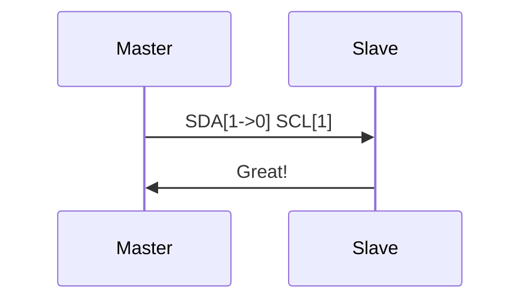

# I2C

_Inter-Integrated Circuit aka I2C is a serial communication protocol where 2 wires are used to communicate_. It supports multiple device and multiple controllers that control send and receive data

> [!Important] Unique Address
> Communication is send in packets with a unique address for each target device

#pins

- **Serial Data (SDA) –** Transfer of data takes place through this pin.
- **Serial Clock (SCL) –** It carries the clock signal.

#modes

- Master mode
- Slave mode

#working

1. **Start Condition** – 1 bit
2. **Slave Address** – 8 bit
3. **Acknowledge** – 1 bit

- _data line can not change when the clock line is high, it can change only when the clock line is low_
- _It uses only 2 bi-directional open-drain lines for data communication called SDA and SCL. Both these lines are pulled high_

1. START and STOP can be generated by **keeping the SCL line high and changing the level of SDA**.
   - START condition the **SDA is changed from high to low while keeping the SCL high**.
   - STOP condition **SDA goes from low to high while keeping the SCL high**


2. **Address Frame:** A 7 or 10 bit sequence unique to each slave that identifies the slave when the master wants to talk to it.
3. **Read/Write Bit:** A single bit specifying whether the master is sending data to the slave (low voltage level) or requesting data from it (high voltage level).

```c
requesting data from it (high voltage level)
sending data to the slave (low voltage level)

```

1. **ACK/NACK Bit:** Each frame in a message is followed by an acknowledge/no-acknowledge bit. If an address frame or data frame was successfully received, an ACK bit is returned to the sender from the receiving device

#disadvantages

- Half Duplex

### Structure

#### Adressing

- It is the first frame after the start bit
- The address of the `slave` with which `master` wants to communicate is send by the master to `every slave`
  - Then the slave compares its own address with the address and sends ACK



## Practical Usage

1. [[Arduino to Arduino I2C Communication]]

## References

1. [Source](https://www.geeksforgeeks.org/i2c-communication-protocol/)
