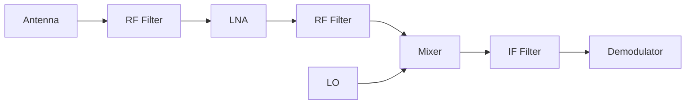

# Pluto SDR
**Param**


>[!Note] SDR 
>Software defined radio(SDR) is a radio communication system where components that have been traditionally implemented in hardware are instead implemented by means of software^[1]

**Superheterodyne**



Inside [[Pluto SDR]] is **Zero IF** architector .

**Q** What is zero IF? 
**uses a local oscillator which is set equal to the desired carrier frequency being tuned, or very close to it**^[https://www.analogictips.com/radio-receiver-aarchitectures-part-2-zero-sdr/#:~:text=A%3A%20Zero%2DIF%2C%20sometimes,values%20such%20as%20455%20kHz.]

## IIO 
Linux's Industrial Input/ouput(IIO) infrastructure. The pluto sdr is a iio based device. 
### Installition

```bash
	sudo pacman -S libiio

```

#### Depts

```

cmake --> needs removal
boost --> needs removal 
swig --> needs removal 

```

## Pluto SDR and GNU Radio 

### **1. FM**


#### Pluto SDR block 

| Params         | Value                           |
| -------------- | ------------------------------- |
| Lo Freq        | Center Freq, or LO Freq --> 5e9 |
| iio context ip | 192.168.2.1                     |
| Sample Rate    | 987                             |

## Tweaking

```bash
ssh root@192.168.2.1
# passwd: analog 

fw_setenv attr_name compatible
fw_setenv attr_val ad9364
reboot

```