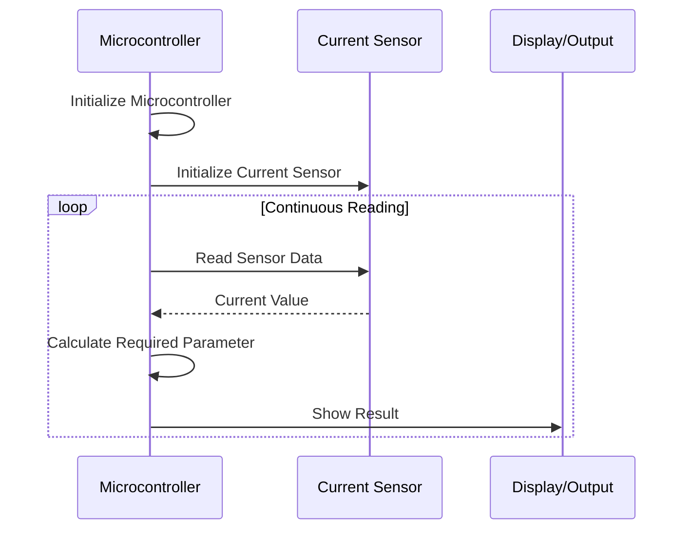

# IoT Based Energy Meter

Objective: Create a simple current measuring project using **esp8266 and current sensor**.

### Phase 1

| Name                   | Task                            | Date           | Status |
| ---------------------- | ------------------------------- | -------------- | ------ |
| [[Fathimath Safah KT]] | Create a sudo code              | 2025-12-11 + 5 | 🕐     |
| [[Anamika VV]]         | Create a simple circuit diagram | 2025-12-11 + 6 | 🕐     |

#### Create a Sude Code
First of all , if you dont know coding, its okey, or if you do know how to code but dont remember the syntax me neither. So what can you do about it. If you think about it you know may know how to code it , but no actually remember the syntax so right that down. 
Eg:

1. Initialize the Micro Controller
2. Initialize the Current Sensor
3. Read data from the Current Sensor
4. Calculate the required Parameter 
5. Show the result 
6. Go to step 3 (Looping)


>[!Note]- How did i drow
>I copy pasted this
>```
>1. Initialize the Micro Controller
>2. Initialize the Current Sensor
>3. Read data from the Current Sensor
>4. Calculate the required Parameter 
>5. Show the result 
>6. Go to step 3 (Looping)
>```
>give a mermaid sequence diagram for this 
>to `chatgpt` so nothing too time taking, just ask it.

This is a simple illustration , but create the complete sudo code.

#### Create a circuit diagram.

