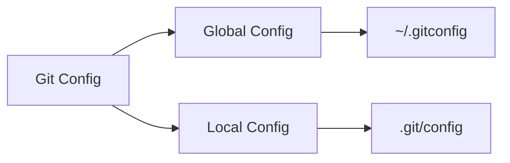

# Level 5 
```dataview
Table without ID  file.name as "Name" , github as Link , status as Status, file.inlinks as Mentioned
where file = this.file
```
---
This is a recap , of what you have learn up until now and , reinforcing what you have learned up until now. 
Also we are going to switch completely to cli, meaning that we are going to use tools like , `vim` or `nano`. And almost ....
- [ ] complete this 

## Lets recap 
Up until you have seen the following commands 
- `git status`
- `git log`
- `git add`
- `git commit`
- `git log`


### Configuring Git
Let's start by properly configuring `git`. I have already explained `git log` in [[Level 3]] of this course. And you may remember the following, a single log entry may look like this. 
![[gitlog.png]]


You can see that , there are a few details like 
- Your name 
- Your email
- The commit message
- The date and time of the commit etc. 
But have you ever thought from where did the `git` obtains this information?.
if you type the following:
```bash
git config --get user.name
```
you will obtain the following
```
Arun CS
```
and to get the `email` run the following.
```bash 
git config --get user.email
```

```
aruncs31ss@gmail.com
```

I was able to get this because i configured it , when i installed `git`. 
In order to configure things like `name` and `email` , run the following

```bash
git config user.name "Arun CS"
```
For example if you want to change you name to something like "Dog", you can run the following command:
```bash
git config user.name "Dog"
```

![[gitconfig-1.png]]

This type of configuration is called `local` or `project` or `repo` level configuration. What i mean by that is that , look at the following example, 
![[localconfig.png]]
when i run 
```bash
git config --get user.name
```
it prints `Dog` , but when i change repo , or directory the name also changes. 
To make the changes `global` you should use the `--global` flag like this,

```bash
git config --global user.name "Arun CS"
```

>[!tip]
> you can also get the `global` configuration like the following
> ![[Screenshot 2025-07-19 at 2.55.11 PM.png]]

So there are 2 types of configuration , and the are `global` and `local` and stored in `~/.gitconfig` and `.git/config` respectively.

>[!tip]- on Linux
>you can check the global config by running the following 
>```bash
>cat ~/.gitconfig
>```
>>[!success]- **output**
>>```ini
>>[user]
>>name = Arun CS
>>mail = aruncs31ss@gmail.com
>>email = aruncs31ss@gmail.com
>>[http]
>>postBuffer = 524288000
>>```
>and `local` by 
>```bash
>cat .git/config
>```
>>[!success]- **output**
>>```ini
>>[core]
>>repositoryformatversion = 0
>>filemode = true
>>bare = false
>>logallrefupdates = true
>>ignorecase = true
>>precomposeunicode = true
>>[remote "origin"]
>>url = https://github.com/aruncs31s/git_by_doing_level_5
>>fetch = +refs/heads/*:refs/remotes/origin/*
>>
>>[branch "main"]
>>remote = origin
>>merge = refs/heads/main
>>[user]
>> name = Dog
>>```

- [ ] check this is true if not modify it.  🏁 delete 
**FAQ: Where these name and mail id used**
- Others can easily verify who made the commit.
- And it is required for fea


Finally, let's set a default branch (we'll talk more about configs and branches later) so that we're all on the same page. Run:

To ensure you get proper credit (or more likely, blame) for all the code you write, you need to set your name and email.

We're using `master` for now because it is Git's default, but later we'll change it to `main`, which is GitHub's default. Just bear with us for a second.


**What if your last commit message is wrong, and you need to change it**

```bash
git commit --amend -m "New commit message
```


# Git Log

A Git repo is a (potentially very long) list of commits, where each commit represents the _full state of the repository_ at a given point in time.

For convenience, you can refer to any commit or change within Git by using the first `7` characters of its hash. For mine, that's `5ba786f`.
Next, run `git log` again, but this time use the `-n` and `--no-pager` options to limit the maximum number of commits shown, and more importantly, to run it without the interactive pager. E.g.:

Next, run `git log` again, but this time use the `-n` and `--no-pager` options to limit the maximum number of commits shown, and more importantly, to run it without the interactive pager. E.g.:

```bash
git --no-pager log -n 10
```


# Cat File

Luckily, Git has a built-in plumbing command, [cat-file](https://git-scm.com/docs/git-cat-file), that allows us to see the contents of a commit without needing to futz around with the object files directly.

```bash
git cat-file -p <hash>
```

## Assignment

1. [ ] Use the `cat-file` command to view the contents of your last commit. (Use `-p` for pretty-print.)
2. [ ] For the CLI to be able to check your output, do it again, but redirect the output to a temporary file:

```bash
catfile-command-here > /tmp/catfileout.txt
```

**Run and submit** the CLI tests.

## Tip

Use `git log -1` to get the hash of your last commit.


# Trees and Blobs

Now that we understand some of our plumbing equipment, let's get into the pipes. Here are some terms to know:

- `tree`: git's way of storing a directory
- `blob`: git's way of storing a file

Here's what I got when I inspected my last commit:

```bash
> git cat-file -p 5ba786fcc93e8092831c01e71444b9baa2228a4f

tree 4e507fdc6d9044ccd8a4a3061324c9f711c4667d
author ThePrimeagen <the.primeagen@aol.com> 1705891256 -0700
committer ThePrimeagen <the.primeagen@aol.com> 1705891256 -0700

A: add contents.md
```

Notice that we can see:

- The `tree` object
- The `author`
- The `committer`
- The commit message

However, we _cannot_ see the contents of the `contents.md` file itself! That's because the `blob` object stores it.

## Assignment

1. [ ] Use `git cat-file -p` again, but this time with the hash of the `tree`object instead of the commit hash. You should see a `blob` object with _its_ own hash.
2. [ ] Use `cat-file` _again_ to view the contents of the `blob` object.
3. Run that same command, but this time [redirect the output](https://tldp.org/LDP/intro-linux/html/sect_05_01.html) to a temporary file: `/tmp/blobfile.txt`.

**Run and submit** the CLI tests.

