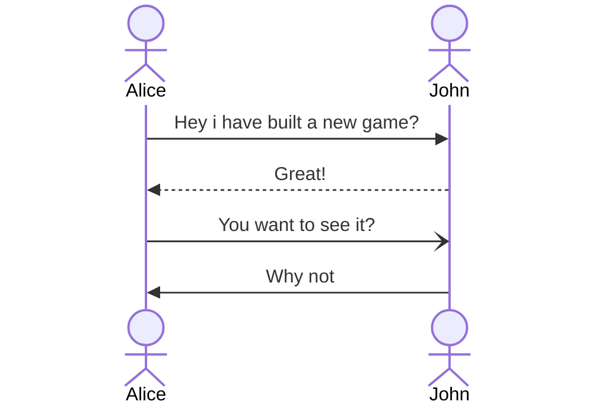
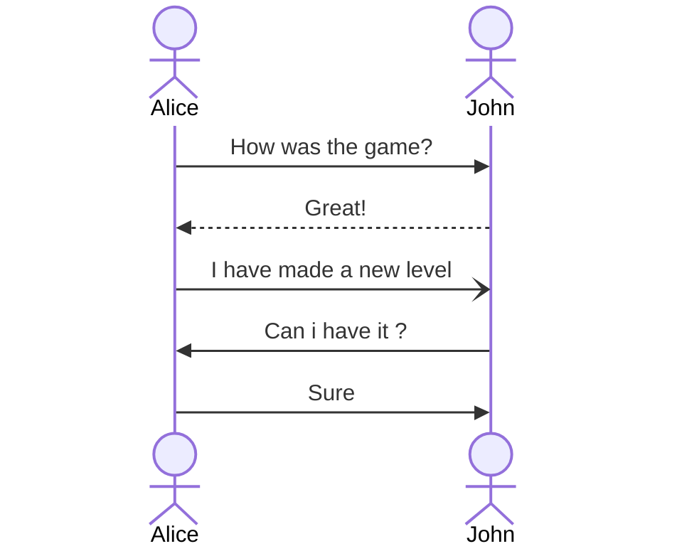
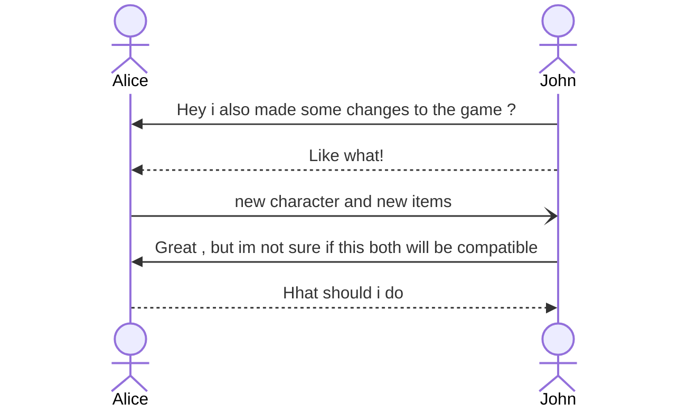

# Git

---

## Assumptions

1. You are watching this on a laptop
2. You have either windows or linux
3. You have no idea about git

---

## What is Git?

- Tool?
- FrameWork?

---

### Tools

Eg: Git , brush tool , fill tool , screenshot etc.

---

### Framework

> a pre-built, reusable structure of code that provides a foundation for developing software applications

Eg: React , Flask

---

## Git vs Github

Tool vs Provider

- Github needs Git
- Inverse is not true

---

## How to install Git

- Linux

```bash
apt install git
pacman -S git
dnf install git
apk add git

```

- Windows

![[git.png]]

---

## Why is Git

1. To share your program to others
2. To keep track of you program

---

### 2 Nerds



---

#### How can the Alice share the code ?

1. Zip it , and share it?
   (whatsapp, g drive, telegram , onedrive, pendrive,)

---

### Then whats the point of git?



---



- John has 3 options
  - 1 Delete the old game , or backup the game somewhere else and copy the new game
    - Problem 1 : Data will be lost
    - Problem 2 : twice the disk usage
  - 2 Manually figure out how to integrate these 2 changes

---

### With Git

##### Alice's Game

```python
class Game1:
	def level_1(args):
		...
	def items():
		...
	def characters:
		...

```

---

##### John's Game

```python
class Game1:
	def level_1(args):
		...
	def level_2():
		...
	def items():
		...
	def characters:
		...

```

---

#### What have changed (demo)

---

### Why this is more efficient

1. Once a Alice create a game and send that John , he dont have to do anything else ,
2. John can look at the **_changes_**
