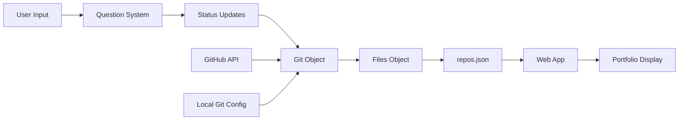

# Level 2


# Level 2

## `level_2.py` Flow

### Overview
`level_2.py` is a setup script that initializes a GitHub portfolio website by collecting user information, fetching GitHub repositories, and allowing users to verify/correct their details before running the web application.

### Flow Diagram

```mermaid
flowchart TD
    A[Script Start] --> B[initialize_repos()]
    B --> C[Create Status Object]
    C --> D[Create Question Helper]
    D --> E[Ask GitHub Username]
    E --> F{Confirm Username?}
    F -->|Yes| G[Setup Git & Files Objects]
    F -->|No| H[Use Default Username]
    G --> I{Check repos.json exists?}
    I -->|No| J[Fetch & Save Repositories]
    I -->|Yes| K[Skip Fetch]
    J --> L[Set Status Git Reference]
    K --> L
    H --> M[Create Fallback Objects]
    M --> N[Return Objects]
    L --> N
    N --> O[main()]
    O --> P[Display Current Status]
    P --> Q{Is Info Correct?}
    Q -->|Yes| R[Show Run Instructions]
    Q -->|No| S[Ask Which to Correct]
    S --> T{Choice}
    T -->|Name| U[Ask New Name]
    T -->|Username| V[Ask New Username]
    T -->|Email| W[Ask New Email]
    T -->|Invalid| X[Exit]
    U --> Y[Update Git Name]
    V --> Z[Update Git Username]
    W --> AA[Update Git Email]
    Y --> BB[Save Repositories]
    Z --> BB
    AA --> BB
    BB --> CC[Display Final Status]
    CC --> DD[Show Run Instructions]
    R --> EE[End]
    DD --> EE
    X --> EE
```

### Detailed Flow

#### 1. Initialization & Imports
```python
import sys
import os
sys.path.append(os.path.join(os.path.dirname(__file__), 'src'))

from modules.question import Question
from modules.status import Status
from modules.git import *
from modules.files import *
```
- **Purpose**: Set up Python path to access modules in `src/` directory
- **Imports**: Question helper, Status tracker, Git operations, File operations

#### 2. `initialize_repos()` Function

**Purpose**: Collect GitHub username and initialize core objects

**Steps**:
1. **Create Status Object**
   ```python
   status = Status(current_question=0)
   ```
   - Initializes status tracking with question counter at 0

2. **Create Question Helper**
   ```python
   question_helper = Question(status)
   ```
   - Links question system with status tracking

3. **Ask for GitHub Username**
   ```python
   github_username = question_helper.ask_question("What is your github username")
   ```
   - Prompts user for GitHub username
   - Updates status counter

4. **Confirm Username**
   ```python
   is_sure = input(f"Are you sure that your username is {github_username} ? ")
   ```
   - Asks user to confirm the entered username

5. **Setup Objects (If Confirmed)**
   ```python
   if is_sure.lower() in ["yes","y"]:
       git: Git = Git(username=github_username)
       files: Files = Files(git=git)
   ```
   - Creates Git object with username
   - Creates Files object linked to Git

6. **Check Repository File**
   ```python
   if not files.is_repos_available():
       files.save_repositories_to_file("repos.json")
   ```
   - Checks if `repos.json` exists and has data
   - Fetches and saves repositories if file is missing/empty

7. **Set Status Git Reference**
   ```python
   status.set_git(git)
   ```
   - Links Git object to status for display purposes

8. **Return Objects**
   ```python
   return git, files, status, question_helper
   ```

9. **Fallback (If Not Confirmed)**
   ```python
   else:
       return Git(username="aruncs31s"), Files(git=Git(username="aruncs31s")), Status(current_question=0), Question(Status(current_question=0))
   ```
   - Uses default username "aruncs31s" if user declines

#### 3. `main()` Function

**Purpose**: Main orchestration function that handles user interaction flow

**Steps**:
1. **Initialize Components**
   ```python
   git, files, status, question_helper = initialize_repos()
   ```

2. **Display Current Status**
   ```python
   status.status()
   ```
   - Shows current name, username, and email

3. **Ask for Confirmation**
   ```python
   is_correct: str = input("Is this all correct ? (yes/no) ")
   ```

4. **Success Path (Information Correct)**
   ```python
   if is_correct.lower() in ["yes","y"]:
       print("Now Run the website using python src/app.py")
       return
   ```
   - Provides instructions to run the web app
   - Exits successfully

5. **Correction Path (Information Incorrect)**
   ```python
   else:
       print("Which one is incorrect ?")
       which_one = input("1. Name\n2. Username\n3. Email\n")
   ```

6. **Handle Corrections**
   - **Option 1 (Name)**:
     ```python
     new_name = question_helper.ask_question("What is your name")
     git.name = new_name
     ```
   - **Option 2 (Username)**:
     ```python
     new_username: str = question_helper.ask_question("What is your github username")
     git.username = new_username
     ```
   - **Option 3 (Email)**:
     ```python
     new_email: str = question_helper.ask_question("What is your email")
     git.github_email = new_email
     ```

7. **Save Updated Data**
   ```python
   files.save_repositories_to_file("repos.json")
   ```
   - Fetches fresh repository data with updated username

8. **Display Final Status**
   ```python
   status.status()
   ```
   - Shows updated information

9. **Final Instructions**
   ```python
   print("Now Run the website using python src/app.py")
   ```

### Key Classes Used

#### `Status` Class
- Tracks current question number
- Stores reference to Git object
- Provides status display functionality

#### `Question` Class
- Handles user input prompts
- Updates status counter
- Formats questions with numbering

#### `Git` Class
- Manages GitHub username
- Fetches user information from GitHub API
- Handles local git configuration

#### `Files` Class
- Manages repository data file (`repos.json`)
- Fetches repositories from GitHub
- Saves data to JSON format

### Error Handling

#### Repository Fetching
- Checks if `repos.json` exists
- Falls back to API call if file is missing
- Handles API failures gracefully

#### User Input Validation
- Accepts multiple confirmation formats ("yes", "y", "no", "n")
- Provides clear options for corrections
- Handles invalid menu selections

#### Fallback Scenarios
- Uses default username if user declines input
- Creates fresh objects for fallback cases
- Maintains consistent object structure

### Data Flow



### Exit Points

1. **Successful Confirmation**: User confirms info is correct
2. **Invalid Menu Choice**: User enters invalid option
3. **Script Completion**: After corrections are made and saved

### Integration Points

- **GitHub API**: Fetches user repositories and profile data
- **Local Git Config**: Reads/writes git user settings
- **File System**: Reads/writes `repos.json`
- **Web App**: Provides instructions to run `python src/app.py`

This script serves as a setup wizard that ensures all user information is correct before launching the portfolio website.

### Detailed Flow

#### 1. Initialization & Imports
```python
import sys
import os
sys.path.append(os.path.join(os.path.dirname(__file__), 'src'))

from modules.question import Question
from modules.status import Status
from modules.git import *
from modules.files import *
```
- **Purpose**: Set up Python path to access modules in `src/` directory
- **Imports**: Question helper, Status tracker, Git operations, File operations

#### 2. `initialize_repos()` Function

**Purpose**: Collect GitHub username and initialize core objects

**Steps**:
1. **Create Status Object**
   ```python
   status = Status(current_question=0)
   ```
   - Initializes status tracking with question counter at 0

2. **Create Question Helper**
   ```python
   question_helper = Question(status)
   ```
   - Links question system with status tracking

3. **Ask for GitHub Username**
   ```python
   github_username = question_helper.ask_question("What is your github username")
   ```
   - Prompts user for GitHub username
   - Updates status counter

4. **Confirm Username**
   ```python
   is_sure = input(f"Are you sure that your username is {github_username} ? ")
   ```
   - Asks user to confirm the entered username

5. **Setup Objects (If Confirmed)**
   ```python
   if is_sure.lower() in ["yes","y"]:
       git: Git = Git(username=github_username)
       files: Files = Files(git=git)
   ```
   - Creates Git object with username
   - Creates Files object linked to Git

6. **Check Repository File**
   ```python
   if not files.is_repos_available():
       files.save_repositories_to_file("repos.json")
   ```
   - Checks if `repos.json` exists and has data
   - Fetches and saves repositories if file is missing/empty

7. **Set Status Git Reference**
   ```python
   status.set_git(git)
   ```
   - Links Git object to status for display purposes

8. **Return Objects**
   ```python
   return git, files, status, question_helper
   ```

9. **Fallback (If Not Confirmed)**
   ```python
   else:
       return Git(username="aruncs31s"), Files(git=Git(username="aruncs31s")), Status(current_question=0), Question(Status(current_question=0))
   ```
   - Uses default username "aruncs31s" if user declines

#### 3. `main()` Function

**Purpose**: Main orchestration function that handles user interaction flow

**Steps**:
1. **Initialize Components**
   ```python
   git, files, status, question_helper = initialize_repos()
   ```

2. **Display Current Status**
   ```python
   status.status()
   ```
   - Shows current name, username, and email

3. **Ask for Confirmation**
   ```python
   is_correct: str = input("Is this all correct ? (yes/no) ")
   ```

4. **Success Path (Information Correct)**
   ```python
   if is_correct.lower() in ["yes","y"]:
       print("Now Run the website using python src/app.py")
       return
   ```
   - Provides instructions to run the web app
   - Exits successfully

5. **Correction Path (Information Incorrect)**
   ```python
   else:
       print("Which one is incorrect ?")
       which_one = input("1. Name
2. Username
3. Email
")
   ```

6. **Handle Corrections**
   - **Option 1 (Name)**:
     ```python
     new_name = question_helper.ask_question("What is your name")
     git.name = new_name
     ```
   - **Option 2 (Username)**:
     ```python
     new_username: str = question_helper.ask_question("What is your github username")
     git.username = new_username
     ```
   - **Option 3 (Email)**:
     ```python
     new_email: str = question_helper.ask_question("What is your email")
     git.github_email = new_email
     ```

7. **Save Updated Data**
   ```python
   files.save_repositories_to_file("repos.json")
   ```
   - Fetches fresh repository data with updated username

8. **Display Final Status**
   ```python
   status.status()
   ```
   - Shows updated information

9. **Final Instructions**
   ```python
   print("Now Run the website using python src/app.py")
   ```

### Key Classes Used

#### `Status` Class
- Tracks current question number
- Stores reference to Git object
- Provides status display functionality

#### `Question` Class
- Handles user input prompts
- Updates status counter
- Formats questions with numbering

#### `Git` Class
- Manages GitHub username
- Fetches user information from GitHub API
- Handles local git configuration

#### `Files` Class
- Manages repository data file (`repos.json`)
- Fetches repositories from GitHub
- Saves data to JSON format

### Error Handling

#### Repository Fetching
- Checks if `repos.json` exists
- Falls back to API call if file is missing
- Handles API failures gracefully

#### User Input Validation
- Accepts multiple confirmation formats ("yes", "y", "no", "n")
- Provides clear options for corrections
- Handles invalid menu selections

#### Fallback Scenarios
- Uses default username if user declines input
- Creates fresh objects for fallback cases
- Maintains consistent object structure

### Data Flow

```
User Input → Question → Status Update → Git Object → Files Object → repos.json
     ↑                                                            ↓
     └──────────────────── Confirmation ──────────────────────────┘
```

### Exit Points

1. **Successful Confirmation**: User confirms info is correct
2. **Invalid Menu Choice**: User enters invalid option
3. **Script Completion**: After corrections are made and saved

### Integration Points

- **GitHub API**: Fetches user repositories and profile data
- **Local Git Config**: Reads/writes git user settings
- **File System**: Reads/writes `repos.json`
- **Web App**: Provides instructions to run `python src/app.py`

This script serves as a setup wizard that ensures all user information is correct before launching the portfolio website. 
