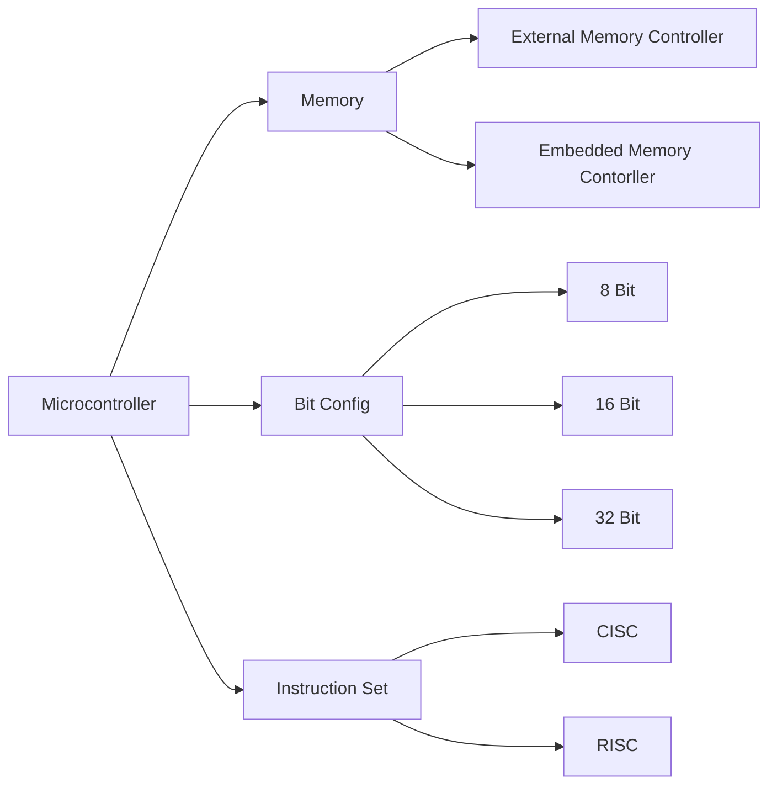

# Digital Core Technologies
- [[Study Session Materials]] 
**Requirements**:
- C Programming
	- Basic Data Types
	- Advanced Data Types
	- Conditional Statements
	- Looping
	- Pointers
	- Arrays and Structures
- Basic Electronics
	- RLC Circuits behaviour
	- Diodes, Transistors and it's behaviour in circuits
	- Digital Electronics
- Microcontrollers (For Example MCS-51/Arduino Controller)
    - [ ] Basics of controllers
    - [ ] Address Mapping/Decoding
    - [ ] Interrupts and Interrupt Handling
- Microcontroller Peripherals and its programming
	- UART
	- SPI
	- ADC
	- PWM
	- I2C
- Microcontroller Interfacing
	- LED
	- Motors
	- Sensors

## Microcontrollers

