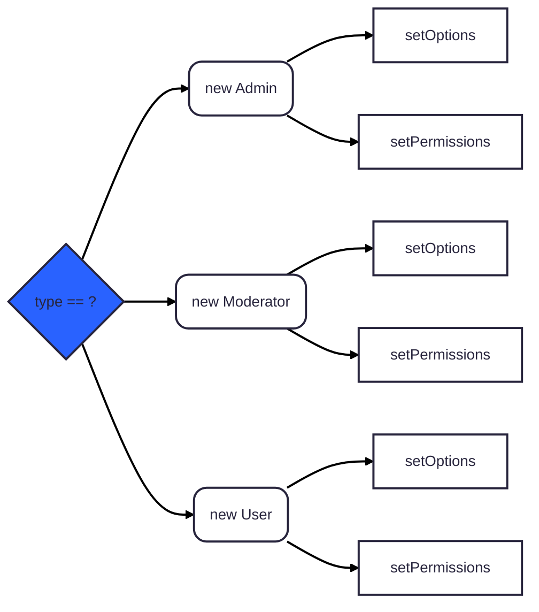

---
tags:
  - programming
  - design_pattern
  - creational_pattern
  - software_design
dg-publish: true
---
### Factory Method Pattern

> **Factory Method** is a creational design pattern that *provides an interface for creating objects in a superclass, but allows subclasses to alter the type of objects that will be created*.

In this the users dont have to worry about the instantiation logic, they just need to call the factory method and get the object they need. It hides the complexity of object creation and provides a simple interface for users. 


#### ✅ **Benefits:**
- **Easier maintenance** and reuse of code
- **Typical solution** to common object creation problems
- **Flexibility** in object creation without tight coupling

#### ❌ **Drawbacks:**
- **Increased complexity** with multiple subclasses
- **Adds an extra layer of abstraction**
- **Potential for code duplication** in subclasses
- **Increased Coupling** Instances are very coupled to the 

#### ❌ **Without Factory Method**
```ts
const type = "admin"; // or "moderator", "user"
const data = { id : 1, name: "Arun CS" };
let user: User;
switch (type) {
    case "admin":
        user = new Admin(data);
        user.setOptions({ canEdit: true, canDelete: true });
        user.setPermissions(["read", "write", "delete"]);
        break;
    case "moderator":
        user = new Moderator(data);
        user.setOptions({ canEdit: true });
        user.setPermissions(["read", "write"]);
        break;
    case "user":
        user = new User(data);
        user.setOptions({ canEdit: false });
        user.setPermissions(["read"]);
        break;
    default:
        throw new Error("Unknown user type");
}
```
**Usage:**


#### ❌ **Without Factory Method In GO**

```go
type User interface {
    SetOptions(options map[string]interface{})
    SetPermissions(permissions []string)
}
type Admin struct {
    User
}
func (a *Admin) SetOptions(options map[string]interface{}) {
    // Set admin specific options
}
func (a *Admin) SetPermissions(permissions []string) {
    // Set admin specific permissions
}
// Similar for Moderator and User types 
```  

#### ✅ **With Factory Method**
```ts
class UserFactory {
    static createUser(type: string, data: any): User {
        switch (type) {
            case "admin":
                return new Admin(data);
            case "moderator":
                return new Moderator(data);
            case "user":
                return new User(data);
            default:
                throw new Error("Unknown user type");
        }
    }
}
```
**Usage:**
```ts
const user = UserFactory.createUser("admin", { id: 1, name: "
Arun CS" });
user.setOptions({ canEdit: true, canDelete: true });
user.setPermissions(["read", "write", "delete"]);
```

#### ✅ **With Factory Method In GO**
```go
type UserFactory interface {
    CreateUser(userType string, data map[string]interface{}) User
}

type UserFactoryImpl struct{}

func (f *UserFactoryImpl) CreateUser(userType string, data map[string]interface{}) User {
    switch userType {
    case "admin":
        return &Admin{Data: data}
    case "moderator":
        return &Moderator{Data: data}
    case "user":
        return &User{Data: data}
    default:
        panic("Unknown user type")
    }
}
```

**Usage:**
```go
factory := &UserFactoryImpl{}
user := factory.CreateUser("admin", map[string]interface{}{
    "id": 1, 
    "name": "Arun CS",
})
user.SetOptions(map[string]interface{}{
    "canEdit": true, 
    "canDelete": true,
})
user.SetPermissions([]string{"read", "write", "delete"})
```


